Linux Virtual Hardware Trends
-----------------------------

A project to identify most popular virtual hardware characteristics and track their change
over time based on data collected by Linux users at https://Linux-Hardware.org.

Anyone can contribute to this report by the [hw-probe](https://github.com/linuxhw/hw-probe) tool:

    sudo -E hw-probe -all -upload

Distribution-specific reports: [OpenMandriva](/Dist/OpenMandriva), [ROSA](/Dist/ROSA), [Ubuntu](/Dist/Ubuntu).

This report is for one last month. Overall report since the beginning of time: [TestCoverage_VE](https://github.com/linuxhw/TestCoverage_VE)

Period: Mar, 2022.

Contents
--------

* [ System ](#system)
  - [ OS                       ](#os)
  - [ OS Family                ](#os-family)
  - [ Kernel                   ](#kernel)
  - [ Kernel Family            ](#kernel-family)
  - [ Kernel Major Ver.        ](#kernel-major-ver)
  - [ Arch                     ](#arch)
  - [ DE                       ](#de)
  - [ Display Server           ](#display-server)
  - [ Display Manager          ](#display-manager)
  - [ OS Lang                  ](#os-lang)
  - [ Boot Mode                ](#boot-mode)
  - [ Filesystem               ](#filesystem)
  - [ Part. scheme             ](#part-scheme)
  - [ Dual Boot with Linux/BSD ](#dual-boot-with-linuxbsd)
  - [ Dual Boot (Win)          ](#dual-boot-win)

* [ Board ](#board)
  - [ Vendor                   ](#vendor)
  - [ Model                    ](#model)
  - [ Model Family             ](#model-family)
  - [ MFG Year                 ](#mfg-year)
  - [ Form Factor              ](#form-factor)
  - [ Secure Boot              ](#secure-boot)
  - [ Coreboot                 ](#coreboot)
  - [ RAM Size                 ](#ram-size)
  - [ RAM Used                 ](#ram-used)
  - [ Total Drives             ](#total-drives)
  - [ Has CD-ROM               ](#has-cd-rom)
  - [ Has Ethernet             ](#has-ethernet)
  - [ Has WiFi                 ](#has-wifi)
  - [ Has Bluetooth            ](#has-bluetooth)

* [ Location ](#location)
  - [ Country                  ](#country)
  - [ City                     ](#city)

* [ Drives ](#drives)
  - [ Drive Vendor             ](#drive-vendor)
  - [ Drive Model              ](#drive-model)
  - [ HDD Vendor               ](#hdd-vendor)
  - [ SSD Vendor               ](#ssd-vendor)
  - [ Drive Kind               ](#drive-kind)
  - [ Drive Connector          ](#drive-connector)
  - [ Drive Size               ](#drive-size)
  - [ Space Total              ](#space-total)
  - [ Space Used               ](#space-used)
  - [ Malfunc. Drives          ](#malfunc-drives)
  - [ Malfunc. Drive Vendor    ](#malfunc-drive-vendor)
  - [ Malfunc. HDD Vendor      ](#malfunc-hdd-vendor)
  - [ Malfunc. Drive Kind      ](#malfunc-drive-kind)
  - [ Failed Drives            ](#failed-drives)
  - [ Failed Drive Vendor      ](#failed-drive-vendor)
  - [ Drive Status             ](#drive-status)

* [ Storage controller ](#storage-controller)
  - [ Storage Vendor           ](#storage-vendor)
  - [ Storage Model            ](#storage-model)
  - [ Storage Kind             ](#storage-kind)

* [ Processor ](#processor)
  - [ CPU Vendor               ](#cpu-vendor)
  - [ CPU Model                ](#cpu-model)
  - [ CPU Model Family         ](#cpu-model-family)
  - [ CPU Cores                ](#cpu-cores)
  - [ CPU Sockets              ](#cpu-sockets)
  - [ CPU Threads              ](#cpu-threads)
  - [ CPU Op-Modes             ](#cpu-op-modes)
  - [ CPU Microcode            ](#cpu-microcode)
  - [ CPU Microarch            ](#cpu-microarch)

* [ Graphics ](#graphics)
  - [ GPU Vendor               ](#gpu-vendor)
  - [ GPU Model                ](#gpu-model)
  - [ GPU Combo                ](#gpu-combo)
  - [ GPU Driver               ](#gpu-driver)
  - [ GPU Memory               ](#gpu-memory)

* [ Monitor ](#monitor)
  - [ Monitor Vendor           ](#monitor-vendor)
  - [ Monitor Model            ](#monitor-model)
  - [ Monitor Resolution       ](#monitor-resolution)
  - [ Monitor Diagonal         ](#monitor-diagonal)
  - [ Monitor Width            ](#monitor-width)
  - [ Aspect Ratio             ](#aspect-ratio)
  - [ Monitor Area             ](#monitor-area)
  - [ Pixel Density            ](#pixel-density)
  - [ Multiple Monitors        ](#multiple-monitors)

* [ Network ](#network)
  - [ Net Controller Vendor    ](#net-controller-vendor)
  - [ Net Controller Model     ](#net-controller-model)
  - [ Wireless Vendor          ](#wireless-vendor)
  - [ Wireless Model           ](#wireless-model)
  - [ Ethernet Vendor          ](#ethernet-vendor)
  - [ Ethernet Model           ](#ethernet-model)
  - [ Net Controller Kind      ](#net-controller-kind)
  - [ Used Controller          ](#used-controller)
  - [ NICs                     ](#nics)
  - [ IPv6                     ](#ipv6)

* [ Bluetooth ](#bluetooth)
  - [ Bluetooth Vendor         ](#bluetooth-vendor)
  - [ Bluetooth Model          ](#bluetooth-model)

* [ Sound ](#sound)
  - [ Sound Vendor             ](#sound-vendor)
  - [ Sound Model              ](#sound-model)

* [ Memory ](#memory)
  - [ Memory Vendor            ](#memory-vendor)
  - [ Memory Model             ](#memory-model)
  - [ Memory Kind              ](#memory-kind)
  - [ Memory Form Factor       ](#memory-form-factor)
  - [ Memory Size              ](#memory-size)
  - [ Memory Speed             ](#memory-speed)

* [ Printers & scanners ](#printers--scanners)
  - [ Printer Vendor           ](#printer-vendor)
  - [ Printer Model            ](#printer-model)
  - [ Scanner Vendor           ](#scanner-vendor)
  - [ Scanner Model            ](#scanner-model)

* [ Camera ](#camera)
  - [ Camera Vendor            ](#camera-vendor)
  - [ Camera Model             ](#camera-model)

* [ Security ](#security)
  - [ Fingerprint Vendor       ](#fingerprint-vendor)
  - [ Fingerprint Model        ](#fingerprint-model)
  - [ Chipcard Vendor          ](#chipcard-vendor)
  - [ Chipcard Model           ](#chipcard-model)

* [ Unsupported ](#unsupported)
  - [ Unsupported Devices      ](#unsupported-devices)
  - [ Unsupported Device Types ](#unsupported-device-types)

System
------

OS
--

Installed operating systems

| Name              | Computers | Percent |
|-------------------|-----------|---------|
| OpenMandriva 4.3  | 262       | 55.98%  |
| ROSA 12.2         | 50        | 10.68%  |
| OpenMandriva 4.2  | 35        | 7.48%   |
| Ubuntu 20.04      | 27        | 5.77%   |
| Debian 11         | 9         | 1.92%   |
| OpenMandriva 4.50 | 7         | 1.5%    |
| Kali 2022.1       | 7         | 1.5%    |
| Xero Rolling      | 6         | 1.28%   |
| Ubuntu 21.10      | 5         | 1.07%   |
| LMDE 5            | 5         | 1.07%   |
| Kylin V10         | 4         | 0.85%   |
| BlackPanther 18.1 | 4         | 0.85%   |
| Zorin 16          | 3         | 0.64%   |
| Ubuntu 22.04      | 3         | 0.64%   |
| ROSA 12.1         | 3         | 0.64%   |
| Fedora 35         | 3         | 0.64%   |
| Xubuntu 20.04     | 2         | 0.43%   |
| Ubuntu 18.04      | 2         | 0.43%   |
| ROSA R11.1        | 2         | 0.43%   |
| ROSA 12           | 2         | 0.43%   |
| Oracle Linux 8.5  | 2         | 0.43%   |
| Kaisen 2.0        | 2         | 0.43%   |
| Zorin 15          | 1         | 0.21%   |
| Slackware 15.0    | 1         | 0.21%   |
| ROSA 2019.05      | 1         | 0.21%   |
| Red OS 7.3.1      | 1         | 0.21%   |
| Red OS 7.2        | 1         | 0.21%   |
| Puppy 9           | 1         | 0.21%   |
| Pop!_OS 21.10     | 1         | 0.21%   |
| openSUSE 20220314 | 1         | 0.21%   |
| OpenMandriva 4.90 | 1         | 0.21%   |
| Manjaro           | 1         | 0.21%   |
| LMDE 4            | 1         | 0.21%   |
| Linux Mint 20.3   | 1         | 0.21%   |
| Kubuntu 21.10     | 1         | 0.21%   |
| KDE neon 20.04    | 1         | 0.21%   |
| Kali Rolling      | 1         | 0.21%   |
| Fedora 37         | 1         | 0.21%   |
| Elementary 6.1    | 1         | 0.21%   |
| Debian 9          | 1         | 0.21%   |
| Debian 10         | 1         | 0.21%   |
| Clear Linux 36070 | 1         | 0.21%   |
| ArcoLinux Rolling | 1         | 0.21%   |
| Arch              | 1         | 0.21%   |
| ALT Linux 10.0    | 1         | 0.21%   |

OS Family
---------

OS without a version

| Name         | Computers | Percent |
|--------------|-----------|---------|
| OpenMandriva | 305       | 65.17%  |
| ROSA         | 58        | 12.39%  |
| Ubuntu       | 37        | 7.91%   |
| Debian       | 11        | 2.35%   |
| Kali         | 8         | 1.71%   |
| Xero         | 6         | 1.28%   |
| LMDE         | 6         | 1.28%   |
| Zorin        | 4         | 0.85%   |
| Kylin        | 4         | 0.85%   |
| Fedora       | 4         | 0.85%   |
| BlackPanther | 4         | 0.85%   |
| Xubuntu      | 2         | 0.43%   |
| Red OS       | 2         | 0.43%   |
| Oracle Linux | 2         | 0.43%   |
| Kaisen       | 2         | 0.43%   |
| Slackware    | 1         | 0.21%   |
| Puppy        | 1         | 0.21%   |
| Pop!_OS      | 1         | 0.21%   |
| openSUSE     | 1         | 0.21%   |
| Manjaro      | 1         | 0.21%   |
| Linux Mint   | 1         | 0.21%   |
| Kubuntu      | 1         | 0.21%   |
| KDE neon     | 1         | 0.21%   |
| Elementary   | 1         | 0.21%   |
| Clear Linux  | 1         | 0.21%   |
| ArcoLinux    | 1         | 0.21%   |
| Arch         | 1         | 0.21%   |
| ALT Linux    | 1         | 0.21%   |

Kernel
------

Version of the Linux kernel

| Version                                              | Computers | Percent |
|------------------------------------------------------|-----------|---------|
| 5.16.7-desktop-1omv4003                              | 260       | 55.56%  |
| 5.10.74-generic-2rosa2021.1-x86_64                   | 50        | 10.68%  |
| 5.10.14-desktop-1omv4002                             | 36        | 7.69%   |
| 5.13.0-35-generic                                    | 13        | 2.78%   |
| 5.10.60.1-microsoft-standard-WSL2                    | 6         | 1.28%   |
| 5.10.0-12-amd64                                      | 5         | 1.07%   |
| 5.12.4-desktop-1omv4050                              | 4         | 0.85%   |
| 5.6.14-desktop-2bP                                   | 3         | 0.64%   |
| 5.4.72-microsoft-standard-WSL2                       | 3         | 0.64%   |
| 5.16.16-arch1-1                                      | 3         | 0.64%   |
| 5.16.15-arch1-1                                      | 3         | 0.64%   |
| 5.13.0-37-generic                                    | 3         | 0.64%   |
| 5.10.0-11-amd64                                      | 3         | 0.64%   |
| 5.4.0-104-generic                                    | 2         | 0.43%   |
| 5.4.0-100-generic                                    | 2         | 0.43%   |
| 5.16.15-201.fc35.x86_64                              | 2         | 0.43%   |
| 5.16.0-kali1-amd64                                   | 2         | 0.43%   |
| 5.15.0-kali3-amd64                                   | 2         | 0.43%   |
| 5.15.0-kaisen1-amd64                                 | 2         | 0.43%   |
| 5.15.0-23-generic                                    | 2         | 0.43%   |
| 5.13.0-39-generic                                    | 2         | 0.43%   |
| 5.13.0-30-generic                                    | 2         | 0.43%   |
| 5.10.92-14532-g179c52887ab5                          | 2         | 0.43%   |
| 5.10.74-generic-2rosa2021.1-i586                     | 2         | 0.43%   |
| 5.10.71-generic-1rosa2021.1-x86_64                   | 2         | 0.43%   |
| 5.10.60.1-microsoft-standard-WSL2+                   | 2         | 0.43%   |
| 5.10.16.3-microsoft-standard-WSL2                    | 2         | 0.43%   |
| 5.10.0-13-amd64                                      | 2         | 0.43%   |
| 4.4.0-19041-Microsoft                                | 2         | 0.43%   |
| 5.4.83-generic-2rosa-x86_64                          | 1         | 0.21%   |
| 5.4.53                                               | 1         | 0.21%   |
| 5.4.32-generic-2rosa-x86_64                          | 1         | 0.21%   |
| 5.4.17-2136.304.4.1.el8uek.x86_64                    | 1         | 0.21%   |
| 5.4.151-16908-gff376e5d5ee1                          | 1         | 0.21%   |
| 5.4.151-16906-g86cbb761e8c4                          | 1         | 0.21%   |
| 5.4.139-nickel-4rosa2019.05-x86_64                   | 1         | 0.21%   |
| 5.4.0-99-generic                                     | 1         | 0.21%   |
| 5.4.0-91-generic                                     | 1         | 0.21%   |
| 5.4.0-72-generic                                     | 1         | 0.21%   |
| 5.4.0-42-generic                                     | 1         | 0.21%   |
| 5.4.0-26-generic                                     | 1         | 0.21%   |
| 5.17.0-0.rc6.20220304git38f80f42147f.113.fc37.x86_64 | 1         | 0.21%   |
| 5.16.9-desktop-1omv4003                              | 1         | 0.21%   |
| 5.16.5-desktop-1omv4050                              | 1         | 0.21%   |
| 5.16.3-desktop-2omv4050                              | 1         | 0.21%   |
| 5.16.17-generic-1rosa2021.1-x86_64                   | 1         | 0.21%   |
| 5.16.14-arch1-1                                      | 1         | 0.21%   |
| 5.16.14-1-default                                    | 1         | 0.21%   |
| 5.16.13-desktop-1omv4050                             | 1         | 0.21%   |
| 5.16.13-desktop-1omv4003                             | 1         | 0.21%   |
| 5.16.12-arch1-1                                      | 1         | 0.21%   |
| 5.16.0-kali5-amd64                                   | 1         | 0.21%   |
| 5.15.27                                              | 1         | 0.21%   |
| 5.15.25-1-MANJARO                                    | 1         | 0.21%   |
| 5.15.15-76051515-generic                             | 1         | 0.21%   |
| 5.15.10-1.el7.x86_64                                 | 1         | 0.21%   |
| 5.15.0-18-generic                                    | 1         | 0.21%   |
| 5.14.10-300.fc35.x86_64                              | 1         | 0.21%   |
| 5.13.0-32-generic                                    | 1         | 0.21%   |
| 5.13.0-28-generic                                    | 1         | 0.21%   |

Kernel Family
-------------

Linux kernel without a distro release

| Version    | Computers | Percent |
|------------|-----------|---------|
| 5.16.7     | 260       | 55.56%  |
| 5.10.74    | 52        | 11.11%  |
| 5.10.14    | 36        | 7.69%   |
| 5.13.0     | 22        | 4.7%    |
| 5.10.0     | 11        | 2.35%   |
| 5.4.0      | 9         | 1.92%   |
| 5.10.60.1  | 8         | 1.71%   |
| 5.15.0     | 7         | 1.5%    |
| 5.16.15    | 5         | 1.07%   |
| 5.12.4     | 4         | 0.85%   |
| 5.6.14     | 3         | 0.64%   |
| 5.4.72     | 3         | 0.64%   |
| 5.16.16    | 3         | 0.64%   |
| 5.16.0     | 3         | 0.64%   |
| 4.19.90    | 3         | 0.64%   |
| 5.4.151    | 2         | 0.43%   |
| 5.16.14    | 2         | 0.43%   |
| 5.16.13    | 2         | 0.43%   |
| 5.10.92    | 2         | 0.43%   |
| 5.10.71    | 2         | 0.43%   |
| 5.10.16.3  | 2         | 0.43%   |
| 4.4.0      | 2         | 0.43%   |
| 4.19.0     | 2         | 0.43%   |
| 5.4.83     | 1         | 0.21%   |
| 5.4.53     | 1         | 0.21%   |
| 5.4.32     | 1         | 0.21%   |
| 5.4.17     | 1         | 0.21%   |
| 5.4.139    | 1         | 0.21%   |
| 5.17.0     | 1         | 0.21%   |
| 5.16.9     | 1         | 0.21%   |
| 5.16.5     | 1         | 0.21%   |
| 5.16.3     | 1         | 0.21%   |
| 5.16.17    | 1         | 0.21%   |
| 5.16.12    | 1         | 0.21%   |
| 5.15.27    | 1         | 0.21%   |
| 5.15.25    | 1         | 0.21%   |
| 5.15.15    | 1         | 0.21%   |
| 5.15.10    | 1         | 0.21%   |
| 5.14.10    | 1         | 0.21%   |
| 5.10.82    | 1         | 0.21%   |
| 5.10.108   | 1         | 0.21%   |
| 5.10.102.1 | 1         | 0.21%   |
| 4.19.79    | 1         | 0.21%   |
| 4.18.16    | 1         | 0.21%   |
| 4.18.0     | 1         | 0.21%   |
| 4.15.0     | 1         | 0.21%   |

Kernel Major Ver.
-----------------

Linux kernel major version

| Version  | Computers | Percent |
|----------|-----------|---------|
| 5.16     | 280       | 59.83%  |
| 5.10     | 105       | 22.44%  |
| 5.13     | 22        | 4.7%    |
| 5.4      | 19        | 4.06%   |
| 5.15     | 11        | 2.35%   |
| 5.10.60  | 8         | 1.71%   |
| 4.19     | 6         | 1.28%   |
| 5.12     | 4         | 0.85%   |
| 5.6      | 3         | 0.64%   |
| 5.10.16  | 2         | 0.43%   |
| 4.4      | 2         | 0.43%   |
| 4.18     | 2         | 0.43%   |
| 5.17     | 1         | 0.21%   |
| 5.14     | 1         | 0.21%   |
| 5.10.102 | 1         | 0.21%   |
| 4.15     | 1         | 0.21%   |

Arch
----

OS architecture (x86_64, i586, etc.)

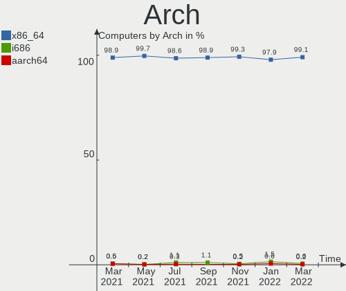

| Name    | Computers | Percent |
|---------|-----------|---------|
| x86_64  | 464       | 99.15%  |
| i686    | 3         | 0.64%   |
| aarch64 | 1         | 0.21%   |

DE
--

Desktop Environment

| Name             | Computers | Percent |
|------------------|-----------|---------|
| KDE5             | 327       | 69.87%  |
| GNOME            | 79        | 16.88%  |
| Unknown          | 21        | 4.49%   |
| XFCE             | 13        | 2.78%   |
| X-Cinnamon       | 7         | 1.5%    |
| MATE             | 6         | 1.28%   |
| LXQt             | 6         | 1.28%   |
| KDE4             | 2         | 0.43%   |
| Cinnamon         | 2         | 0.43%   |
| Unity            | 1         | 0.21%   |
| Pantheon         | 1         | 0.21%   |
| lightdm-xsession | 1         | 0.21%   |
| i3               | 1         | 0.21%   |
| GNOME Classic    | 1         | 0.21%   |

Display Server
--------------

X11 or Wayland

| Name    | Computers | Percent |
|---------|-----------|---------|
| X11     | 267       | 57.05%  |
| Wayland | 181       | 38.68%  |
| Unknown | 13        | 2.78%   |
| Tty     | 7         | 1.5%    |

Display Manager
---------------

SDDM, LightDM, etc.

| Name    | Computers | Percent |
|---------|-----------|---------|
| SDDM    | 323       | 69.02%  |
| GDM     | 59        | 12.61%  |
| Unknown | 44        | 9.4%    |
| LightDM | 23        | 4.91%   |
| GDM3    | 16        | 3.42%   |
| KDM     | 2         | 0.43%   |
| XDM     | 1         | 0.21%   |

OS Lang
-------

Language

| Lang    | Computers | Percent |
|---------|-----------|---------|
| en_US   | 246       | 52.56%  |
| ru_RU   | 76        | 16.24%  |
| fr_FR   | 24        | 5.13%   |
| de_DE   | 15        | 3.21%   |
| C       | 15        | 3.21%   |
| en_GB   | 13        | 2.78%   |
| Unknown | 10        | 2.14%   |
| es_MX   | 9         | 1.92%   |
| es_ES   | 8         | 1.71%   |
| it_IT   | 7         | 1.5%    |
| zh_CN   | 6         | 1.28%   |
| pt_BR   | 6         | 1.28%   |
| pl_PL   | 5         | 1.07%   |
| en_CA   | 4         | 0.85%   |
| en_AU   | 3         | 0.64%   |
| fr_BE   | 2         | 0.43%   |
| en_AG   | 2         | 0.43%   |
| tr_TR   | 1         | 0.21%   |
| sv_SE   | 1         | 0.21%   |
| ja_JP   | 1         | 0.21%   |
| hu_HU   | 1         | 0.21%   |
| fr_CA   | 1         | 0.21%   |
| es_HN   | 1         | 0.21%   |
| es_EC   | 1         | 0.21%   |
| es_CL   | 1         | 0.21%   |
| es_BO   | 1         | 0.21%   |
| es_AR   | 1         | 0.21%   |
| en_SG   | 1         | 0.21%   |
| en_HK   | 1         | 0.21%   |
| en_DK   | 1         | 0.21%   |
| de_CH   | 1         | 0.21%   |
| cs_CZ   | 1         | 0.21%   |
| ca_ES   | 1         | 0.21%   |
| "en_US" | 1         | 0.21%   |

Boot Mode
---------

EFI or BIOS

| Mode | Computers | Percent |
|------|-----------|---------|
| BIOS | 436       | 93.16%  |
| EFI  | 32        | 6.84%   |

Filesystem
----------

Type of filesystem

| Type    | Computers | Percent |
|---------|-----------|---------|
| Overlay | 286       | 61.11%  |
| Ext4    | 155       | 33.12%  |
| Btrfs   | 14        | 2.99%   |
| Xfs     | 6         | 1.28%   |
| Unknown | 3         | 0.64%   |
| Wslfs   | 2         | 0.43%   |
| Zfs     | 1         | 0.21%   |
| Aufs    | 1         | 0.21%   |

Part. scheme
------------

Scheme of partitioning

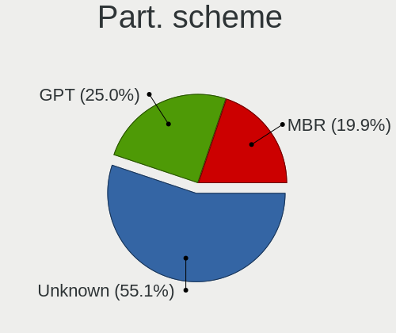

| Type    | Computers | Percent |
|---------|-----------|---------|
| Unknown | 258       | 55.13%  |
| GPT     | 117       | 25%     |
| MBR     | 93        | 19.87%  |

Dual Boot with Linux/BSD
------------------------

Hosting more than one Linux/BSD

| Dual boot | Computers | Percent |
|-----------|-----------|---------|
| No        | 428       | 91.45%  |
| Yes       | 40        | 8.55%   |

Dual Boot (Win)
---------------

Hosting Linux and Windows

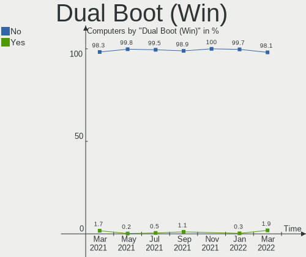

| Dual boot | Computers | Percent |
|-----------|-----------|---------|
| No        | 459       | 98.08%  |
| Yes       | 9         | 1.92%   |

Board
-----

Vendor
------

Motherboard manufacturer

| Name                             | Computers | Percent |
|----------------------------------|-----------|---------|
| Oracle                           | 275       | 58.76%  |
| VMware                           | 95        | 20.3%   |
| QEMU                             | 62        | 13.25%  |
| Microsoft                        | 25        | 5.34%   |
| ChromiumOS                       | 4         | 0.85%   |
| OpenStack Foundation             | 3         | 0.64%   |
| Parallels Software International | 2         | 0.43%   |
| McGhie                           | 1         | 0.21%   |
| Hetzner                          | 1         | 0.21%   |

Model
-----

Motherboard model

| Name                                                        | Computers | Percent |
|-------------------------------------------------------------|-----------|---------|
| Oracle VirtualBox                                           | 275       | 58.76%  |
| VMware Virtual Platform                                     | 90        | 19.23%  |
| QEMU Standard PC (i440FX + PIIX, 1996)                      | 45        | 9.62%   |
| QEMU Standard PC (Q35 + ICH9, 2009)                         | 16        | 3.42%   |
| Microsoft Windows Subsystem for Linux                       | 15        | 3.21%   |
| Microsoft Virtual Machine                                   | 10        | 2.14%   |
| VMware VMware7,1                                            | 5         | 1.07%   |
| ChromiumOS crosvm                                           | 4         | 0.85%   |
| OpenStack Foundation OpenStack Nova                         | 3         | 0.64%   |
| Parallels Software International Parallels Virtual Platform | 2         | 0.43%   |
| QEMU KVM Virtual Machine                                    | 1         | 0.21%   |
| McGhie Debian-10                                            | 1         | 0.21%   |
| Hetzner vServer                                             | 1         | 0.21%   |

Model Family
------------

Motherboard model prefix

| Name                                       | Computers | Percent |
|--------------------------------------------|-----------|---------|
| Oracle VirtualBox                          | 275       | 58.76%  |
| VMware Virtual                             | 90        | 19.23%  |
| QEMU Standard                              | 61        | 13.03%  |
| Microsoft Windows                          | 15        | 3.21%   |
| Microsoft Virtual                          | 10        | 2.14%   |
| VMware VMware7                             | 5         | 1.07%   |
| ChromiumOS crosvm                          | 4         | 0.85%   |
| OpenStack Foundation OpenStack             | 3         | 0.64%   |
| Parallels Software International Parallels | 2         | 0.43%   |
| QEMU KVM                                   | 1         | 0.21%   |
| McGhie Debian-10                           | 1         | 0.21%   |
| Hetzner vServer                            | 1         | 0.21%   |

MFG Year
--------

Motherboard manufacture year

| Year    | Computers | Percent |
|---------|-----------|---------|
| 2006    | 274       | 58.55%  |
| 2020    | 86        | 18.38%  |
| 2014    | 56        | 11.97%  |
| Unknown | 19        | 4.06%   |
| 2021    | 13        | 2.78%   |
| 2015    | 11        | 2.35%   |
| 2019    | 3         | 0.64%   |
| 2018    | 3         | 0.64%   |
| 2017    | 2         | 0.43%   |
| 2016    | 1         | 0.21%   |

Form Factor
-----------

Physical design of the computer

| Name            | Computers | Percent |
|-----------------|-----------|---------|
| Virtual machine | 468       | 100%    |

Secure Boot
-----------

Enabled or disabled

| State    | Computers | Percent |
|----------|-----------|---------|
| Disabled | 468       | 100%    |

Coreboot
--------

Have coreboot on board

| Used | Computers | Percent |
|------|-----------|---------|
| No   | 468       | 100%    |

RAM Size
--------

Total RAM memory

| Size in GB  | Computers | Percent |
|-------------|-----------|---------|
| 1.01-2.0    | 146       | 31.2%   |
| 3.01-4.0    | 126       | 26.92%  |
| 8.01-16.0   | 70        | 14.96%  |
| 4.01-8.0    | 42        | 8.97%   |
| 0.51-1.0    | 34        | 7.26%   |
| 2.01-3.0    | 27        | 5.77%   |
| 16.01-24.0  | 15        | 3.21%   |
| 24.01-32.0  | 4         | 0.85%   |
| 32.01-64.0  | 2         | 0.43%   |
| 64.01-256.0 | 1         | 0.21%   |
| 0.01-0.5    | 1         | 0.21%   |

RAM Used
--------

Used RAM memory

| Used GB    | Computers | Percent |
|------------|-----------|---------|
| 1.01-2.0   | 163       | 34.83%  |
| 0.01-0.5   | 141       | 30.13%  |
| 0.51-1.0   | 136       | 29.06%  |
| 2.01-3.0   | 18        | 3.85%   |
| 4.01-8.0   | 3         | 0.64%   |
| 0          | 2         | 0.43%   |
| Unknown    | 2         | 0.43%   |
| 3.01-4.0   | 1         | 0.21%   |
| 24.01-32.0 | 1         | 0.21%   |
| 8.01-16.0  | 1         | 0.21%   |

Total Drives
------------

Number of drives on board

| Drives | Computers | Percent |
|--------|-----------|---------|
| 1      | 421       | 89.96%  |
| 0      | 31        | 6.62%   |
| 2      | 8         | 1.71%   |
| 3      | 6         | 1.28%   |
| 4      | 2         | 0.43%   |

Has CD-ROM
----------

Has CD-ROM on board

| Presented | Computers | Percent |
|-----------|-----------|---------|
| Yes       | 439       | 93.8%   |
| No        | 29        | 6.2%    |

Has Ethernet
------------

Has Ethernet on board

| Presented | Computers | Percent |
|-----------|-----------|---------|
| Yes       | 398       | 85.04%  |
| No        | 70        | 14.96%  |

Has WiFi
--------

Has WiFi module

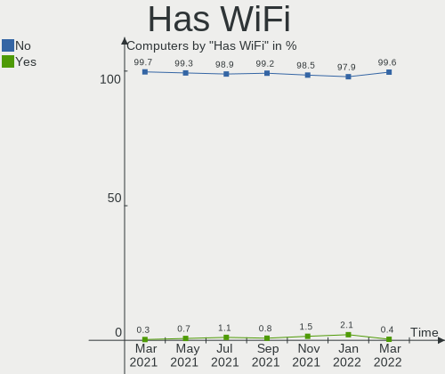

| Presented | Computers | Percent |
|-----------|-----------|---------|
| No        | 466       | 99.57%  |
| Yes       | 2         | 0.43%   |

Has Bluetooth
-------------

Has Bluetooth module

| Presented | Computers | Percent |
|-----------|-----------|---------|
| No        | 431       | 92.09%  |
| Yes       | 37        | 7.91%   |

Location
--------

Country
-------

Geographic location (country)

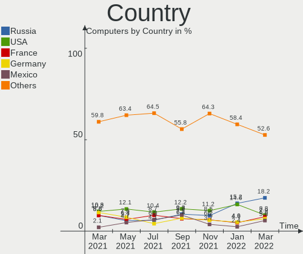

| Country            | Computers | Percent |
|--------------------|-----------|---------|
| Russia             | 85        | 18.16%  |
| USA                | 41        | 8.76%   |
| France             | 37        | 7.91%   |
| Germany            | 32        | 6.84%   |
| Mexico             | 27        | 5.77%   |
| Romania            | 21        | 4.49%   |
| Italy              | 18        | 3.85%   |
| Poland             | 15        | 3.21%   |
| Brazil             | 15        | 3.21%   |
| UK                 | 11        | 2.35%   |
| Spain              | 10        | 2.14%   |
| Moldova            | 10        | 2.14%   |
| China              | 10        | 2.14%   |
| Canada             | 9         | 1.92%   |
| Japan              | 8         | 1.71%   |
| Indonesia          | 7         | 1.5%    |
| India              | 7         | 1.5%    |
| Hungary            | 7         | 1.5%    |
| Honduras           | 6         | 1.28%   |
| Australia          | 6         | 1.28%   |
| Turkey             | 5         | 1.07%   |
| Morocco            | 5         | 1.07%   |
| Bolivia            | 5         | 1.07%   |
| Switzerland        | 4         | 0.85%   |
| Belarus            | 4         | 0.85%   |
| Sweden             | 3         | 0.64%   |
| Norway             | 3         | 0.64%   |
| Denmark            | 3         | 0.64%   |
| Bulgaria           | 3         | 0.64%   |
| Ukraine            | 2         | 0.43%   |
| Taiwan             | 2         | 0.43%   |
| Slovenia           | 2         | 0.43%   |
| Serbia             | 2         | 0.43%   |
| Qatar              | 2         | 0.43%   |
| Netherlands        | 2         | 0.43%   |
| Lebanon            | 2         | 0.43%   |
| Latvia             | 2         | 0.43%   |
| Greece             | 2         | 0.43%   |
| Finland            | 2         | 0.43%   |
| DR Congo           | 2         | 0.43%   |
| Czechia            | 2         | 0.43%   |
| Congo Republic     | 2         | 0.43%   |
| Colombia           | 2         | 0.43%   |
| Chile              | 2         | 0.43%   |
| Belgium            | 2         | 0.43%   |
| Argentina          | 2         | 0.43%   |
| Algeria            | 2         | 0.43%   |
| Tunisia            | 1         | 0.21%   |
| Thailand           | 1         | 0.21%   |
| South Korea        | 1         | 0.21%   |
| Slovakia           | 1         | 0.21%   |
| Singapore          | 1         | 0.21%   |
| Senegal            | 1         | 0.21%   |
| Peru               | 1         | 0.21%   |
| Pakistan           | 1         | 0.21%   |
| Martinique         | 1         | 0.21%   |
| Kazakhstan         | 1         | 0.21%   |
| French Guiana      | 1         | 0.21%   |
| Ecuador            | 1         | 0.21%   |
| Dominican Republic | 1         | 0.21%   |

City
----

Geographic location (city)

| City                   | Computers | Percent |
|------------------------|-----------|---------|
| Moscow                 | 24        | 5.13%   |
| Zalău               | 17        | 3.63%   |
| St Petersburg          | 12        | 2.56%   |
| Paris                  | 9         | 1.92%   |
| Orléans             | 9         | 1.92%   |
| Chisinau               | 8         | 1.71%   |
| Genoa                  | 6         | 1.28%   |
| Tegucigalpa            | 5         | 1.07%   |
| Santa Cruz             | 5         | 1.07%   |
| Warsaw                 | 4         | 0.85%   |
| Mumbai                 | 4         | 0.85%   |
| Krasnodar              | 4         | 0.85%   |
| Izhevsk                | 4         | 0.85%   |
| Guadalajara            | 4         | 0.85%   |
| Ciudad Guzmán       | 4         | 0.85%   |
| Barcelona              | 4         | 0.85%   |
| Zurich                 | 3         | 0.64%   |
| Sofia                  | 3         | 0.64%   |
| Shenzhen               | 3         | 0.64%   |
| Scunthorpe             | 3         | 0.64%   |
| Minsk                  | 3         | 0.64%   |
| Istanbul               | 3         | 0.64%   |
| Guangzhou              | 3         | 0.64%   |
| Colima                 | 3         | 0.64%   |
| Zapopan                | 2         | 0.43%   |
| Yoshkar-Ola            | 2         | 0.43%   |
| Yokohama               | 2         | 0.43%   |
| Yekaterinburg          | 2         | 0.43%   |
| Xalapa                 | 2         | 0.43%   |
| Wiesbaden              | 2         | 0.43%   |
| Tver                   | 2         | 0.43%   |
| Tracadie–Sheila | 2         | 0.43%   |
| Thessaloniki           | 2         | 0.43%   |
| Slagelse               | 2         | 0.43%   |
| Sao Paulo              | 2         | 0.43%   |
| Rennes                 | 2         | 0.43%   |
| Rawson                 | 2         | 0.43%   |
| Prague                 | 2         | 0.43%   |
| Pouso Alegre           | 2         | 0.43%   |
| Port Orange            | 2         | 0.43%   |
| Pontianak              | 2         | 0.43%   |
| Osnabrück           | 2         | 0.43%   |
| Nizhniy Novgorod       | 2         | 0.43%   |
| Murom                  | 2         | 0.43%   |
| Mexico City            | 2         | 0.43%   |
| Melbourne              | 2         | 0.43%   |
| Lubumbashi             | 2         | 0.43%   |
| Los Angeles            | 2         | 0.43%   |
| Ljubljana              | 2         | 0.43%   |
| Kyoto                  | 2         | 0.43%   |
| Krasnystaw             | 2         | 0.43%   |
| Kirov                  | 2         | 0.43%   |
| Kaposvár            | 2         | 0.43%   |
| Kaliningrad            | 2         | 0.43%   |
| JÅ«rmala             | 2         | 0.43%   |
| Jakarta                | 2         | 0.43%   |
| Gilbert                | 2         | 0.43%   |
| Farnborough            | 2         | 0.43%   |
| El Aouinet             | 2         | 0.43%   |
| Doha                   | 2         | 0.43%   |

Drives
------

Drive Vendor
------------

Hard drive vendors

| Vendor   | Computers | Drives | Percent |
|----------|-----------|--------|---------|
| VBOX     | 274       | 275    | 62.7%   |
| VMware   | 95        | 95     | 21.74%  |
| QEMU     | 41        | 41     | 9.38%   |
| Msft     | 23        | 47     | 5.26%   |
| SYNOLOGY | 1         | 1      | 0.23%   |
| ORACLE   | 1         | 1      | 0.23%   |
| Debian-0 | 1         | 1      | 0.23%   |
| Autre    | 1         | 1      | 0.23%   |

Drive Model
-----------

Hard drive models

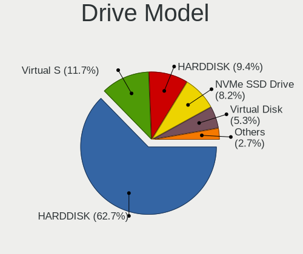

| Model                          | Computers | Percent |
|--------------------------------|-----------|---------|
| VBOX HARDDISK                  | 274       | 62.7%   |
| VMware Virtual S               | 51        | 11.67%  |
| QEMU HARDDISK                  | 41        | 9.38%   |
| VMware NVMe SSD Drive          | 36        | 8.24%   |
| Msft Virtual Disk              | 23        | 5.26%   |
| VMware Virtual disk            | 5         | 1.14%   |
| VMware Virtual SATA Hard Drive | 3         | 0.69%   |
| SYNOLOGY iSCSI Storage         | 1         | 0.23%   |
| ORACLE BlockVolume             | 1         | 0.23%   |
| Debian-0 SSD 138GB             | 1         | 0.23%   |
| Autre Linux-0 SSD 137GB        | 1         | 0.23%   |

HDD Vendor
----------

Hard disk drive vendors

| Vendor   | Computers | Drives | Percent |
|----------|-----------|--------|---------|
| VBOX     | 274       | 275    | 62.99%  |
| VMware   | 95        | 95     | 21.84%  |
| QEMU     | 41        | 41     | 9.43%   |
| Msft     | 23        | 47     | 5.29%   |
| SYNOLOGY | 1         | 1      | 0.23%   |
| ORACLE   | 1         | 1      | 0.23%   |

SSD Vendor
----------

Solid state drive vendors

| Vendor   | Computers | Drives | Percent |
|----------|-----------|--------|---------|
| Debian-0 | 1         | 1      | 50%     |
| Autre    | 1         | 1      | 50%     |

Drive Kind
----------

HDD or SSD

| Kind | Computers | Drives | Percent |
|------|-----------|--------|---------|
| HDD  | 435       | 460    | 99.54%  |
| SSD  | 2         | 2      | 0.46%   |

Drive Connector
---------------

SATA, SAS, NVMe, etc.

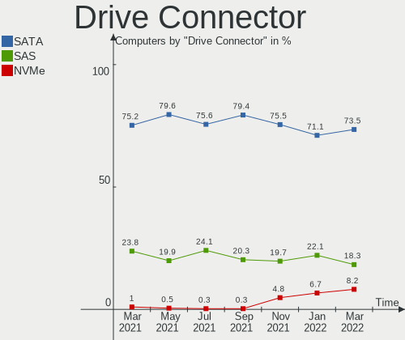

| Type | Computers | Drives | Percent |
|------|-----------|--------|---------|
| SATA | 321       | 322    | 73.46%  |
| SAS  | 80        | 104    | 18.31%  |
| NVMe | 36        | 36     | 8.24%   |

Drive Size
----------

Size of hard drive

| Size in TB | Computers | Drives | Percent |
|------------|-----------|--------|---------|
| 0.01-0.5   | 436       | 461    | 99.77%  |
| 0.51-1.0   | 1         | 1      | 0.23%   |

Space Total
-----------

Amount of disk space available on the file system

| Size in GB | Computers | Percent |
|------------|-----------|---------|
| Unknown    | 255       | 54.49%  |
| 1-20       | 80        | 17.09%  |
| 21-50      | 73        | 15.6%   |
| 51-100     | 28        | 5.98%   |
| 101-250    | 19        | 4.06%   |
| 251-500    | 11        | 2.35%   |
| 1001-2000  | 1         | 0.21%   |
| 501-1000   | 1         | 0.21%   |

Space Used
----------

Amount of used disk space

| Used GB | Computers | Percent |
|---------|-----------|---------|
| Unknown | 255       | 54.49%  |
| 1-20    | 199       | 42.52%  |
| 51-100  | 6         | 1.28%   |
| 21-50   | 4         | 0.85%   |
| 101-250 | 4         | 0.85%   |

Malfunc. Drives
---------------

Drive models with a malfunction

Zero info for selected period =(

Malfunc. Drive Vendor
---------------------

Vendors of faulty drives

Zero info for selected period =(

Malfunc. HDD Vendor
-------------------

Vendors of faulty HDD drives

Zero info for selected period =(

Malfunc. Drive Kind
-------------------

Kinds of faulty drives

Zero info for selected period =(

Failed Drives
-------------

Failed drive models

Zero info for selected period =(

Failed Drive Vendor
-------------------

Failed drive vendors

Zero info for selected period =(

Drive Status
------------

Number of failed and malfunc. drives

| Status   | Computers | Drives | Percent |
|----------|-----------|--------|---------|
| Detected | 413       | 438    | 94.51%  |
| Works    | 24        | 24     | 5.49%   |

Storage controller
------------------

Storage Vendor
--------------

Storage controller vendors

| Vendor                    | Computers | Percent |
|---------------------------|-----------|---------|
| Intel                     | 440       | 73.33%  |
| VMware                    | 58        | 9.67%   |
| LSI Logic / Symbios Logic | 57        | 9.5%    |
| Red Hat                   | 45        | 7.5%    |

Storage Model
-------------

Storage controller models

| Model                                                                 | Computers | Percent |
|-----------------------------------------------------------------------|-----------|---------|
| Intel 82371AB/EB/MB PIIX4 IDE                                         | 358       | 42.12%  |
| Intel 82801HM/HEM (ICH8M/ICH8M-E) SATA Controller [AHCI mode]         | 253       | 29.76%  |
| LSI Logic / Symbios Logic 53c1030 PCI-X Fusion-MPT Dual Ultra320 SCSI | 57        | 6.71%   |
| Intel 82371SB PIIX3 IDE [Natoma/Triton II]                            | 50        | 5.88%   |
| VMware NVMe SSD Controller                                            | 36        | 4.24%   |
| VMware SATA AHCI controller                                           | 22        | 2.59%   |
| Red Hat Virtio SCSI                                                   | 21        | 2.47%   |
| Red Hat Virtio block device                                           | 21        | 2.47%   |
| Intel 82801IR/IO/IH (ICH9R/DO/DH) 6 port SATA Controller [AHCI mode]  | 20        | 2.35%   |
| Red Hat Virtio filesystem                                             | 4         | 0.47%   |
| VMware PVSCSI SCSI Controller                                         | 2         | 0.24%   |
| Intel 82801HR/HO/HH (ICH8R/DO/DH) 6 port SATA Controller [AHCI mode]  | 2         | 0.24%   |
| Intel 82801BA IDE U100 Controller                                     | 2         | 0.24%   |
| Intel 631xESB/632xESB IDE Controller                                  | 2         | 0.24%   |

Storage Kind
------------

Kind of storage controller (IDE, SATA, NVMe, SAS, ...)

| Kind | Computers | Percent |
|------|-----------|---------|
| IDE  | 412       | 48.53%  |
| SATA | 297       | 34.98%  |
| SCSI | 102       | 12.01%  |
| NVMe | 36        | 4.24%   |
| SAS  | 2         | 0.24%   |

Processor
---------

CPU Vendor
----------

Processor vendors

| Vendor       | Computers | Percent |
|--------------|-----------|---------|
| Intel        | 349       | 74.57%  |
| AMD          | 116       | 24.79%  |
| HygonGenuine | 2         | 0.43%   |
| QEMU         | 1         | 0.21%   |

CPU Model
---------

Processor models

| Model                                       | Computers | Percent |
|---------------------------------------------|-----------|---------|
| Intel Core i3-4005U CPU @ 1.70GHz           | 12        | 2.56%   |
| Intel 11th Gen Core i5-1135G7 @ 2.40GHz     | 12        | 2.56%   |
| AMD Ryzen 5 3400G with Radeon Vega Graphics | 9         | 1.92%   |
| Intel Core Processor (Skylake, IBRS)        | 8         | 1.71%   |
| Intel Core i3-2310M CPU @ 2.10GHz           | 8         | 1.71%   |
| Intel Common KVM processor                  | 7         | 1.5%    |
| Intel Core i9-9900K CPU @ 3.60GHz           | 6         | 1.28%   |
| Intel Core i7-7700HQ CPU @ 2.80GHz          | 6         | 1.28%   |
| AMD Ryzen 5 3600 6-Core Processor           | 6         | 1.28%   |
| AMD Ryzen 5 2600 Six-Core Processor         | 6         | 1.28%   |
| Intel Core i7-8565U CPU @ 1.80GHz           | 5         | 1.07%   |
| Intel Core i7-10750H CPU @ 2.60GHz          | 5         | 1.07%   |
| Intel Core i5-3570 CPU @ 3.40GHz            | 5         | 1.07%   |
| Intel Core i5-10210U CPU @ 1.60GHz          | 5         | 1.07%   |
| AMD Ryzen 7 3700X 8-Core Processor          | 5         | 1.07%   |
| Intel Core i7-8650U CPU @ 1.90GHz           | 4         | 0.85%   |
| Intel Core i7-10510U CPU @ 1.80GHz          | 4         | 0.85%   |
| Intel Core i5-9600K CPU @ 3.70GHz           | 4         | 0.85%   |
| Intel Core i5-9400F CPU @ 2.90GHz           | 4         | 0.85%   |
| Intel Core i5-8400 CPU @ 2.80GHz            | 4         | 0.85%   |
| Intel Core i5-7400 CPU @ 3.00GHz            | 4         | 0.85%   |
| Intel Core i5-5200U CPU @ 2.20GHz           | 4         | 0.85%   |
| Intel Core i5-4460 CPU @ 3.20GHz            | 4         | 0.85%   |
| Intel Core i5-1035G1 CPU @ 1.00GHz          | 4         | 0.85%   |
| Intel Core i3-7020U CPU @ 2.30GHz           | 4         | 0.85%   |
| Intel Pentium CPU G4400 @ 3.30GHz           | 3         | 0.64%   |
| Intel Core i7-9700K CPU @ 3.60GHz           | 3         | 0.64%   |
| Intel Core i7-8550U CPU @ 1.80GHz           | 3         | 0.64%   |
| Intel Core i7-7700K CPU @ 4.20GHz           | 3         | 0.64%   |
| Intel Core i7-4790 CPU @ 3.60GHz            | 3         | 0.64%   |
| Intel Core i7-3770K CPU @ 3.50GHz           | 3         | 0.64%   |
| Intel Core i5-9300H CPU @ 2.40GHz           | 3         | 0.64%   |
| Intel Core i5-8265U CPU @ 1.60GHz           | 3         | 0.64%   |
| Intel Core i5-8250U CPU @ 1.60GHz           | 3         | 0.64%   |
| Intel Core i5-7600K CPU @ 3.80GHz           | 3         | 0.64%   |
| Intel Core i5-7200U CPU @ 2.50GHz           | 3         | 0.64%   |
| Intel Core i5-6600K CPU @ 3.50GHz           | 3         | 0.64%   |
| Intel Core i5-4210U CPU @ 1.70GHz           | 3         | 0.64%   |
| Intel Core i5-2400 CPU @ 3.10GHz            | 3         | 0.64%   |
| Intel Core i3-8100 CPU @ 3.60GHz            | 3         | 0.64%   |
| Intel Core i3-7100 CPU @ 3.90GHz            | 3         | 0.64%   |
| Intel Core i3-5005U CPU @ 2.00GHz           | 3         | 0.64%   |
| Intel 11th Gen Core i7-1165G7 @ 2.80GHz     | 3         | 0.64%   |
| AMD Ryzen 7 5700U with Radeon Graphics      | 3         | 0.64%   |
| AMD Ryzen 5 2400G with Radeon Vega Graphics | 3         | 0.64%   |
| AMD Phenom II X4 B93 Processor              | 3         | 0.64%   |
| Intel Xeon Processor (Cooperlake)           | 2         | 0.43%   |
| Intel Xeon CPU E5-2620 v2 @ 2.10GHz         | 2         | 0.43%   |
| Intel Xeon CPU E5-2620 0 @ 2.00GHz          | 2         | 0.43%   |
| Intel Core i7-8750H CPU @ 2.20GHz           | 2         | 0.43%   |
| Intel Core i7-7700 CPU @ 3.60GHz            | 2         | 0.43%   |
| Intel Core i7-6820HQ CPU @ 2.70GHz          | 2         | 0.43%   |
| Intel Core i7-6500U CPU @ 2.50GHz           | 2         | 0.43%   |
| Intel Core i7-4770K CPU @ 3.50GHz           | 2         | 0.43%   |
| Intel Core i7-3770 CPU @ 3.40GHz            | 2         | 0.43%   |
| Intel Core i7-2600 CPU @ 3.40GHz            | 2         | 0.43%   |
| Intel Core i7-1065G7 CPU @ 1.30GHz          | 2         | 0.43%   |
| Intel Core i5-9300HF CPU @ 2.40GHz          | 2         | 0.43%   |
| Intel Core i5-8600K CPU @ 3.60GHz           | 2         | 0.43%   |
| Intel Core i5-8500 CPU @ 3.00GHz            | 2         | 0.43%   |

CPU Model Family
----------------

Processor model prefix

| Model                   | Computers | Percent |
|-------------------------|-----------|---------|
| Intel Core i5           | 107       | 22.86%  |
| Intel Core i7           | 79        | 16.88%  |
| Intel Core i3           | 55        | 11.75%  |
| Other                   | 49        | 10.47%  |
| AMD Ryzen 5             | 38        | 8.12%   |
| Intel Xeon              | 26        | 5.56%   |
| AMD Ryzen 7             | 20        | 4.27%   |
| Intel Core i9           | 12        | 2.56%   |
| Intel Core              | 10        | 2.14%   |
| Intel Pentium           | 8         | 1.71%   |
| Intel Celeron           | 8         | 1.71%   |
| AMD Ryzen 9             | 7         | 1.5%    |
| AMD EPYC                | 7         | 1.5%    |
| AMD FX                  | 5         | 1.07%   |
| AMD Ryzen 3             | 4         | 0.85%   |
| AMD A8                  | 4         | 0.85%   |
| AMD A10                 | 4         | 0.85%   |
| AMD Phenom II X4        | 3         | 0.64%   |
| AMD A6                  | 3         | 0.64%   |
| Intel Xeon Gold         | 2         | 0.43%   |
| AMD Ryzen 3 PRO         | 2         | 0.43%   |
| AMD Opteron             | 2         | 0.43%   |
| AMD Athlon X4           | 2         | 0.43%   |
| AMD A4                  | 2         | 0.43%   |
| AMD A12                 | 2         | 0.43%   |
| Intel Pentium Gold      | 1         | 0.21%   |
| Intel Pentium Dual-Core | 1         | 0.21%   |
| Intel Core 2 Quad       | 1         | 0.21%   |
| AMD Phenom II X6        | 1         | 0.21%   |
| AMD Phenom              | 1         | 0.21%   |
| AMD E1                  | 1         | 0.21%   |
| AMD Athlon II X2        | 1         | 0.21%   |

CPU Cores
---------

Number of processor cores

| Number | Computers | Percent |
|--------|-----------|---------|
| 1      | 214       | 45.73%  |
| 2      | 110       | 23.5%   |
| 4      | 85        | 18.16%  |
| 6      | 18        | 3.85%   |
| 8      | 16        | 3.42%   |
| 3      | 16        | 3.42%   |
| 16     | 3         | 0.64%   |
| 12     | 3         | 0.64%   |
| 38     | 1         | 0.21%   |
| 32     | 1         | 0.21%   |
| 10     | 1         | 0.21%   |

CPU Sockets
-----------

Number of sockets

| Number | Computers | Percent |
|--------|-----------|---------|
| 1      | 385       | 82.26%  |
| 2      | 56        | 11.97%  |
| 4      | 19        | 4.06%   |
| 8      | 6         | 1.28%   |
| 6      | 1         | 0.21%   |
| 3      | 1         | 0.21%   |

CPU Threads
-----------

Threads per core (Hyper-Threading)

| Number | Computers | Percent |
|--------|-----------|---------|
| 1      | 435       | 92.95%  |
| 2      | 33        | 7.05%   |

CPU Op-Modes
------------

CPU Operation Modes (32-bit, 64-bit)

| Op mode        | Computers | Percent |
|----------------|-----------|---------|
| 32-bit, 64-bit | 466       | 99.57%  |
| 64-bit         | 1         | 0.21%   |
| 32-bit         | 1         | 0.21%   |

CPU Microcode
-------------

Microcode number

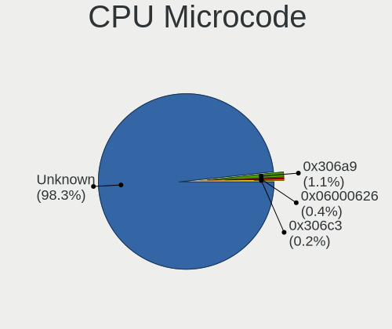

| Number     | Computers | Percent |
|------------|-----------|---------|
| Unknown    | 460       | 98.29%  |
| 0x306a9    | 5         | 1.07%   |
| 0x06000626 | 2         | 0.43%   |
| 0x306c3    | 1         | 0.21%   |

CPU Microarch
-------------

Microarchitecture

| Name          | Computers | Percent |
|---------------|-----------|---------|
| KabyLake      | 113       | 24.15%  |
| Haswell       | 49        | 10.47%  |
| Skylake       | 40        | 8.55%   |
| IvyBridge     | 34        | 7.26%   |
| Zen 2         | 31        | 6.62%   |
| SandyBridge   | 28        | 5.98%   |
| Zen+          | 23        | 4.91%   |
| TigerLake     | 19        | 4.06%   |
| Unknown       | 18        | 3.85%   |
| CometLake     | 13        | 2.78%   |
| Zen           | 11        | 2.35%   |
| Piledriver    | 10        | 2.14%   |
| Zen 3         | 9         | 1.92%   |
| IceLake       | 9         | 1.92%   |
| Broadwell     | 9         | 1.92%   |
| Excavator     | 8         | 1.71%   |
| NetBurst      | 7         | 1.5%    |
| K10           | 7         | 1.5%    |
| Goldmont plus | 5         | 1.07%   |
| Westmere      | 4         | 0.85%   |
| Steamroller   | 4         | 0.85%   |
| Nehalem       | 4         | 0.85%   |
| Puma          | 3         | 0.64%   |
| K8 Hammer     | 3         | 0.64%   |
| Penryn        | 2         | 0.43%   |
| Silvermont    | 1         | 0.21%   |
| Jaguar        | 1         | 0.21%   |
| Goldmont      | 1         | 0.21%   |
| Core          | 1         | 0.21%   |
| Bulldozer     | 1         | 0.21%   |

Graphics
--------

GPU Vendor
----------

Vendors of graphics cards

| Vendor                 | Computers | Percent |
|------------------------|-----------|---------|
| VMware                 | 330       | 72.69%  |
| Red Hat                | 54        | 11.89%  |
| InnoTek Systemberatung | 41        | 9.03%   |
| Technical              | 14        | 3.08%   |
| Microsoft              | 12        | 2.64%   |
| Cirrus Logic           | 3         | 0.66%   |

GPU Model
---------

Graphics card models

| Model                                              | Computers | Percent |
|----------------------------------------------------|-----------|---------|
| VMware SVGA II Adapter                             | 330       | 72.69%  |
| InnoTek Systemberatung VirtualBox Graphics Adapter | 41        | 9.03%   |
| Red Hat QXL paravirtual graphic card               | 34        | 7.49%   |
| Red Hat Virtio GPU                                 | 20        | 4.41%   |
| Technical VGA compatible controller                | 14        | 3.08%   |
| Microsoft Virtual Render                           | 9         | 1.98%   |
| Microsoft Hyper-V virtual VGA                      | 3         | 0.66%   |
| Cirrus Logic GD 5446                               | 3         | 0.66%   |

GPU Combo
---------

Combinations of graphics cards

| Name                       | Computers | Percent |
|----------------------------|-----------|---------|
| 1 x VMware                 | 330       | 70.51%  |
| 1 x Red Hat                | 53        | 11.32%  |
| 1 x InnoTek Systemberatung | 41        | 8.76%   |
| Other                      | 28        | 5.98%   |
| 1 x Microsoft              | 12        | 2.56%   |
| 1 x Cirrus Logic           | 3         | 0.64%   |
| 1 x Virtio:                | 1         | 0.21%   |

GPU Driver
----------

Free vs proprietary

| Driver  | Computers | Percent |
|---------|-----------|---------|
| Unknown | 468       | 100%    |

GPU Memory
----------

Total video memory

| Size in GB | Computers | Percent |
|------------|-----------|---------|
| Unknown    | 468       | 100%    |

Monitor
-------

Monitor Vendor
--------------

Monitor vendors

| Vendor | Computers | Percent |
|--------|-----------|---------|
| RHT    | 24        | 100%    |

Monitor Model
-------------

Monitor models

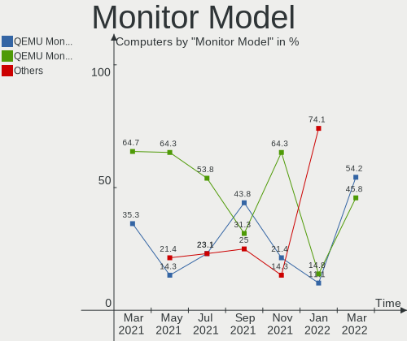

| Model                                                  | Computers | Percent |
|--------------------------------------------------------|-----------|---------|
| RHT QEMU Monitor RHT1234 2048x1152 260x195mm 12.8-inch | 13        | 54.17%  |
| RHT QEMU Monitor RHT1234 2048x1152 260x190mm 12.7-inch | 11        | 45.83%  |

Monitor Resolution
------------------

Monitor screen resolution

| Resolution | Computers | Percent |
|------------|-----------|---------|
| 2048x1152  | 13        | 54.17%  |
| 3196x1798  | 11        | 45.83%  |

Monitor Diagonal
----------------

Diagonal size in inches

| Inches | Computers | Percent |
|--------|-----------|---------|
| 19     | 13        | 54.17%  |
| 33     | 11        | 45.83%  |

Monitor Width
-------------

Physical width

| Width in mm | Computers | Percent |
|-------------|-----------|---------|
| 401-500     | 13        | 54.17%  |
| 701-800     | 11        | 45.83%  |

Aspect Ratio
------------

Proportional relationship between the width and the height

| Ratio | Computers | Percent |
|-------|-----------|---------|
| 4/3   | 13        | 54.17%  |
| 16/9  | 11        | 45.83%  |

Monitor Area
------------

Area in inch²

| Area in inch² | Computers | Percent |
|----------------|-----------|---------|
| 151-200        | 13        | 54.17%  |
| 351-500        | 11        | 45.83%  |

Pixel Density
-------------

Pixels per inch

| Density | Computers | Percent |
|---------|-----------|---------|
| 101-120 | 13        | 54.17%  |
| 51-100  | 11        | 45.83%  |

Multiple Monitors
-----------------

Total monitors connected

| Total | Computers | Percent |
|-------|-----------|---------|
| 0     | 259       | 55.34%  |
| 1     | 209       | 44.66%  |

Network
-------

Net Controller Vendor
---------------------

Controller vendors

| Vendor                | Computers | Percent |
|-----------------------|-----------|---------|
| Intel                 | 337       | 76.77%  |
| Red Hat               | 38        | 8.66%   |
| VMware                | 35        | 7.97%   |
| Realtek Semiconductor | 16        | 3.64%   |
| AMD                   | 11        | 2.51%   |
| Qualcomm Atheros      | 1         | 0.23%   |
| Allwinner Technology  | 1         | 0.23%   |

Net Controller Model
--------------------

Controller models

| Model                                                           | Computers | Percent |
|-----------------------------------------------------------------|-----------|---------|
| Intel 82540EM Gigabit Ethernet Controller                       | 287       | 65.38%  |
| Intel 82545EM Gigabit Ethernet Controller (Copper)              | 50        | 11.39%  |
| Red Hat Virtio network device                                   | 38        | 8.66%   |
| VMware VMXNET3 Ethernet Controller                              | 35        | 7.97%   |
| Realtek RTL-8100/8101L/8139 PCI Fast Ethernet Adapter           | 15        | 3.42%   |
| AMD 79c970 [PCnet32 LANCE]                                      | 11        | 2.51%   |
| Realtek RTL88x2bu [AC1200 Techkey]                              | 1         | 0.23%   |
| Qualcomm Atheros QCA986x/988x 802.11ac Wireless Network Adapter | 1         | 0.23%   |
| Allwinner sunxi SoC OTG connector in FEL/flashing mode          | 1         | 0.23%   |

Wireless Vendor
---------------

Wireless vendors

| Vendor                | Computers | Percent |
|-----------------------|-----------|---------|
| Realtek Semiconductor | 1         | 50%     |
| Qualcomm Atheros      | 1         | 50%     |

Wireless Model
--------------

Wireless models

| Model                                                           | Computers | Percent |
|-----------------------------------------------------------------|-----------|---------|
| Realtek RTL88x2bu [AC1200 Techkey]                              | 1         | 50%     |
| Qualcomm Atheros QCA986x/988x 802.11ac Wireless Network Adapter | 1         | 50%     |

Ethernet Vendor
---------------

Ethernet vendors

| Vendor                | Computers | Percent |
|-----------------------|-----------|---------|
| Intel                 | 337       | 84.67%  |
| VMware                | 35        | 8.79%   |
| Realtek Semiconductor | 15        | 3.77%   |
| AMD                   | 11        | 2.76%   |

Ethernet Model
--------------

Ethernet models

| Model                                                 | Computers | Percent |
|-------------------------------------------------------|-----------|---------|
| Intel 82540EM Gigabit Ethernet Controller             | 287       | 72.11%  |
| Intel 82545EM Gigabit Ethernet Controller (Copper)    | 50        | 12.56%  |
| VMware VMXNET3 Ethernet Controller                    | 35        | 8.79%   |
| Realtek RTL-8100/8101L/8139 PCI Fast Ethernet Adapter | 15        | 3.77%   |
| AMD 79c970 [PCnet32 LANCE]                            | 11        | 2.76%   |

Net Controller Kind
-------------------

Ethernet, WiFi or modem

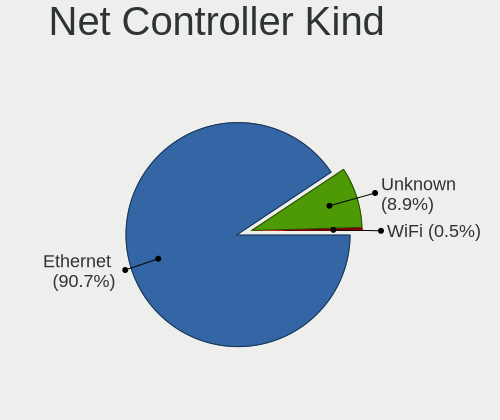

| Kind     | Computers | Percent |
|----------|-----------|---------|
| Ethernet | 398       | 90.66%  |
| Unknown  | 39        | 8.88%   |
| WiFi     | 2         | 0.46%   |

Used Controller
---------------

Currently used network controller

| Kind     | Computers | Percent |
|----------|-----------|---------|
| Ethernet | 398       | 100%    |

NICs
----

Total network controllers on board

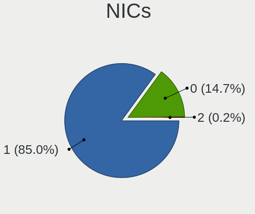

| Total | Computers | Percent |
|-------|-----------|---------|
| 1     | 398       | 85.04%  |
| 0     | 69        | 14.74%  |
| 2     | 1         | 0.21%   |

IPv6
----

IPv6 vs IPv4

| Used | Computers | Percent |
|------|-----------|---------|
| No   | 446       | 95.3%   |
| Yes  | 22        | 4.7%    |

Bluetooth
---------

Bluetooth Vendor
----------------

Controller vendors

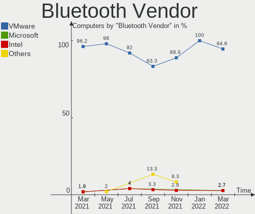

| Vendor    | Computers | Percent |
|-----------|-----------|---------|
| VMware    | 35        | 94.59%  |
| Microsoft | 1         | 2.7%    |
| Intel     | 1         | 2.7%    |

Bluetooth Model
---------------

Controller models

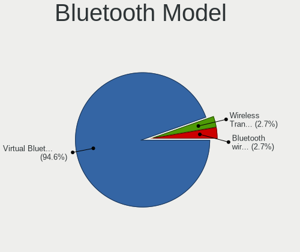

| Model                                        | Computers | Percent |
|----------------------------------------------|-----------|---------|
| VMware Virtual Bluetooth Adapter             | 35        | 94.59%  |
| Microsoft Wireless Transceiver for Bluetooth | 1         | 2.7%    |
| Intel Bluetooth wireless interface           | 1         | 2.7%    |

Sound
-----

Sound Vendor
------------

Sound card vendors

| Vendor              | Computers | Percent |
|---------------------|-----------|---------|
| Intel               | 323       | 77.46%  |
| Ensoniq             | 89        | 21.34%  |
| Logitech            | 3         | 0.72%   |
| Native Instruments  | 1         | 0.24%   |
| Kingston Technology | 1         | 0.24%   |

Sound Model
-----------

Sound card models

| Model                                                                      | Computers | Percent |
|----------------------------------------------------------------------------|-----------|---------|
| Intel 82801AA AC'97 Audio Controller                                       | 265       | 63.55%  |
| Ensoniq ES1371/ES1373 / Creative Labs CT2518                               | 89        | 21.34%  |
| Intel 82801FB/FBM/FR/FW/FRW (ICH6 Family) High Definition Audio Controller | 40        | 9.59%   |
| Intel 82801I (ICH9 Family) HD Audio Controller                             | 16        | 3.84%   |
| Logitech [G533 Wireless Headset Dongle]                                    | 2         | 0.48%   |
| Intel 82801BA/BAM AC'97 Audio Controller                                   | 2         | 0.48%   |
| Native Instruments Komplete Audio 6 MK2                                    | 1         | 0.24%   |
| Logitech G635 Gaming Headset                                               | 1         | 0.24%   |
| Kingston Technology HyperX Cloud Flight S                                  | 1         | 0.24%   |

Memory
------

Memory Vendor
-------------

Memory module vendors

| Vendor             | Computers | Percent |
|--------------------|-----------|---------|
| QEMU               | 60        | 37.74%  |
| Unknown            | 50        | 31.45%  |
| Unknown            | 38        | 23.9%   |
| Microsoft          | 6         | 3.77%   |
| VMware Virtual RAM | 5         | 3.14%   |

Memory Model
------------

Memory module models

| Model                                           | Computers | Percent |
|-------------------------------------------------|-----------|---------|
| Unknown                                         | 50        | 28.41%  |
| Unknown RAM Module 2GB DIMM DRAM                | 32        | 18.18%  |
| QEMU RAM Module 2GB DIMM RAM                    | 12        | 6.82%   |
| QEMU RAM Module 4GB DIMM RAM                    | 10        | 5.68%   |
| Unknown RAM Module 256MB DIMM DRAM              | 6         | 3.41%   |
| Unknown RAM Module 1GB DIMM DRAM                | 6         | 3.41%   |
| QEMU RAM Module 8GB DIMM RAM                    | 5         | 2.84%   |
| Unknown RAM Module 128MB DIMM DRAM              | 4         | 2.27%   |
| QEMU RAM Module 1024MB DIMM RAM                 | 4         | 2.27%   |
| VMware Virtual RAM RAM VMW-8192MB 8GB DIMM DRAM | 3         | 1.7%    |
| Microsoft RAM Module 3968MB                     | 3         | 1.7%    |
| Microsoft RAM Module 128MB                      | 3         | 1.7%    |
| VMware Virtual RAM RAM VMW-4096MB 4GB DIMM DRAM | 2         | 1.14%   |
| Unknown RAM Module 512MB DIMM DRAM              | 2         | 1.14%   |
| QEMU RAM Module 4096MB DIMM RAM                 | 2         | 1.14%   |
| QEMU RAM Module 16GB DIMM RAM                   | 2         | 1.14%   |
| Microsoft RAM Module 3GB                        | 2         | 1.14%   |
| VMware Virtual RAM RAM VMW-4MB 4MB DIMM DRAM    | 1         | 0.57%   |
| Unknown RAM Module 4096MB DIMM DRAM             | 1         | 0.57%   |
| QEMU RAM Module 8479MB DIMM RAM                 | 1         | 0.57%   |
| QEMU RAM Module 8230MB DIMM RAM                 | 1         | 0.57%   |
| QEMU RAM Module 8192MB DIMM RAM                 | 1         | 0.57%   |
| QEMU RAM Module 8096MB DIMM RAM                 | 1         | 0.57%   |
| QEMU RAM Module 768MB DIMM RAM                  | 1         | 0.57%   |
| QEMU RAM Module 7616MB DIMM RAM                 | 1         | 0.57%   |
| QEMU RAM Module 6000MB DIMM RAM                 | 1         | 0.57%   |
| QEMU RAM Module 5GB DIMM RAM                    | 1         | 0.57%   |
| QEMU RAM Module 5518MB DIMM RAM                 | 1         | 0.57%   |
| QEMU RAM Module 5096MB DIMM RAM                 | 1         | 0.57%   |
| QEMU RAM Module 4116MB DIMM RAM                 | 1         | 0.57%   |
| QEMU RAM Module 4078MB DIMM RAM                 | 1         | 0.57%   |
| QEMU RAM Module 4070MB DIMM RAM                 | 1         | 0.57%   |
| QEMU RAM Module 4000MB DIMM RAM                 | 1         | 0.57%   |
| QEMU RAM Module 3GB DIMM RAM                    | 1         | 0.57%   |
| QEMU RAM Module 3776MB DIMM RAM                 | 1         | 0.57%   |
| QEMU RAM Module 3070MB DIMM RAM                 | 1         | 0.57%   |
| QEMU RAM Module 3050MB DIMM RAM                 | 1         | 0.57%   |
| QEMU RAM Module 3024MB DIMM RAM                 | 1         | 0.57%   |
| QEMU RAM Module 3000MB DIMM RAM                 | 1         | 0.57%   |
| QEMU RAM Module 2518MB DIMM RAM                 | 1         | 0.57%   |
| QEMU RAM Module 2095MB DIMM RAM                 | 1         | 0.57%   |
| QEMU RAM Module 2000MB DIMM RAM                 | 1         | 0.57%   |
| QEMU RAM Module 1GB DIMM RAM                    | 1         | 0.57%   |
| QEMU RAM Module 10778MB DIMM RAM                | 1         | 0.57%   |
| Microsoft RAM Module 1GB                        | 1         | 0.57%   |

Memory Kind
-----------

Memory module kinds

| Kind    | Computers | Percent |
|---------|-----------|---------|
| DRAM    | 84        | 56%     |
| RAM     | 60        | 40%     |
| Unknown | 6         | 4%      |

Memory Form Factor
------------------

Physical design of the memory module

| Name    | Computers | Percent |
|---------|-----------|---------|
| DIMM    | 143       | 95.33%  |
| Unknown | 6         | 4%      |
| SODIMM  | 1         | 0.67%   |

Memory Size
-----------

Memory module size

| Size  | Computers | Percent |
|-------|-----------|---------|
| 2048  | 44        | 23.04%  |
| 4096  | 42        | 21.99%  |
| 8192  | 26        | 13.61%  |
| 1024  | 12        | 6.28%   |
| 16384 | 7         | 3.66%   |
| 128   | 7         | 3.66%   |
| 256   | 6         | 3.14%   |
| 4     | 6         | 3.14%   |
| 64    | 4         | 2.09%   |
| 3968  | 3         | 1.57%   |
| 3072  | 3         | 1.57%   |
| 32    | 3         | 1.57%   |
| 512   | 2         | 1.05%   |
| 16    | 2         | 1.05%   |
| 8     | 2         | 1.05%   |
| 10778 | 1         | 0.52%   |
| 8479  | 1         | 0.52%   |
| 8230  | 1         | 0.52%   |
| 8096  | 1         | 0.52%   |
| 7616  | 1         | 0.52%   |
| 6000  | 1         | 0.52%   |
| 5518  | 1         | 0.52%   |
| 5120  | 1         | 0.52%   |
| 5096  | 1         | 0.52%   |
| 4116  | 1         | 0.52%   |
| 4078  | 1         | 0.52%   |
| 4070  | 1         | 0.52%   |
| 4000  | 1         | 0.52%   |
| 3776  | 1         | 0.52%   |
| 3070  | 1         | 0.52%   |
| 3050  | 1         | 0.52%   |
| 3024  | 1         | 0.52%   |
| 3000  | 1         | 0.52%   |
| 2518  | 1         | 0.52%   |
| 2095  | 1         | 0.52%   |
| 2000  | 1         | 0.52%   |
| 768   | 1         | 0.52%   |

Memory Speed
------------

Memory module speed

| Speed   | Computers | Percent |
|---------|-----------|---------|
| Unknown | 148       | 98.67%  |
| 667     | 2         | 1.33%   |

Printers & scanners
-------------------

Printer Vendor
--------------

Printer device vendors

| Vendor    | Computers | Percent |
|-----------|-----------|---------|
| PARALLELS | 2         | 100%    |

Printer Model
-------------

Printer device models

| Model                                                                                  | Computers | Percent |
|----------------------------------------------------------------------------------------|-----------|---------|
| PARALLELS Virtual Printer (/Users/jean/Parallels/OpenMandriva Lx 4.3.pvm/parallel.txt) | 2         | 100%    |

Scanner Vendor
--------------

Scanner device vendors

Zero info for selected period =(

Scanner Model
-------------

Scanner device models

Zero info for selected period =(

Camera
------

Camera Vendor
-------------

Camera device vendors

| Vendor                      | Computers | Percent |
|-----------------------------|-----------|---------|
| VMware                      | 5         | 50%     |
| PARALLELS                   | 2         | 20%     |
| Logitech                    | 2         | 20%     |
| Luxvisions Innotech Limited | 1         | 10%     |

Camera Model
------------

Camera device models

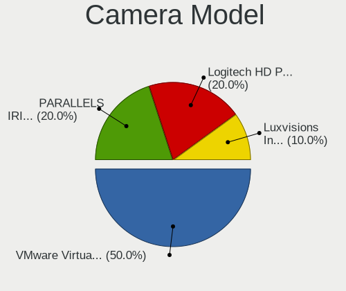

| Model                                               | Computers | Percent |
|-----------------------------------------------------|-----------|---------|
| VMware Virtual USB Video Device                     | 5         | 50%     |
| PARALLELS IRIScan Desk 5 Pro                        | 2         | 20%     |
| Logitech HD Pro Webcam C920                         | 2         | 20%     |
| Luxvisions Innotech Limited HP TrueVision HD Camera | 1         | 10%     |

Security
--------

Fingerprint Vendor
------------------

Fingerprint sensor vendors

Zero info for selected period =(

Fingerprint Model
-----------------

Fingerprint sensor models

Zero info for selected period =(

Chipcard Vendor
---------------

Chipcard module vendors

| Vendor                | Computers | Percent |
|-----------------------|-----------|---------|
| Gemalto (was Gemplus) | 21        | 100%    |

Chipcard Model
--------------

Chipcard module models

| Model                               | Computers | Percent |
|-------------------------------------|-----------|---------|
| Gemalto (was Gemplus) GemPC433-Swap | 21        | 100%    |

Unsupported
-----------

Unsupported Devices
-------------------

Total unsupported devices on board

| Total | Computers | Percent |
|-------|-----------|---------|
| 0     | 271       | 57.91%  |
| 1     | 194       | 41.45%  |
| 2     | 3         | 0.64%   |

Unsupported Device Types
------------------------

Types of unsupported devices

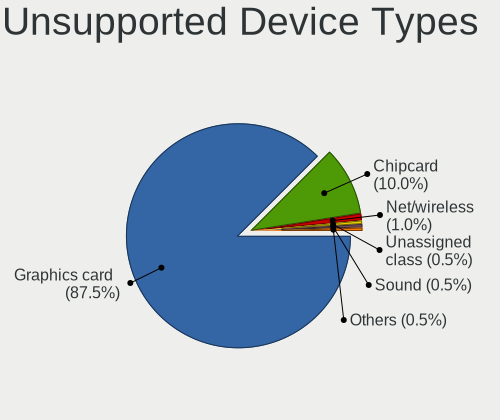

| Type             | Computers | Percent |
|------------------|-----------|---------|
| Graphics card    | 175       | 87.5%   |
| Chipcard         | 20        | 10%     |
| Net/wireless     | 2         | 1%      |
| Unassigned class | 1         | 0.5%    |
| Sound            | 1         | 0.5%    |
| Network          | 1         | 0.5%    |

