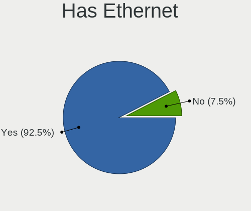
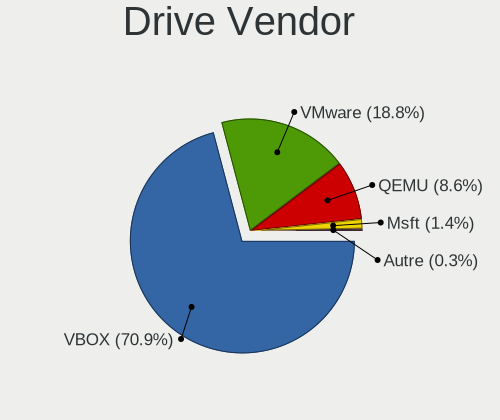
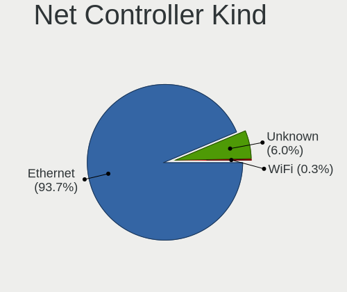
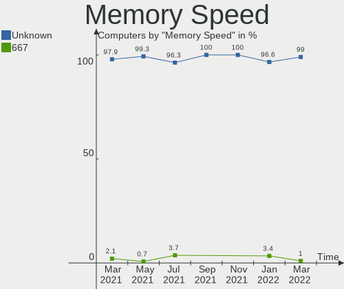

OpenMandriva Virtual Hardware Trends
------------------------------------

A project to identify most popular virtual hardware characteristics and track their change
over time based on data collected by OpenMandriva users at https://Linux-Hardware.org.

Anyone can contribute to this report by the [hw-probe](https://github.com/linuxhw/hw-probe) tool:

    sudo -E hw-probe -all -upload

This report is for one last month. Overall report since the beginning of time: [TestCoverage_VE](https://github.com/linuxhw/TestCoverage_VE)

Period: Mar, 2022.

Contents
--------

* [ System ](#system)
  - [ OS                       ](#os)
  - [ OS Family                ](#os-family)
  - [ Kernel                   ](#kernel)
  - [ Kernel Family            ](#kernel-family)
  - [ Kernel Major Ver.        ](#kernel-major-ver)
  - [ Arch                     ](#arch)
  - [ DE                       ](#de)
  - [ Display Server           ](#display-server)
  - [ Display Manager          ](#display-manager)
  - [ OS Lang                  ](#os-lang)
  - [ Boot Mode                ](#boot-mode)
  - [ Filesystem               ](#filesystem)
  - [ Part. scheme             ](#part-scheme)
  - [ Dual Boot with Linux/BSD ](#dual-boot-with-linuxbsd)
  - [ Dual Boot (Win)          ](#dual-boot-win)

* [ Board ](#board)
  - [ Vendor                   ](#vendor)
  - [ Model                    ](#model)
  - [ Model Family             ](#model-family)
  - [ MFG Year                 ](#mfg-year)
  - [ Form Factor              ](#form-factor)
  - [ Secure Boot              ](#secure-boot)
  - [ Coreboot                 ](#coreboot)
  - [ RAM Size                 ](#ram-size)
  - [ RAM Used                 ](#ram-used)
  - [ Total Drives             ](#total-drives)
  - [ Has CD-ROM               ](#has-cd-rom)
  - [ Has Ethernet             ](#has-ethernet)
  - [ Has WiFi                 ](#has-wifi)
  - [ Has Bluetooth            ](#has-bluetooth)

* [ Location ](#location)
  - [ Country                  ](#country)
  - [ City                     ](#city)

* [ Drives ](#drives)
  - [ Drive Vendor             ](#drive-vendor)
  - [ Drive Model              ](#drive-model)
  - [ HDD Vendor               ](#hdd-vendor)
  - [ SSD Vendor               ](#ssd-vendor)
  - [ Drive Kind               ](#drive-kind)
  - [ Drive Connector          ](#drive-connector)
  - [ Drive Size               ](#drive-size)
  - [ Space Total              ](#space-total)
  - [ Space Used               ](#space-used)
  - [ Malfunc. Drives          ](#malfunc-drives)
  - [ Malfunc. Drive Vendor    ](#malfunc-drive-vendor)
  - [ Malfunc. HDD Vendor      ](#malfunc-hdd-vendor)
  - [ Malfunc. Drive Kind      ](#malfunc-drive-kind)
  - [ Failed Drives            ](#failed-drives)
  - [ Failed Drive Vendor      ](#failed-drive-vendor)
  - [ Drive Status             ](#drive-status)

* [ Storage controller ](#storage-controller)
  - [ Storage Vendor           ](#storage-vendor)
  - [ Storage Model            ](#storage-model)
  - [ Storage Kind             ](#storage-kind)

* [ Processor ](#processor)
  - [ CPU Vendor               ](#cpu-vendor)
  - [ CPU Model                ](#cpu-model)
  - [ CPU Model Family         ](#cpu-model-family)
  - [ CPU Cores                ](#cpu-cores)
  - [ CPU Sockets              ](#cpu-sockets)
  - [ CPU Threads              ](#cpu-threads)
  - [ CPU Op-Modes             ](#cpu-op-modes)
  - [ CPU Microcode            ](#cpu-microcode)
  - [ CPU Microarch            ](#cpu-microarch)

* [ Graphics ](#graphics)
  - [ GPU Vendor               ](#gpu-vendor)
  - [ GPU Model                ](#gpu-model)
  - [ GPU Combo                ](#gpu-combo)
  - [ GPU Driver               ](#gpu-driver)
  - [ GPU Memory               ](#gpu-memory)

* [ Monitor ](#monitor)
  - [ Monitor Vendor           ](#monitor-vendor)
  - [ Monitor Model            ](#monitor-model)
  - [ Monitor Resolution       ](#monitor-resolution)
  - [ Monitor Diagonal         ](#monitor-diagonal)
  - [ Monitor Width            ](#monitor-width)
  - [ Aspect Ratio             ](#aspect-ratio)
  - [ Monitor Area             ](#monitor-area)
  - [ Pixel Density            ](#pixel-density)
  - [ Multiple Monitors        ](#multiple-monitors)

* [ Network ](#network)
  - [ Net Controller Vendor    ](#net-controller-vendor)
  - [ Net Controller Model     ](#net-controller-model)
  - [ Wireless Vendor          ](#wireless-vendor)
  - [ Wireless Model           ](#wireless-model)
  - [ Ethernet Vendor          ](#ethernet-vendor)
  - [ Ethernet Model           ](#ethernet-model)
  - [ Net Controller Kind      ](#net-controller-kind)
  - [ Used Controller          ](#used-controller)
  - [ NICs                     ](#nics)
  - [ IPv6                     ](#ipv6)

* [ Bluetooth ](#bluetooth)
  - [ Bluetooth Vendor         ](#bluetooth-vendor)
  - [ Bluetooth Model          ](#bluetooth-model)

* [ Sound ](#sound)
  - [ Sound Vendor             ](#sound-vendor)
  - [ Sound Model              ](#sound-model)

* [ Memory ](#memory)
  - [ Memory Vendor            ](#memory-vendor)
  - [ Memory Model             ](#memory-model)
  - [ Memory Kind              ](#memory-kind)
  - [ Memory Form Factor       ](#memory-form-factor)
  - [ Memory Size              ](#memory-size)
  - [ Memory Speed             ](#memory-speed)

* [ Printers & scanners ](#printers--scanners)
  - [ Printer Vendor           ](#printer-vendor)
  - [ Printer Model            ](#printer-model)
  - [ Scanner Vendor           ](#scanner-vendor)
  - [ Scanner Model            ](#scanner-model)

* [ Camera ](#camera)
  - [ Camera Vendor            ](#camera-vendor)
  - [ Camera Model             ](#camera-model)

* [ Security ](#security)
  - [ Fingerprint Vendor       ](#fingerprint-vendor)
  - [ Fingerprint Model        ](#fingerprint-model)
  - [ Chipcard Vendor          ](#chipcard-vendor)
  - [ Chipcard Model           ](#chipcard-model)

* [ Unsupported ](#unsupported)
  - [ Unsupported Devices      ](#unsupported-devices)
  - [ Unsupported Device Types ](#unsupported-device-types)

System
------

OS
--

Installed operating systems

| Name              | Computers | Percent |
|-------------------|-----------|---------|
| OpenMandriva 4.3  | 262       | 85.9%   |
| OpenMandriva 4.2  | 35        | 11.48%  |
| OpenMandriva 4.50 | 7         | 2.3%    |
| OpenMandriva 4.90 | 1         | 0.33%   |

OS Family
---------

OS without a version

| Name         | Computers | Percent |
|--------------|-----------|---------|
| OpenMandriva | 305       | 100%    |

Kernel
------

Version of the Linux kernel

| Version                  | Computers | Percent |
|--------------------------|-----------|---------|
| 5.16.7-desktop-1omv4003  | 260       | 85.25%  |
| 5.10.14-desktop-1omv4002 | 36        | 11.8%   |
| 5.12.4-desktop-1omv4050  | 4         | 1.31%   |
| 5.16.9-desktop-1omv4003  | 1         | 0.33%   |
| 5.16.5-desktop-1omv4050  | 1         | 0.33%   |
| 5.16.3-desktop-2omv4050  | 1         | 0.33%   |
| 5.16.13-desktop-1omv4050 | 1         | 0.33%   |
| 5.16.13-desktop-1omv4003 | 1         | 0.33%   |

Kernel Family
-------------

Linux kernel without a distro release

| Version | Computers | Percent |
|---------|-----------|---------|
| 5.16.7  | 260       | 85.25%  |
| 5.10.14 | 36        | 11.8%   |
| 5.12.4  | 4         | 1.31%   |
| 5.16.13 | 2         | 0.66%   |
| 5.16.9  | 1         | 0.33%   |
| 5.16.5  | 1         | 0.33%   |
| 5.16.3  | 1         | 0.33%   |

Kernel Major Ver.
-----------------

Linux kernel major version

| Version | Computers | Percent |
|---------|-----------|---------|
| 5.16    | 265       | 86.89%  |
| 5.10    | 36        | 11.8%   |
| 5.12    | 4         | 1.31%   |

Arch
----

OS architecture (x86_64, i586, etc.)

| Name   | Computers | Percent |
|--------|-----------|---------|
| x86_64 | 305       | 100%    |

DE
--

Desktop Environment

| Name  | Computers | Percent |
|-------|-----------|---------|
| KDE5  | 303       | 99.34%  |
| LXQt  | 1         | 0.33%   |
| GNOME | 1         | 0.33%   |

Display Server
--------------

X11 or Wayland

| Name    | Computers | Percent |
|---------|-----------|---------|
| X11     | 194       | 63.61%  |
| Wayland | 111       | 36.39%  |

Display Manager
---------------

SDDM, LightDM, etc.

| Name | Computers | Percent |
|------|-----------|---------|
| SDDM | 305       | 100%    |

OS Lang
-------

Language

| Lang  | Computers | Percent |
|-------|-----------|---------|
| en_US | 201       | 65.9%   |
| fr_FR | 20        | 6.56%   |
| ru_RU | 18        | 5.9%    |
| de_DE | 10        | 3.28%   |
| en_GB | 9         | 2.95%   |
| es_MX | 8         | 2.62%   |
| es_ES | 8         | 2.62%   |
| pl_PL | 5         | 1.64%   |
| it_IT | 5         | 1.64%   |
| pt_BR | 4         | 1.31%   |
| en_AG | 2         | 0.66%   |
| tr_TR | 1         | 0.33%   |
| hu_HU | 1         | 0.33%   |
| fr_CA | 1         | 0.33%   |
| fr_BE | 1         | 0.33%   |
| es_HN | 1         | 0.33%   |
| es_EC | 1         | 0.33%   |
| es_CL | 1         | 0.33%   |
| es_BO | 1         | 0.33%   |
| es_AR | 1         | 0.33%   |
| en_HK | 1         | 0.33%   |
| en_DK | 1         | 0.33%   |
| en_CA | 1         | 0.33%   |
| de_CH | 1         | 0.33%   |
| cs_CZ | 1         | 0.33%   |
| ca_ES | 1         | 0.33%   |

Boot Mode
---------

EFI or BIOS

| Mode | Computers | Percent |
|------|-----------|---------|
| BIOS | 289       | 94.75%  |
| EFI  | 16        | 5.25%   |

Filesystem
----------

Type of filesystem

| Type    | Computers | Percent |
|---------|-----------|---------|
| Overlay | 277       | 90.82%  |
| Ext4    | 28        | 9.18%   |

Part. scheme
------------

Scheme of partitioning

| Type    | Computers | Percent |
|---------|-----------|---------|
| Unknown | 187       | 61.31%  |
| GPT     | 97        | 31.8%   |
| MBR     | 21        | 6.89%   |

Dual Boot with Linux/BSD
------------------------

Hosting more than one Linux/BSD

| Dual boot | Computers | Percent |
|-----------|-----------|---------|
| No        | 283       | 92.79%  |
| Yes       | 22        | 7.21%   |

Dual Boot (Win)
---------------

Hosting Linux and Windows

| Dual boot | Computers | Percent |
|-----------|-----------|---------|
| No        | 296       | 97.05%  |
| Yes       | 9         | 2.95%   |

Board
-----

Vendor
------

Motherboard manufacturer

| Name                             | Computers | Percent |
|----------------------------------|-----------|---------|
| Oracle                           | 208       | 68.2%   |
| VMware                           | 55        | 18.03%  |
| QEMU                             | 37        | 12.13%  |
| Microsoft                        | 4         | 1.31%   |
| Parallels Software International | 1         | 0.33%   |

Model
-----

Motherboard model

| Name                                                        | Computers | Percent |
|-------------------------------------------------------------|-----------|---------|
| Oracle VirtualBox                                           | 208       | 68.2%   |
| VMware Virtual Platform                                     | 54        | 17.7%   |
| QEMU Standard PC (i440FX + PIIX, 1996)                      | 27        | 8.85%   |
| QEMU Standard PC (Q35 + ICH9, 2009)                         | 10        | 3.28%   |
| Microsoft Virtual Machine                                   | 4         | 1.31%   |
| VMware VMware7,1                                            | 1         | 0.33%   |
| Parallels Software International Parallels Virtual Platform | 1         | 0.33%   |

Model Family
------------

Motherboard model prefix

| Name                                       | Computers | Percent |
|--------------------------------------------|-----------|---------|
| Oracle VirtualBox                          | 208       | 68.2%   |
| VMware Virtual                             | 54        | 17.7%   |
| QEMU Standard                              | 37        | 12.13%  |
| Microsoft Virtual                          | 4         | 1.31%   |
| VMware VMware7                             | 1         | 0.33%   |
| Parallels Software International Parallels | 1         | 0.33%   |

MFG Year
--------

Motherboard manufacture year

| Year | Computers | Percent |
|------|-----------|---------|
| 2006 | 208       | 68.2%   |
| 2020 | 51        | 16.72%  |
| 2014 | 30        | 9.84%   |
| 2015 | 9         | 2.95%   |
| 2021 | 5         | 1.64%   |
| 2019 | 1         | 0.33%   |
| 2018 | 1         | 0.33%   |

Form Factor
-----------

Physical design of the computer

| Name            | Computers | Percent |
|-----------------|-----------|---------|
| Virtual machine | 305       | 100%    |

Secure Boot
-----------

Enabled or disabled

| State    | Computers | Percent |
|----------|-----------|---------|
| Disabled | 305       | 100%    |

Coreboot
--------

Have coreboot on board

| Used | Computers | Percent |
|------|-----------|---------|
| No   | 305       | 100%    |

RAM Size
--------

Total RAM memory

| Size in GB | Computers | Percent |
|------------|-----------|---------|
| 1.01-2.0   | 115       | 37.7%   |
| 3.01-4.0   | 86        | 28.2%   |
| 8.01-16.0  | 39        | 12.79%  |
| 0.51-1.0   | 23        | 7.54%   |
| 2.01-3.0   | 21        | 6.89%   |
| 4.01-8.0   | 15        | 4.92%   |
| 16.01-24.0 | 5         | 1.64%   |
| 0.01-0.5   | 1         | 0.33%   |

RAM Used
--------

Used RAM memory

| Used GB  | Computers | Percent |
|----------|-----------|---------|
| 0.01-0.5 | 126       | 41.31%  |
| 1.01-2.0 | 89        | 29.18%  |
| 0.51-1.0 | 86        | 28.2%   |
| 2.01-3.0 | 4         | 1.31%   |

Total Drives
------------

Number of drives on board

| Drives | Computers | Percent |
|--------|-----------|---------|
| 1      | 290       | 95.08%  |
| 0      | 13        | 4.26%   |
| 2      | 2         | 0.66%   |

Has CD-ROM
----------

Has CD-ROM on board

| Presented | Computers | Percent |
|-----------|-----------|---------|
| Yes       | 302       | 99.02%  |
| No        | 3         | 0.98%   |

Has Ethernet
------------

Has Ethernet on board

| Presented | Computers | Percent |
|-----------|-----------|---------|
| Yes       | 282       | 92.46%  |
| No        | 23        | 7.54%   |

Has WiFi
--------

Has WiFi module

| Presented | Computers | Percent |
|-----------|-----------|---------|
| No        | 304       | 99.67%  |
| Yes       | 1         | 0.33%   |

Has Bluetooth
-------------

Has Bluetooth module

| Presented | Computers | Percent |
|-----------|-----------|---------|
| No        | 282       | 92.46%  |
| Yes       | 23        | 7.54%   |

Location
--------

Country
-------

Geographic location (country)

| Country        | Computers | Percent |
|----------------|-----------|---------|
| France         | 30        | 9.84%   |
| Mexico         | 26        | 8.52%   |
| Russia         | 25        | 8.2%    |
| USA            | 22        | 7.21%   |
| Germany        | 21        | 6.89%   |
| Romania        | 19        | 6.23%   |
| Italy          | 15        | 4.92%   |
| Poland         | 12        | 3.93%   |
| Brazil         | 12        | 3.93%   |
| Moldova        | 10        | 3.28%   |
| UK             | 7         | 2.3%    |
| Japan          | 7         | 2.3%    |
| Spain          | 6         | 1.97%   |
| India          | 6         | 1.97%   |
| Honduras       | 6         | 1.97%   |
| Turkey         | 5         | 1.64%   |
| Indonesia      | 5         | 1.64%   |
| Canada         | 5         | 1.64%   |
| Bolivia        | 5         | 1.64%   |
| China          | 4         | 1.31%   |
| Switzerland    | 3         | 0.98%   |
| Norway         | 3         | 0.98%   |
| Morocco        | 3         | 0.98%   |
| Hungary        | 3         | 0.98%   |
| Bulgaria       | 3         | 0.98%   |
| Taiwan         | 2         | 0.66%   |
| Sweden         | 2         | 0.66%   |
| Qatar          | 2         | 0.66%   |
| Latvia         | 2         | 0.66%   |
| Greece         | 2         | 0.66%   |
| DR Congo       | 2         | 0.66%   |
| Denmark        | 2         | 0.66%   |
| Czechia        | 2         | 0.66%   |
| Congo Republic | 2         | 0.66%   |
| Chile          | 2         | 0.66%   |
| Belarus        | 2         | 0.66%   |
| Argentina      | 2         | 0.66%   |
| Algeria        | 2         | 0.66%   |
| Ukraine        | 1         | 0.33%   |
| Thailand       | 1         | 0.33%   |
| South Korea    | 1         | 0.33%   |
| Slovenia       | 1         | 0.33%   |
| Serbia         | 1         | 0.33%   |
| Pakistan       | 1         | 0.33%   |
| Netherlands    | 1         | 0.33%   |
| Martinique     | 1         | 0.33%   |
| Kazakhstan     | 1         | 0.33%   |
| French Guiana  | 1         | 0.33%   |
| Finland        | 1         | 0.33%   |
| Ecuador        | 1         | 0.33%   |
| Costa Rica     | 1         | 0.33%   |
| Colombia       | 1         | 0.33%   |
| Belgium        | 1         | 0.33%   |
| Australia      | 1         | 0.33%   |

City
----

Geographic location (city)

| City                   | Computers | Percent |
|------------------------|-----------|---------|
| Zalău               | 17        | 5.57%   |
| Orléans             | 9         | 2.95%   |
| Chisinau               | 8         | 2.62%   |
| Paris                  | 7         | 2.3%    |
| St Petersburg          | 6         | 1.97%   |
| Moscow                 | 6         | 1.97%   |
| Genoa                  | 6         | 1.97%   |
| Tegucigalpa            | 5         | 1.64%   |
| Santa Cruz             | 4         | 1.31%   |
| Guadalajara            | 4         | 1.31%   |
| Ciudad Guzmán       | 4         | 1.31%   |
| Sofia                  | 3         | 0.98%   |
| Scunthorpe             | 3         | 0.98%   |
| Mumbai                 | 3         | 0.98%   |
| Izhevsk                | 3         | 0.98%   |
| Istanbul               | 3         | 0.98%   |
| Colima                 | 3         | 0.98%   |
| Barcelona              | 3         | 0.98%   |
| Zurich                 | 2         | 0.66%   |
| Zapopan                | 2         | 0.66%   |
| Yoshkar-Ola            | 2         | 0.66%   |
| Yokohama               | 2         | 0.66%   |
| Xalapa                 | 2         | 0.66%   |
| Wiesbaden              | 2         | 0.66%   |
| Warsaw                 | 2         | 0.66%   |
| Tracadie–Sheila | 2         | 0.66%   |
| Thessaloniki           | 2         | 0.66%   |
| Slagelse               | 2         | 0.66%   |
| Sao Paulo              | 2         | 0.66%   |
| Rennes                 | 2         | 0.66%   |
| Rawson                 | 2         | 0.66%   |
| Prague                 | 2         | 0.66%   |
| Pontianak              | 2         | 0.66%   |
| Osnabrück           | 2         | 0.66%   |
| Minsk                  | 2         | 0.66%   |
| Lubumbashi             | 2         | 0.66%   |
| Kyoto                  | 2         | 0.66%   |
| Krasnystaw             | 2         | 0.66%   |
| Kaposvár            | 2         | 0.66%   |
| JÅ«rmala             | 2         | 0.66%   |
| Jakarta                | 2         | 0.66%   |
| Gilbert                | 2         | 0.66%   |
| Farnborough            | 2         | 0.66%   |
| El Aouinet             | 2         | 0.66%   |
| Doha                   | 2         | 0.66%   |
| Delhi                  | 2         | 0.66%   |
| Chandler               | 2         | 0.66%   |
| Brescia                | 2         | 0.66%   |
| Brazzaville            | 2         | 0.66%   |
| Bălţi            | 2         | 0.66%   |
| Baton Rouge            | 2         | 0.66%   |
| Yeongdeungpo-gu        | 1         | 0.33%   |
| Wuhan                  | 1         | 0.33%   |
| Wroclaw                | 1         | 0.33%   |
| Weybridge              | 1         | 0.33%   |
| Viladecans             | 1         | 0.33%   |
| Uberlândia          | 1         | 0.33%   |
| Tuxtla Gutiérrez    | 1         | 0.33%   |
| Tournai                | 1         | 0.33%   |
| Torzhok                | 1         | 0.33%   |

Drives
------

Drive Vendor
------------

Hard drive vendors

| Vendor | Computers | Drives | Percent |
|--------|-----------|--------|---------|
| VBOX   | 207       | 208    | 70.89%  |
| VMware | 55        | 55     | 18.84%  |
| QEMU   | 25        | 25     | 8.56%   |
| Msft   | 4         | 4      | 1.37%   |
| Autre  | 1         | 1      | 0.34%   |

Drive Model
-----------

Hard drive models

| Model                          | Computers | Percent |
|--------------------------------|-----------|---------|
| VBOX HARDDISK                  | 207       | 70.89%  |
| VMware NVMe SSD Drive          | 28        | 9.59%   |
| QEMU HARDDISK                  | 25        | 8.56%   |
| VMware Virtual S               | 22        | 7.53%   |
| Msft Virtual Disk              | 4         | 1.37%   |
| VMware Virtual disk            | 3         | 1.03%   |
| VMware Virtual SATA Hard Drive | 2         | 0.68%   |
| Autre Linux-0 SSD 137GB        | 1         | 0.34%   |

HDD Vendor
----------

Hard disk drive vendors

| Vendor | Computers | Drives | Percent |
|--------|-----------|--------|---------|
| VBOX   | 207       | 208    | 71.13%  |
| VMware | 55        | 55     | 18.9%   |
| QEMU   | 25        | 25     | 8.59%   |
| Msft   | 4         | 4      | 1.37%   |

SSD Vendor
----------

Solid state drive vendors

| Vendor | Computers | Drives | Percent |
|--------|-----------|--------|---------|
| Autre  | 1         | 1      | 100%    |

Drive Kind
----------

HDD or SSD

| Kind | Computers | Drives | Percent |
|------|-----------|--------|---------|
| HDD  | 291       | 292    | 99.66%  |
| SSD  | 1         | 1      | 0.34%   |

Drive Connector
---------------

SATA, SAS, NVMe, etc.

| Type | Computers | Drives | Percent |
|------|-----------|--------|---------|
| SATA | 234       | 235    | 80.14%  |
| SAS  | 30        | 30     | 10.27%  |
| NVMe | 28        | 28     | 9.59%   |

Drive Size
----------

Size of hard drive

| Size in TB | Computers | Drives | Percent |
|------------|-----------|--------|---------|
| 0.01-0.5   | 291       | 292    | 99.66%  |
| 0.51-1.0   | 1         | 1      | 0.34%   |

Space Total
-----------

Amount of disk space available on the file system

| Size in GB | Computers | Percent |
|------------|-----------|---------|
| Unknown    | 226       | 74.1%   |
| 1-20       | 33        | 10.82%  |
| 21-50      | 27        | 8.85%   |
| 51-100     | 11        | 3.61%   |
| 101-250    | 6         | 1.97%   |
| 251-500    | 2         | 0.66%   |

Space Used
----------

Amount of used disk space

| Used GB | Computers | Percent |
|---------|-----------|---------|
| Unknown | 226       | 74.1%   |
| 1-20    | 79        | 25.9%   |

Malfunc. Drives
---------------

Drive models with a malfunction

Zero info for selected period =(

Malfunc. Drive Vendor
---------------------

Vendors of faulty drives

Zero info for selected period =(

Malfunc. HDD Vendor
-------------------

Vendors of faulty HDD drives

Zero info for selected period =(

Malfunc. Drive Kind
-------------------

Kinds of faulty drives

Zero info for selected period =(

Failed Drives
-------------

Failed drive models

Zero info for selected period =(

Failed Drive Vendor
-------------------

Failed drive vendors

Zero info for selected period =(

Drive Status
------------

Number of failed and malfunc. drives

| Status   | Computers | Drives | Percent |
|----------|-----------|--------|---------|
| Detected | 274       | 275    | 93.84%  |
| Works    | 18        | 18     | 6.16%   |

Storage controller
------------------

Storage Vendor
--------------

Storage controller vendors

| Vendor                    | Computers | Percent |
|---------------------------|-----------|---------|
| Intel                     | 301       | 79.42%  |
| VMware                    | 31        | 8.18%   |
| LSI Logic / Symbios Logic | 27        | 7.12%   |
| Red Hat                   | 20        | 5.28%   |

Storage Model
-------------

Storage controller models

| Model                                                                 | Computers | Percent |
|-----------------------------------------------------------------------|-----------|---------|
| Intel 82371AB/EB/MB PIIX4 IDE                                         | 253       | 43.92%  |
| Intel 82801HM/HEM (ICH8M/ICH8M-E) SATA Controller [AHCI mode]         | 201       | 34.9%   |
| VMware NVMe SSD Controller                                            | 28        | 4.86%   |
| LSI Logic / Symbios Logic 53c1030 PCI-X Fusion-MPT Dual Ultra320 SCSI | 27        | 4.69%   |
| Intel 82371SB PIIX3 IDE [Natoma/Triton II]                            | 27        | 4.69%   |
| Intel 82801IR/IO/IH (ICH9R/DO/DH) 6 port SATA Controller [AHCI mode]  | 12        | 2.08%   |
| Red Hat Virtio block device                                           | 11        | 1.91%   |
| Red Hat Virtio SCSI                                                   | 9         | 1.56%   |
| VMware SATA AHCI controller                                           | 3         | 0.52%   |
| Intel 631xESB/632xESB IDE Controller                                  | 2         | 0.35%   |
| VMware PVSCSI SCSI Controller                                         | 1         | 0.17%   |
| Intel 82801HR/HO/HH (ICH8R/DO/DH) 6 port SATA Controller [AHCI mode]  | 1         | 0.17%   |
| Intel 82801BA IDE U100 Controller                                     | 1         | 0.17%   |

Storage Kind
------------

Kind of storage controller (IDE, SATA, NVMe, SAS, ...)

| Kind | Computers | Percent |
|------|-----------|---------|
| IDE  | 283       | 49.13%  |
| SATA | 217       | 37.67%  |
| SCSI | 47        | 8.16%   |
| NVMe | 28        | 4.86%   |
| SAS  | 1         | 0.17%   |

Processor
---------

CPU Vendor
----------

Processor vendors

| Vendor | Computers | Percent |
|--------|-----------|---------|
| Intel  | 230       | 75.41%  |
| AMD    | 75        | 24.59%  |

CPU Model
---------

Processor models

| Model                                           | Computers | Percent |
|-------------------------------------------------|-----------|---------|
| Intel Core i3-4005U CPU @ 1.70GHz               | 12        | 3.93%   |
| Intel 11th Gen Core i5-1135G7 @ 2.40GHz         | 11        | 3.61%   |
| AMD Ryzen 5 3400G with Radeon Vega Graphics     | 9         | 2.95%   |
| Intel Core i3-2310M CPU @ 2.10GHz               | 8         | 2.62%   |
| Intel Core Processor (Skylake, IBRS)            | 6         | 1.97%   |
| Intel Core i7-8565U CPU @ 1.80GHz               | 5         | 1.64%   |
| Intel Core i5-3570 CPU @ 3.40GHz                | 5         | 1.64%   |
| Intel Common KVM processor                      | 5         | 1.64%   |
| Intel Core i9-9900K CPU @ 3.60GHz               | 4         | 1.31%   |
| Intel Core i7-8650U CPU @ 1.90GHz               | 4         | 1.31%   |
| Intel Core i7-7700HQ CPU @ 2.80GHz              | 4         | 1.31%   |
| Intel Core i7-10750H CPU @ 2.60GHz              | 4         | 1.31%   |
| Intel Core i5-9600K CPU @ 3.70GHz               | 4         | 1.31%   |
| Intel Core i5-9400F CPU @ 2.90GHz               | 4         | 1.31%   |
| Intel Core i5-1035G1 CPU @ 1.00GHz              | 4         | 1.31%   |
| Intel Core i5-10210U CPU @ 1.60GHz              | 4         | 1.31%   |
| AMD Ryzen 5 2600 Six-Core Processor             | 4         | 1.31%   |
| Intel Pentium CPU G4400 @ 3.30GHz               | 3         | 0.98%   |
| Intel Core i7-3770K CPU @ 3.50GHz               | 3         | 0.98%   |
| Intel Core i7-10510U CPU @ 1.80GHz              | 3         | 0.98%   |
| Intel Core i5-8400 CPU @ 2.80GHz                | 3         | 0.98%   |
| Intel Core i5-8250U CPU @ 1.60GHz               | 3         | 0.98%   |
| Intel Core i5-7400 CPU @ 3.00GHz                | 3         | 0.98%   |
| Intel Core i5-5200U CPU @ 2.20GHz               | 3         | 0.98%   |
| Intel Core i5-4460 CPU @ 3.20GHz                | 3         | 0.98%   |
| Intel Core i5-4210U CPU @ 1.70GHz               | 3         | 0.98%   |
| Intel Core i3-7100 CPU @ 3.90GHz                | 3         | 0.98%   |
| Intel Core i3-7020U CPU @ 2.30GHz               | 3         | 0.98%   |
| Intel Core i3-5005U CPU @ 2.00GHz               | 3         | 0.98%   |
| AMD Ryzen 7 5700U with Radeon Graphics          | 3         | 0.98%   |
| AMD Ryzen 7 3700X 8-Core Processor              | 3         | 0.98%   |
| AMD Ryzen 5 3600 6-Core Processor               | 3         | 0.98%   |
| AMD Phenom II X4 B93 Processor                  | 3         | 0.98%   |
| Intel Xeon CPU E5-2620 0 @ 2.00GHz              | 2         | 0.66%   |
| Intel Core i7-6500U CPU @ 2.50GHz               | 2         | 0.66%   |
| Intel Core i7-4770K CPU @ 3.50GHz               | 2         | 0.66%   |
| Intel Core i7-3770 CPU @ 3.40GHz                | 2         | 0.66%   |
| Intel Core i5-9300H CPU @ 2.40GHz               | 2         | 0.66%   |
| Intel Core i5-8500 CPU @ 3.00GHz                | 2         | 0.66%   |
| Intel Core i5-7600K CPU @ 3.80GHz               | 2         | 0.66%   |
| Intel Core i5-7200U CPU @ 2.50GHz               | 2         | 0.66%   |
| Intel Core i5-6200U CPU @ 2.30GHz               | 2         | 0.66%   |
| Intel Core i5-3210M CPU @ 2.50GHz               | 2         | 0.66%   |
| Intel Core i5-2400 CPU @ 3.10GHz                | 2         | 0.66%   |
| Intel Core i3-9300 CPU @ 3.70GHz                | 2         | 0.66%   |
| Intel Core i3-6100T CPU @ 3.20GHz               | 2         | 0.66%   |
| Intel Core i3-6006U CPU @ 2.00GHz               | 2         | 0.66%   |
| Intel Core i3-3110M CPU @ 2.40GHz               | 2         | 0.66%   |
| Intel Core i3-1005G1 CPU @ 1.20GHz              | 2         | 0.66%   |
| Intel Celeron N4100 CPU @ 1.10GHz               | 2         | 0.66%   |
| Intel 11th Gen Core i7-1185G7 @ 3.00GHz         | 2         | 0.66%   |
| AMD Ryzen 5 3600X 6-Core Processor              | 2         | 0.66%   |
| AMD Ryzen 5 2400G with Radeon Vega Graphics     | 2         | 0.66%   |
| AMD Ryzen 3 3200G with Radeon Vega Graphics     | 2         | 0.66%   |
| AMD FX-8350 Eight-Core Processor                | 2         | 0.66%   |
| AMD EPYC-Milan Processor                        | 2         | 0.66%   |
| AMD Athlon X4 730 Quad Core Processor           | 2         | 0.66%   |
| AMD A12-9720P RADEON R7, 12 COMPUTE CORES 4C+8G | 2         | 0.66%   |
| Intel Xeon W-2140B CPU @ 3.20GHz                | 1         | 0.33%   |
| Intel Xeon Processor (Cooperlake)               | 1         | 0.33%   |

CPU Model Family
----------------

Processor model prefix

| Model                   | Computers | Percent |
|-------------------------|-----------|---------|
| Intel Core i5           | 71        | 23.28%  |
| Intel Core i7           | 50        | 16.39%  |
| Intel Core i3           | 47        | 15.41%  |
| Other                   | 28        | 9.18%   |
| AMD Ryzen 5             | 23        | 7.54%   |
| AMD Ryzen 7             | 13        | 4.26%   |
| Intel Xeon              | 10        | 3.28%   |
| Intel Pentium           | 7         | 2.3%    |
| Intel Core i9           | 7         | 2.3%    |
| Intel Core              | 7         | 2.3%    |
| Intel Celeron           | 6         | 1.97%   |
| AMD Ryzen 3             | 4         | 1.31%   |
| AMD A10                 | 4         | 1.31%   |
| AMD Phenom II X4        | 3         | 0.98%   |
| AMD FX                  | 3         | 0.98%   |
| AMD A8                  | 3         | 0.98%   |
| AMD A6                  | 3         | 0.98%   |
| AMD Opteron             | 2         | 0.66%   |
| AMD EPYC                | 2         | 0.66%   |
| AMD Athlon X4           | 2         | 0.66%   |
| AMD A4                  | 2         | 0.66%   |
| AMD A12                 | 2         | 0.66%   |
| Intel Pentium Dual-Core | 1         | 0.33%   |
| Intel Core 2 Quad       | 1         | 0.33%   |
| AMD Ryzen 9             | 1         | 0.33%   |
| AMD Ryzen 3 PRO         | 1         | 0.33%   |
| AMD Phenom              | 1         | 0.33%   |
| AMD E1                  | 1         | 0.33%   |

CPU Cores
---------

Number of processor cores

| Number | Computers | Percent |
|--------|-----------|---------|
| 1      | 177       | 58.03%  |
| 2      | 60        | 19.67%  |
| 4      | 42        | 13.77%  |
| 3      | 10        | 3.28%   |
| 6      | 7         | 2.3%    |
| 8      | 6         | 1.97%   |
| 16     | 2         | 0.66%   |
| 10     | 1         | 0.33%   |

CPU Sockets
-----------

Number of sockets

| Number | Computers | Percent |
|--------|-----------|---------|
| 1      | 268       | 87.87%  |
| 2      | 20        | 6.56%   |
| 4      | 12        | 3.93%   |
| 8      | 4         | 1.31%   |
| 3      | 1         | 0.33%   |

CPU Threads
-----------

Threads per core (Hyper-Threading)

| Number | Computers | Percent |
|--------|-----------|---------|
| 1      | 292       | 95.74%  |
| 2      | 13        | 4.26%   |

CPU Op-Modes
------------

CPU Operation Modes (32-bit, 64-bit)

| Op mode        | Computers | Percent |
|----------------|-----------|---------|
| 32-bit, 64-bit | 305       | 100%    |

CPU Microcode
-------------

Microcode number

| Number     | Computers | Percent |
|------------|-----------|---------|
| Unknown    | 298       | 97.7%   |
| 0x306a9    | 5         | 1.64%   |
| 0x06000626 | 2         | 0.66%   |

CPU Microarch
-------------

Microarchitecture

| Name          | Computers | Percent |
|---------------|-----------|---------|
| KabyLake      | 70        | 22.95%  |
| Haswell       | 35        | 11.48%  |
| Skylake       | 28        | 9.18%   |
| IvyBridge     | 22        | 7.21%   |
| SandyBridge   | 19        | 6.23%   |
| Zen+          | 18        | 5.9%    |
| TigerLake     | 14        | 4.59%   |
| Zen 2         | 13        | 4.26%   |
| Unknown       | 9         | 2.95%   |
| Piledriver    | 8         | 2.62%   |
| IceLake       | 8         | 2.62%   |
| Excavator     | 8         | 2.62%   |
| Broadwell     | 8         | 2.62%   |
| CometLake     | 7         | 2.3%    |
| NetBurst      | 5         | 1.64%   |
| K10           | 5         | 1.64%   |
| Zen 3         | 4         | 1.31%   |
| Zen           | 4         | 1.31%   |
| Goldmont plus | 4         | 1.31%   |
| Steamroller   | 3         | 0.98%   |
| Puma          | 3         | 0.98%   |
| Nehalem       | 3         | 0.98%   |
| K8 Hammer     | 2         | 0.66%   |
| Penryn        | 1         | 0.33%   |
| Jaguar        | 1         | 0.33%   |
| Goldmont      | 1         | 0.33%   |
| Core          | 1         | 0.33%   |
| Bulldozer     | 1         | 0.33%   |

Graphics
--------

GPU Vendor
----------

Vendors of graphics cards

| Vendor                 | Computers | Percent |
|------------------------|-----------|---------|
| VMware                 | 226       | 74.83%  |
| InnoTek Systemberatung | 37        | 12.25%  |
| Red Hat                | 31        | 10.26%  |
| Technical              | 7         | 2.32%   |
| Microsoft              | 1         | 0.33%   |

GPU Model
---------

Graphics card models

| Model                                              | Computers | Percent |
|----------------------------------------------------|-----------|---------|
| VMware SVGA II Adapter                             | 226       | 74.83%  |
| InnoTek Systemberatung VirtualBox Graphics Adapter | 37        | 12.25%  |
| Red Hat QXL paravirtual graphic card               | 21        | 6.95%   |
| Red Hat Virtio GPU                                 | 10        | 3.31%   |
| Technical VGA compatible controller                | 7         | 2.32%   |
| Microsoft Hyper-V virtual VGA                      | 1         | 0.33%   |

GPU Combo
---------

Combinations of graphics cards

| Name                       | Computers | Percent |
|----------------------------|-----------|---------|
| 1 x VMware                 | 226       | 74.1%   |
| 1 x InnoTek Systemberatung | 37        | 12.13%  |
| 1 x Red Hat                | 31        | 10.16%  |
| Other                      | 10        | 3.28%   |
| 1 x Microsoft              | 1         | 0.33%   |

GPU Driver
----------

Free vs proprietary

| Driver  | Computers | Percent |
|---------|-----------|---------|
| Unknown | 305       | 100%    |

GPU Memory
----------

Total video memory

| Size in GB | Computers | Percent |
|------------|-----------|---------|
| Unknown    | 305       | 100%    |

Monitor
-------

Monitor Vendor
--------------

Monitor vendors

| Vendor | Computers | Percent |
|--------|-----------|---------|
| RHT    | 15        | 100%    |

Monitor Model
-------------

Monitor models

| Model                                                  | Computers | Percent |
|--------------------------------------------------------|-----------|---------|
| RHT QEMU Monitor RHT1234 2048x1152 260x190mm 12.7-inch | 8         | 53.33%  |
| RHT QEMU Monitor RHT1234 2048x1152 260x195mm 12.8-inch | 7         | 46.67%  |

Monitor Resolution
------------------

Monitor screen resolution

| Resolution | Computers | Percent |
|------------|-----------|---------|
| 3196x1798  | 8         | 53.33%  |
| 2048x1152  | 7         | 46.67%  |

Monitor Diagonal
----------------

Diagonal size in inches

| Inches | Computers | Percent |
|--------|-----------|---------|
| 33     | 8         | 53.33%  |
| 19     | 7         | 46.67%  |

Monitor Width
-------------

Physical width

| Width in mm | Computers | Percent |
|-------------|-----------|---------|
| 701-800     | 8         | 53.33%  |
| 401-500     | 7         | 46.67%  |

Aspect Ratio
------------

Proportional relationship between the width and the height

| Ratio | Computers | Percent |
|-------|-----------|---------|
| 16/9  | 8         | 53.33%  |
| 4/3   | 7         | 46.67%  |

Monitor Area
------------

Area in inch²

| Area in inch² | Computers | Percent |
|----------------|-----------|---------|
| 351-500        | 8         | 53.33%  |
| 151-200        | 7         | 46.67%  |

Pixel Density
-------------

Pixels per inch

| Density | Computers | Percent |
|---------|-----------|---------|
| 51-100  | 8         | 53.33%  |
| 101-120 | 7         | 46.67%  |

Multiple Monitors
-----------------

Total monitors connected

| Total | Computers | Percent |
|-------|-----------|---------|
| 0     | 173       | 56.72%  |
| 1     | 132       | 43.28%  |

Network
-------

Net Controller Vendor
---------------------

Controller vendors

| Vendor                | Computers | Percent |
|-----------------------|-----------|---------|
| Intel                 | 233       | 77.41%  |
| VMware                | 28        | 9.3%    |
| Red Hat               | 18        | 5.98%   |
| Realtek Semiconductor | 12        | 3.99%   |
| AMD                   | 10        | 3.32%   |

Net Controller Model
--------------------

Controller models

| Model                                                 | Computers | Percent |
|-------------------------------------------------------|-----------|---------|
| Intel 82540EM Gigabit Ethernet Controller             | 215       | 71.43%  |
| VMware VMXNET3 Ethernet Controller                    | 28        | 9.3%    |
| Red Hat Virtio network device                         | 18        | 5.98%   |
| Intel 82545EM Gigabit Ethernet Controller (Copper)    | 18        | 5.98%   |
| Realtek RTL-8100/8101L/8139 PCI Fast Ethernet Adapter | 11        | 3.65%   |
| AMD 79c970 [PCnet32 LANCE]                            | 10        | 3.32%   |
| Realtek RTL88x2bu [AC1200 Techkey]                    | 1         | 0.33%   |

Wireless Vendor
---------------

Wireless vendors

| Vendor                | Computers | Percent |
|-----------------------|-----------|---------|
| Realtek Semiconductor | 1         | 100%    |

Wireless Model
--------------

Wireless models

| Model                              | Computers | Percent |
|------------------------------------|-----------|---------|
| Realtek RTL88x2bu [AC1200 Techkey] | 1         | 100%    |

Ethernet Vendor
---------------

Ethernet vendors

| Vendor                | Computers | Percent |
|-----------------------|-----------|---------|
| Intel                 | 233       | 82.62%  |
| VMware                | 28        | 9.93%   |
| Realtek Semiconductor | 11        | 3.9%    |
| AMD                   | 10        | 3.55%   |

Ethernet Model
--------------

Ethernet models

| Model                                                 | Computers | Percent |
|-------------------------------------------------------|-----------|---------|
| Intel 82540EM Gigabit Ethernet Controller             | 215       | 76.24%  |
| VMware VMXNET3 Ethernet Controller                    | 28        | 9.93%   |
| Intel 82545EM Gigabit Ethernet Controller (Copper)    | 18        | 6.38%   |
| Realtek RTL-8100/8101L/8139 PCI Fast Ethernet Adapter | 11        | 3.9%    |
| AMD 79c970 [PCnet32 LANCE]                            | 10        | 3.55%   |

Net Controller Kind
-------------------

Ethernet, WiFi or modem

| Kind     | Computers | Percent |
|----------|-----------|---------|
| Ethernet | 282       | 93.69%  |
| Unknown  | 18        | 5.98%   |
| WiFi     | 1         | 0.33%   |

Used Controller
---------------

Currently used network controller

| Kind     | Computers | Percent |
|----------|-----------|---------|
| Ethernet | 282       | 100%    |

NICs
----

Total network controllers on board

| Total | Computers | Percent |
|-------|-----------|---------|
| 1     | 282       | 92.46%  |
| 0     | 23        | 7.54%   |

IPv6
----

IPv6 vs IPv4

| Used | Computers | Percent |
|------|-----------|---------|
| No   | 291       | 95.41%  |
| Yes  | 14        | 4.59%   |

Bluetooth
---------

Bluetooth Vendor
----------------

Controller vendors

| Vendor | Computers | Percent |
|--------|-----------|---------|
| VMware | 22        | 95.65%  |
| Intel  | 1         | 4.35%   |

Bluetooth Model
---------------

Controller models

| Model                              | Computers | Percent |
|------------------------------------|-----------|---------|
| VMware Virtual Bluetooth Adapter   | 22        | 95.65%  |
| Intel Bluetooth wireless interface | 1         | 4.35%   |

Sound
-----

Sound Vendor
------------

Sound card vendors

| Vendor  | Computers | Percent |
|---------|-----------|---------|
| Intel   | 239       | 82.41%  |
| Ensoniq | 51        | 17.59%  |

Sound Model
-----------

Sound card models

| Model                                                                      | Computers | Percent |
|----------------------------------------------------------------------------|-----------|---------|
| Intel 82801AA AC'97 Audio Controller                                       | 201       | 69.31%  |
| Ensoniq ES1371/ES1373 / Creative Labs CT2518                               | 51        | 17.59%  |
| Intel 82801FB/FBM/FR/FW/FRW (ICH6 Family) High Definition Audio Controller | 27        | 9.31%   |
| Intel 82801I (ICH9 Family) HD Audio Controller                             | 10        | 3.45%   |
| Intel 82801BA/BAM AC'97 Audio Controller                                   | 1         | 0.34%   |

Memory
------

Memory Vendor
-------------

Memory module vendors

| Vendor             | Computers | Percent |
|--------------------|-----------|---------|
| QEMU               | 37        | 35.92%  |
| Unknown            | 34        | 33.01%  |
| Unknown            | 27        | 26.21%  |
| Microsoft          | 4         | 3.88%   |
| VMware Virtual RAM | 1         | 0.97%   |

Memory Model
------------

Memory module models

| Model                                           | Computers | Percent |
|-------------------------------------------------|-----------|---------|
| Unknown                                         | 34        | 30.09%  |
| Unknown RAM Module 2GB DIMM DRAM                | 24        | 21.24%  |
| QEMU RAM Module 4GB DIMM RAM                    | 9         | 7.96%   |
| QEMU RAM Module 2GB DIMM RAM                    | 9         | 7.96%   |
| Unknown RAM Module 256MB DIMM DRAM              | 4         | 3.54%   |
| Unknown RAM Module 1GB DIMM DRAM                | 3         | 2.65%   |
| Unknown RAM Module 128MB DIMM DRAM              | 3         | 2.65%   |
| QEMU RAM Module 8GB DIMM RAM                    | 3         | 2.65%   |
| Microsoft RAM Module 3GB                        | 2         | 1.77%   |
| Microsoft RAM Module 3968MB                     | 2         | 1.77%   |
| Microsoft RAM Module 128MB                      | 2         | 1.77%   |
| VMware Virtual RAM RAM VMW-8192MB 8GB DIMM DRAM | 1         | 0.88%   |
| Unknown RAM Module 512MB DIMM DRAM              | 1         | 0.88%   |
| QEMU RAM Module 8230MB DIMM RAM                 | 1         | 0.88%   |
| QEMU RAM Module 8096MB DIMM RAM                 | 1         | 0.88%   |
| QEMU RAM Module 768MB DIMM RAM                  | 1         | 0.88%   |
| QEMU RAM Module 7616MB DIMM RAM                 | 1         | 0.88%   |
| QEMU RAM Module 5GB DIMM RAM                    | 1         | 0.88%   |
| QEMU RAM Module 5096MB DIMM RAM                 | 1         | 0.88%   |
| QEMU RAM Module 4116MB DIMM RAM                 | 1         | 0.88%   |
| QEMU RAM Module 4078MB DIMM RAM                 | 1         | 0.88%   |
| QEMU RAM Module 4070MB DIMM RAM                 | 1         | 0.88%   |
| QEMU RAM Module 3GB DIMM RAM                    | 1         | 0.88%   |
| QEMU RAM Module 3776MB DIMM RAM                 | 1         | 0.88%   |
| QEMU RAM Module 3050MB DIMM RAM                 | 1         | 0.88%   |
| QEMU RAM Module 3024MB DIMM RAM                 | 1         | 0.88%   |
| QEMU RAM Module 2518MB DIMM RAM                 | 1         | 0.88%   |
| QEMU RAM Module 16GB DIMM RAM                   | 1         | 0.88%   |
| QEMU RAM Module 10778MB DIMM RAM                | 1         | 0.88%   |

Memory Kind
-----------

Memory module kinds

| Kind    | Computers | Percent |
|---------|-----------|---------|
| DRAM    | 56        | 57.73%  |
| RAM     | 37        | 38.14%  |
| Unknown | 4         | 4.12%   |

Memory Form Factor
------------------

Physical design of the memory module

| Name    | Computers | Percent |
|---------|-----------|---------|
| DIMM    | 93        | 95.88%  |
| Unknown | 4         | 4.12%   |

Memory Size
-----------

Memory module size

| Size  | Computers | Percent |
|-------|-----------|---------|
| 2048  | 33        | 27.27%  |
| 4096  | 30        | 24.79%  |
| 8192  | 15        | 12.4%   |
| 128   | 5         | 4.13%   |
| 256   | 4         | 3.31%   |
| 3072  | 3         | 2.48%   |
| 1024  | 3         | 2.48%   |
| 4     | 3         | 2.48%   |
| 16384 | 2         | 1.65%   |
| 3968  | 2         | 1.65%   |
| 64    | 2         | 1.65%   |
| 32    | 2         | 1.65%   |
| 10778 | 1         | 0.83%   |
| 8230  | 1         | 0.83%   |
| 8096  | 1         | 0.83%   |
| 7616  | 1         | 0.83%   |
| 5120  | 1         | 0.83%   |
| 5096  | 1         | 0.83%   |
| 4116  | 1         | 0.83%   |
| 4078  | 1         | 0.83%   |
| 4070  | 1         | 0.83%   |
| 3776  | 1         | 0.83%   |
| 3050  | 1         | 0.83%   |
| 3024  | 1         | 0.83%   |
| 2518  | 1         | 0.83%   |
| 768   | 1         | 0.83%   |
| 512   | 1         | 0.83%   |
| 16    | 1         | 0.83%   |
| 8     | 1         | 0.83%   |

Memory Speed
------------

Memory module speed

| Speed   | Computers | Percent |
|---------|-----------|---------|
| Unknown | 96        | 98.97%  |
| 667     | 1         | 1.03%   |

Printers & scanners
-------------------

Printer Vendor
--------------

Printer device vendors

| Vendor    | Computers | Percent |
|-----------|-----------|---------|
| PARALLELS | 1         | 100%    |

Printer Model
-------------

Printer device models

| Model                                                                                  | Computers | Percent |
|----------------------------------------------------------------------------------------|-----------|---------|
| PARALLELS Virtual Printer (/Users/jean/Parallels/OpenMandriva Lx 4.3.pvm/parallel.txt) | 1         | 100%    |

Scanner Vendor
--------------

Scanner device vendors

Zero info for selected period =(

Scanner Model
-------------

Scanner device models

Zero info for selected period =(

Camera
------

Camera Vendor
-------------

Camera device vendors

| Vendor    | Computers | Percent |
|-----------|-----------|---------|
| VMware    | 4         | 80%     |
| PARALLELS | 1         | 20%     |

Camera Model
------------

Camera device models

| Model                           | Computers | Percent |
|---------------------------------|-----------|---------|
| VMware Virtual USB Video Device | 4         | 80%     |
| PARALLELS IRIScan Desk 5 Pro    | 1         | 20%     |

Security
--------

Fingerprint Vendor
------------------

Fingerprint sensor vendors

Zero info for selected period =(

Fingerprint Model
-----------------

Fingerprint sensor models

Zero info for selected period =(

Chipcard Vendor
---------------

Chipcard module vendors

| Vendor                | Computers | Percent |
|-----------------------|-----------|---------|
| Gemalto (was Gemplus) | 14        | 100%    |

Chipcard Model
--------------

Chipcard module models

| Model                               | Computers | Percent |
|-------------------------------------|-----------|---------|
| Gemalto (was Gemplus) GemPC433-Swap | 14        | 100%    |

Unsupported
-----------

Unsupported Devices
-------------------

Total unsupported devices on board

| Total | Computers | Percent |
|-------|-----------|---------|
| 1     | 184       | 60.33%  |
| 0     | 119       | 39.02%  |
| 2     | 2         | 0.66%   |

Unsupported Device Types
------------------------

Types of unsupported devices

| Type             | Computers | Percent |
|------------------|-----------|---------|
| Graphics card    | 171       | 90.96%  |
| Chipcard         | 14        | 7.45%   |
| Unassigned class | 1         | 0.53%   |
| Sound            | 1         | 0.53%   |
| Net/wireless     | 1         | 0.53%   |

