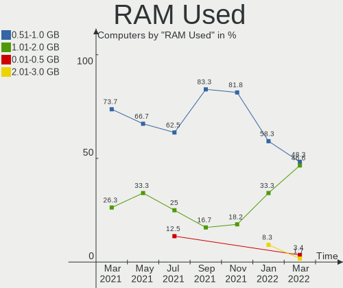
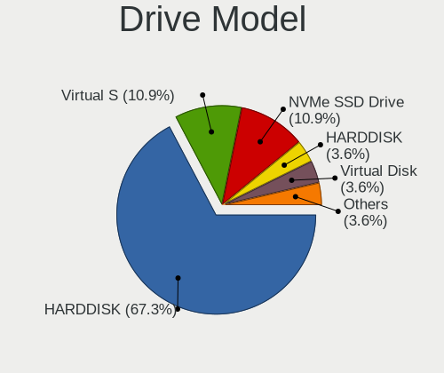
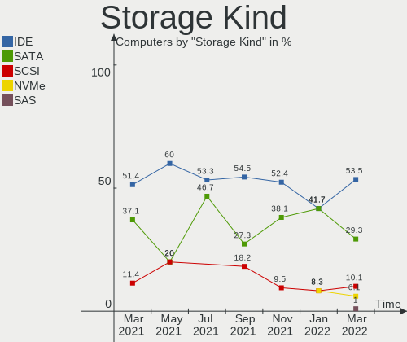
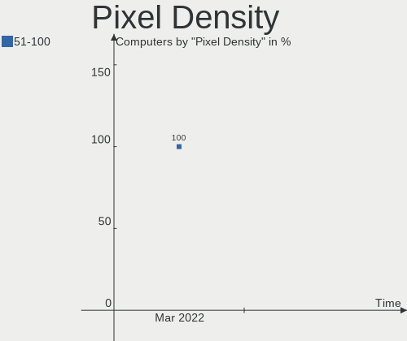
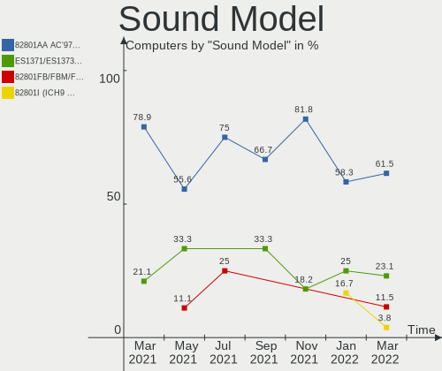

ROSA Virtual Hardware Trends
----------------------------

A project to identify most popular virtual hardware characteristics and track their change
over time based on data collected by ROSA users at https://Linux-Hardware.org.

Anyone can contribute to this report by the [hw-probe](https://github.com/linuxhw/hw-probe) tool:

    sudo -E hw-probe -all -upload

This report is for one last month. Overall report since the beginning of time: [TestCoverage_VE](https://github.com/linuxhw/TestCoverage_VE)

Period: Mar, 2022.

Contents
--------

* [ System ](#system)
  - [ OS                       ](#os)
  - [ OS Family                ](#os-family)
  - [ Kernel                   ](#kernel)
  - [ Kernel Family            ](#kernel-family)
  - [ Kernel Major Ver.        ](#kernel-major-ver)
  - [ Arch                     ](#arch)
  - [ DE                       ](#de)
  - [ Display Server           ](#display-server)
  - [ Display Manager          ](#display-manager)
  - [ OS Lang                  ](#os-lang)
  - [ Boot Mode                ](#boot-mode)
  - [ Filesystem               ](#filesystem)
  - [ Part. scheme             ](#part-scheme)
  - [ Dual Boot with Linux/BSD ](#dual-boot-with-linuxbsd)
  - [ Dual Boot (Win)          ](#dual-boot-win)

* [ Board ](#board)
  - [ Vendor                   ](#vendor)
  - [ Model                    ](#model)
  - [ Model Family             ](#model-family)
  - [ MFG Year                 ](#mfg-year)
  - [ Form Factor              ](#form-factor)
  - [ Secure Boot              ](#secure-boot)
  - [ Coreboot                 ](#coreboot)
  - [ RAM Size                 ](#ram-size)
  - [ RAM Used                 ](#ram-used)
  - [ Total Drives             ](#total-drives)
  - [ Has CD-ROM               ](#has-cd-rom)
  - [ Has Ethernet             ](#has-ethernet)
  - [ Has WiFi                 ](#has-wifi)
  - [ Has Bluetooth            ](#has-bluetooth)

* [ Location ](#location)
  - [ Country                  ](#country)
  - [ City                     ](#city)

* [ Drives ](#drives)
  - [ Drive Vendor             ](#drive-vendor)
  - [ Drive Model              ](#drive-model)
  - [ HDD Vendor               ](#hdd-vendor)
  - [ SSD Vendor               ](#ssd-vendor)
  - [ Drive Kind               ](#drive-kind)
  - [ Drive Connector          ](#drive-connector)
  - [ Drive Size               ](#drive-size)
  - [ Space Total              ](#space-total)
  - [ Space Used               ](#space-used)
  - [ Malfunc. Drives          ](#malfunc-drives)
  - [ Malfunc. Drive Vendor    ](#malfunc-drive-vendor)
  - [ Malfunc. HDD Vendor      ](#malfunc-hdd-vendor)
  - [ Malfunc. Drive Kind      ](#malfunc-drive-kind)
  - [ Failed Drives            ](#failed-drives)
  - [ Failed Drive Vendor      ](#failed-drive-vendor)
  - [ Drive Status             ](#drive-status)

* [ Storage controller ](#storage-controller)
  - [ Storage Vendor           ](#storage-vendor)
  - [ Storage Model            ](#storage-model)
  - [ Storage Kind             ](#storage-kind)

* [ Processor ](#processor)
  - [ CPU Vendor               ](#cpu-vendor)
  - [ CPU Model                ](#cpu-model)
  - [ CPU Model Family         ](#cpu-model-family)
  - [ CPU Cores                ](#cpu-cores)
  - [ CPU Sockets              ](#cpu-sockets)
  - [ CPU Threads              ](#cpu-threads)
  - [ CPU Op-Modes             ](#cpu-op-modes)
  - [ CPU Microcode            ](#cpu-microcode)
  - [ CPU Microarch            ](#cpu-microarch)

* [ Graphics ](#graphics)
  - [ GPU Vendor               ](#gpu-vendor)
  - [ GPU Model                ](#gpu-model)
  - [ GPU Combo                ](#gpu-combo)
  - [ GPU Driver               ](#gpu-driver)
  - [ GPU Memory               ](#gpu-memory)

* [ Monitor ](#monitor)
  - [ Monitor Vendor           ](#monitor-vendor)
  - [ Monitor Model            ](#monitor-model)
  - [ Monitor Resolution       ](#monitor-resolution)
  - [ Monitor Diagonal         ](#monitor-diagonal)
  - [ Monitor Width            ](#monitor-width)
  - [ Aspect Ratio             ](#aspect-ratio)
  - [ Monitor Area             ](#monitor-area)
  - [ Pixel Density            ](#pixel-density)
  - [ Multiple Monitors        ](#multiple-monitors)

* [ Network ](#network)
  - [ Net Controller Vendor    ](#net-controller-vendor)
  - [ Net Controller Model     ](#net-controller-model)
  - [ Wireless Vendor          ](#wireless-vendor)
  - [ Wireless Model           ](#wireless-model)
  - [ Ethernet Vendor          ](#ethernet-vendor)
  - [ Ethernet Model           ](#ethernet-model)
  - [ Net Controller Kind      ](#net-controller-kind)
  - [ Used Controller          ](#used-controller)
  - [ NICs                     ](#nics)
  - [ IPv6                     ](#ipv6)

* [ Bluetooth ](#bluetooth)
  - [ Bluetooth Vendor         ](#bluetooth-vendor)
  - [ Bluetooth Model          ](#bluetooth-model)

* [ Sound ](#sound)
  - [ Sound Vendor             ](#sound-vendor)
  - [ Sound Model              ](#sound-model)

* [ Memory ](#memory)
  - [ Memory Vendor            ](#memory-vendor)
  - [ Memory Model             ](#memory-model)
  - [ Memory Kind              ](#memory-kind)
  - [ Memory Form Factor       ](#memory-form-factor)
  - [ Memory Size              ](#memory-size)
  - [ Memory Speed             ](#memory-speed)

* [ Printers & scanners ](#printers--scanners)
  - [ Printer Vendor           ](#printer-vendor)
  - [ Printer Model            ](#printer-model)
  - [ Scanner Vendor           ](#scanner-vendor)
  - [ Scanner Model            ](#scanner-model)

* [ Camera ](#camera)
  - [ Camera Vendor            ](#camera-vendor)
  - [ Camera Model             ](#camera-model)

* [ Security ](#security)
  - [ Fingerprint Vendor       ](#fingerprint-vendor)
  - [ Fingerprint Model        ](#fingerprint-model)
  - [ Chipcard Vendor          ](#chipcard-vendor)
  - [ Chipcard Model           ](#chipcard-model)

* [ Unsupported ](#unsupported)
  - [ Unsupported Devices      ](#unsupported-devices)
  - [ Unsupported Device Types ](#unsupported-device-types)

System
------

OS
--

Installed operating systems

| Name         | Computers | Percent |
|--------------|-----------|---------|
| ROSA 12.2    | 50        | 86.21%  |
| ROSA 12.1    | 3         | 5.17%   |
| ROSA R11.1   | 2         | 3.45%   |
| ROSA 12      | 2         | 3.45%   |
| ROSA 2019.05 | 1         | 1.72%   |

OS Family
---------

OS without a version

| Name | Computers | Percent |
|------|-----------|---------|
| ROSA | 58        | 100%    |

Kernel
------

Version of the Linux kernel

| Version                            | Computers | Percent |
|------------------------------------|-----------|---------|
| 5.10.74-generic-2rosa2021.1-x86_64 | 50        | 86.21%  |
| 5.10.74-generic-2rosa2021.1-i586   | 2         | 3.45%   |
| 5.10.71-generic-1rosa2021.1-x86_64 | 2         | 3.45%   |
| 5.4.83-generic-2rosa-x86_64        | 1         | 1.72%   |
| 5.4.32-generic-2rosa-x86_64        | 1         | 1.72%   |
| 5.4.139-nickel-4rosa2019.05-x86_64 | 1         | 1.72%   |
| 5.16.17-generic-1rosa2021.1-x86_64 | 1         | 1.72%   |

Kernel Family
-------------

Linux kernel without a distro release

| Version | Computers | Percent |
|---------|-----------|---------|
| 5.10.74 | 52        | 89.66%  |
| 5.10.71 | 2         | 3.45%   |
| 5.4.83  | 1         | 1.72%   |
| 5.4.32  | 1         | 1.72%   |
| 5.4.139 | 1         | 1.72%   |
| 5.16.17 | 1         | 1.72%   |

Kernel Major Ver.
-----------------

Linux kernel major version

| Version | Computers | Percent |
|---------|-----------|---------|
| 5.10    | 54        | 93.1%   |
| 5.4     | 3         | 5.17%   |
| 5.16    | 1         | 1.72%   |

Arch
----

OS architecture (x86_64, i586, etc.)

| Name   | Computers | Percent |
|--------|-----------|---------|
| x86_64 | 56        | 96.55%  |
| i686   | 2         | 3.45%   |

DE
--

Desktop Environment

| Name  | Computers | Percent |
|-------|-----------|---------|
| GNOME | 39        | 67.24%  |
| KDE5  | 12        | 20.69%  |
| LXQt  | 5         | 8.62%   |
| KDE4  | 2         | 3.45%   |

Display Server
--------------

X11 or Wayland

| Name    | Computers | Percent |
|---------|-----------|---------|
| Wayland | 48        | 82.76%  |
| X11     | 10        | 17.24%  |

Display Manager
---------------

SDDM, LightDM, etc.

| Name    | Computers | Percent |
|---------|-----------|---------|
| GDM     | 46        | 79.31%  |
| SDDM    | 8         | 13.79%  |
| LightDM | 2         | 3.45%   |
| KDM     | 2         | 3.45%   |

OS Lang
-------

Language

| Lang  | Computers | Percent |
|-------|-----------|---------|
| ru_RU | 54        | 93.1%   |
| en_US | 3         | 5.17%   |
| zh_CN | 1         | 1.72%   |

Boot Mode
---------

EFI or BIOS

| Mode | Computers | Percent |
|------|-----------|---------|
| BIOS | 50        | 86.21%  |
| EFI  | 8         | 13.79%  |

Filesystem
----------

Type of filesystem

| Type  | Computers | Percent |
|-------|-----------|---------|
| Ext4  | 56        | 96.55%  |
| Btrfs | 2         | 3.45%   |

Part. scheme
------------

Scheme of partitioning

| Type    | Computers | Percent |
|---------|-----------|---------|
| MBR     | 42        | 72.41%  |
| Unknown | 11        | 18.97%  |
| GPT     | 5         | 8.62%   |

Dual Boot with Linux/BSD
------------------------

Hosting more than one Linux/BSD

| Dual boot | Computers | Percent |
|-----------|-----------|---------|
| No        | 45        | 77.59%  |
| Yes       | 13        | 22.41%  |

Dual Boot (Win)
---------------

Hosting Linux and Windows

| Dual boot | Computers | Percent |
|-----------|-----------|---------|
| No        | 58        | 100%    |

Board
-----

Vendor
------

Motherboard manufacturer

| Name                 | Computers | Percent |
|----------------------|-----------|---------|
| Oracle               | 37        | 63.79%  |
| VMware               | 13        | 22.41%  |
| QEMU                 | 5         | 8.62%   |
| Microsoft            | 2         | 3.45%   |
| OpenStack Foundation | 1         | 1.72%   |

Model
-----

Motherboard model

| Name                                   | Computers | Percent |
|----------------------------------------|-----------|---------|
| Oracle VirtualBox                      | 37        | 63.79%  |
| VMware Virtual Platform                | 11        | 18.97%  |
| QEMU Standard PC (i440FX + PIIX, 1996) | 3         | 5.17%   |
| VMware VMware7,1                       | 2         | 3.45%   |
| QEMU Standard PC (Q35 + ICH9, 2009)    | 2         | 3.45%   |
| Microsoft Virtual Machine              | 2         | 3.45%   |
| OpenStack Foundation OpenStack Nova    | 1         | 1.72%   |

Model Family
------------

Motherboard model prefix

| Name                           | Computers | Percent |
|--------------------------------|-----------|---------|
| Oracle VirtualBox              | 37        | 63.79%  |
| VMware Virtual                 | 11        | 18.97%  |
| QEMU Standard                  | 5         | 8.62%   |
| VMware VMware7                 | 2         | 3.45%   |
| Microsoft Virtual              | 2         | 3.45%   |
| OpenStack Foundation OpenStack | 1         | 1.72%   |

MFG Year
--------

Motherboard manufacture year

| Year | Computers | Percent |
|------|-----------|---------|
| 2006 | 37        | 63.79%  |
| 2020 | 10        | 17.24%  |
| 2014 | 6         | 10.34%  |
| 2021 | 2         | 3.45%   |
| 2018 | 2         | 3.45%   |
| 2019 | 1         | 1.72%   |

Form Factor
-----------

Physical design of the computer

| Name            | Computers | Percent |
|-----------------|-----------|---------|
| Virtual machine | 58        | 100%    |

Secure Boot
-----------

Enabled or disabled

| State    | Computers | Percent |
|----------|-----------|---------|
| Disabled | 58        | 100%    |

Coreboot
--------

Have coreboot on board

| Used | Computers | Percent |
|------|-----------|---------|
| No   | 58        | 100%    |

RAM Size
--------

Total RAM memory

| Size in GB | Computers | Percent |
|------------|-----------|---------|
| 1.01-2.0   | 18        | 31.03%  |
| 3.01-4.0   | 17        | 29.31%  |
| 4.01-8.0   | 10        | 17.24%  |
| 8.01-16.0  | 6         | 10.34%  |
| 0.51-1.0   | 3         | 5.17%   |
| 2.01-3.0   | 2         | 3.45%   |
| 16.01-24.0 | 2         | 3.45%   |

RAM Used
--------

Used RAM memory

| Used GB  | Computers | Percent |
|----------|-----------|---------|
| 0.51-1.0 | 28        | 48.28%  |
| 1.01-2.0 | 27        | 46.55%  |
| 0.01-0.5 | 2         | 3.45%   |
| 2.01-3.0 | 1         | 1.72%   |

Total Drives
------------

Number of drives on board

| Drives | Computers | Percent |
|--------|-----------|---------|
| 1      | 55        | 94.83%  |
| 0      | 3         | 5.17%   |

Has CD-ROM
----------

Has CD-ROM on board

| Presented | Computers | Percent |
|-----------|-----------|---------|
| Yes       | 58        | 100%    |

Has Ethernet
------------

Has Ethernet on board

| Presented | Computers | Percent |
|-----------|-----------|---------|
| Yes       | 52        | 89.66%  |
| No        | 6         | 10.34%  |

Has WiFi
--------

Has WiFi module

| Presented | Computers | Percent |
|-----------|-----------|---------|
| No        | 58        | 100%    |

Has Bluetooth
-------------

Has Bluetooth module

| Presented | Computers | Percent |
|-----------|-----------|---------|
| No        | 53        | 91.38%  |
| Yes       | 5         | 8.62%   |

Location
--------

Country
-------

Geographic location (country)

| Country   | Computers | Percent |
|-----------|-----------|---------|
| Russia    | 52        | 89.66%  |
| Belarus   | 2         | 3.45%   |
| Ukraine   | 1         | 1.72%   |
| Romania   | 1         | 1.72%   |
| China     | 1         | 1.72%   |
| Australia | 1         | 1.72%   |

City
----

Geographic location (city)

| City             | Computers | Percent |
|------------------|-----------|---------|
| Moscow           | 15        | 25.86%  |
| St Petersburg    | 4         | 6.9%    |
| Krasnodar        | 4         | 6.9%    |
| Yekaterinburg    | 2         | 3.45%   |
| Tver             | 2         | 3.45%   |
| Kaliningrad      | 2         | 3.45%   |
| Astrakhan        | 2         | 3.45%   |
| Voronezh         | 1         | 1.72%   |
| Vorkuta          | 1         | 1.72%   |
| Tobol'sk         | 1         | 1.72%   |
| Saransk          | 1         | 1.72%   |
| Samara           | 1         | 1.72%   |
| Rostov-on-Don    | 1         | 1.72%   |
| Quakers Hill     | 1         | 1.72%   |
| Orenburg         | 1         | 1.72%   |
| Novy Urengoy     | 1         | 1.72%   |
| Novorossiysk     | 1         | 1.72%   |
| Nizhniy Novgorod | 1         | 1.72%   |
| Monchegorsk      | 1         | 1.72%   |
| Mogilev          | 1         | 1.72%   |
| Minsk            | 1         | 1.72%   |
| Kyiv             | 1         | 1.72%   |
| Krasnogorsk      | 1         | 1.72%   |
| Kirov            | 1         | 1.72%   |
| Kimry            | 1         | 1.72%   |
| Izhevsk          | 1         | 1.72%   |
| Guangzhou        | 1         | 1.72%   |
| Galati           | 1         | 1.72%   |
| Elektrostal      | 1         | 1.72%   |
| Bogorodsk        | 1         | 1.72%   |
| Blagoveshchensk  | 1         | 1.72%   |
| Barnaul          | 1         | 1.72%   |
| Babayevo         | 1         | 1.72%   |
| Arkhangelsk      | 1         | 1.72%   |

Drives
------

Drive Vendor
------------

Hard drive vendors

| Vendor   | Computers | Drives | Percent |
|----------|-----------|--------|---------|
| VBOX     | 37        | 37     | 67.27%  |
| VMware   | 13        | 13     | 23.64%  |
| QEMU     | 2         | 2      | 3.64%   |
| Msft     | 2         | 2      | 3.64%   |
| SYNOLOGY | 1         | 1      | 1.82%   |

Drive Model
-----------

Hard drive models

| Model                  | Computers | Percent |
|------------------------|-----------|---------|
| VBOX HARDDISK          | 37        | 67.27%  |
| VMware Virtual S       | 6         | 10.91%  |
| VMware NVMe SSD Drive  | 6         | 10.91%  |
| QEMU HARDDISK          | 2         | 3.64%   |
| Msft Virtual Disk      | 2         | 3.64%   |
| VMware Virtual disk    | 1         | 1.82%   |
| SYNOLOGY iSCSI Storage | 1         | 1.82%   |

HDD Vendor
----------

Hard disk drive vendors

| Vendor   | Computers | Drives | Percent |
|----------|-----------|--------|---------|
| VBOX     | 37        | 37     | 67.27%  |
| VMware   | 13        | 13     | 23.64%  |
| QEMU     | 2         | 2      | 3.64%   |
| Msft     | 2         | 2      | 3.64%   |
| SYNOLOGY | 1         | 1      | 1.82%   |

SSD Vendor
----------

Solid state drive vendors

Zero info for selected period =(

Drive Kind
----------

HDD or SSD

| Kind | Computers | Drives | Percent |
|------|-----------|--------|---------|
| HDD  | 55        | 55     | 100%    |

Drive Connector
---------------

SATA, SAS, NVMe, etc.

| Type | Computers | Drives | Percent |
|------|-----------|--------|---------|
| SATA | 40        | 40     | 72.73%  |
| SAS  | 9         | 9      | 16.36%  |
| NVMe | 6         | 6      | 10.91%  |

Drive Size
----------

Size of hard drive

| Size in TB | Computers | Drives | Percent |
|------------|-----------|--------|---------|
| 0.01-0.5   | 55        | 55     | 100%    |

Space Total
-----------

Amount of disk space available on the file system

| Size in GB | Computers | Percent |
|------------|-----------|---------|
| 1-20       | 26        | 44.83%  |
| 21-50      | 20        | 34.48%  |
| 51-100     | 6         | 10.34%  |
| 101-250    | 3         | 5.17%   |
| Unknown    | 2         | 3.45%   |
| 251-500    | 1         | 1.72%   |

Space Used
----------

Amount of used disk space

| Used GB | Computers | Percent |
|---------|-----------|---------|
| 1-20    | 55        | 94.83%  |
| Unknown | 2         | 3.45%   |
| 21-50   | 1         | 1.72%   |

Malfunc. Drives
---------------

Drive models with a malfunction

Zero info for selected period =(

Malfunc. Drive Vendor
---------------------

Vendors of faulty drives

Zero info for selected period =(

Malfunc. HDD Vendor
-------------------

Vendors of faulty HDD drives

Zero info for selected period =(

Malfunc. Drive Kind
-------------------

Kinds of faulty drives

Zero info for selected period =(

Failed Drives
-------------

Failed drive models

Zero info for selected period =(

Failed Drive Vendor
-------------------

Failed drive vendors

Zero info for selected period =(

Drive Status
------------

Number of failed and malfunc. drives

| Status   | Computers | Drives | Percent |
|----------|-----------|--------|---------|
| Detected | 52        | 52     | 94.55%  |
| Works    | 3         | 3      | 5.45%   |

Storage controller
------------------

Storage Vendor
--------------

Storage controller vendors

| Vendor                    | Computers | Percent |
|---------------------------|-----------|---------|
| Intel                     | 58        | 76.32%  |
| VMware                    | 8         | 10.53%  |
| LSI Logic / Symbios Logic | 6         | 7.89%   |
| Red Hat                   | 4         | 5.26%   |

Storage Model
-------------

Storage controller models

| Model                                                                 | Computers | Percent |
|-----------------------------------------------------------------------|-----------|---------|
| Intel 82371AB/EB/MB PIIX4 IDE                                         | 49        | 49.49%  |
| Intel 82801HM/HEM (ICH8M/ICH8M-E) SATA Controller [AHCI mode]         | 26        | 26.26%  |
| VMware NVMe SSD Controller                                            | 6         | 6.06%   |
| LSI Logic / Symbios Logic 53c1030 PCI-X Fusion-MPT Dual Ultra320 SCSI | 6         | 6.06%   |
| Intel 82371SB PIIX3 IDE [Natoma/Triton II]                            | 4         | 4.04%   |
| Red Hat Virtio block device                                           | 3         | 3.03%   |
| Intel 82801IR/IO/IH (ICH9R/DO/DH) 6 port SATA Controller [AHCI mode]  | 2         | 2.02%   |
| VMware SATA AHCI controller                                           | 1         | 1.01%   |
| VMware PVSCSI SCSI Controller                                         | 1         | 1.01%   |
| Red Hat Virtio SCSI                                                   | 1         | 1.01%   |

Storage Kind
------------

Kind of storage controller (IDE, SATA, NVMe, SAS, ...)

| Kind | Computers | Percent |
|------|-----------|---------|
| IDE  | 53        | 53.54%  |
| SATA | 29        | 29.29%  |
| SCSI | 10        | 10.1%   |
| NVMe | 6         | 6.06%   |
| SAS  | 1         | 1.01%   |

Processor
---------

CPU Vendor
----------

Processor vendors

| Vendor | Computers | Percent |
|--------|-----------|---------|
| Intel  | 44        | 75.86%  |
| AMD    | 14        | 24.14%  |

CPU Model
---------

Processor models

| Model                                           | Computers | Percent |
|-------------------------------------------------|-----------|---------|
| Intel Core i7-9700K CPU @ 3.60GHz               | 2         | 3.45%   |
| Intel Core i7-4790 CPU @ 3.60GHz                | 2         | 3.45%   |
| Intel Core i5-10400 CPU @ 2.90GHz               | 2         | 3.45%   |
| Intel Core i3-8100 CPU @ 3.60GHz                | 2         | 3.45%   |
| AMD Ryzen 5 2600 Six-Core Processor             | 2         | 3.45%   |
| Intel Xeon Gold 6278C CPU @ 2.60GHz             | 1         | 1.72%   |
| Intel Xeon Gold 6226R CPU @ 2.90GHz             | 1         | 1.72%   |
| Intel Xeon CPU X5675 @ 3.07GHz                  | 1         | 1.72%   |
| Intel Xeon CPU E5450 @ 3.00GHz                  | 1         | 1.72%   |
| Intel Xeon CPU E5-2689 0 @ 2.60GHz              | 1         | 1.72%   |
| Intel Xeon CPU E5-2678 v3 @ 2.50GHz             | 1         | 1.72%   |
| Intel Xeon CPU E5-2640 v3 @ 2.60GHz             | 1         | 1.72%   |
| Intel Xeon CPU E5-1650 v2 @ 3.50GHz             | 1         | 1.72%   |
| Intel Xeon CPU E31275 @ 3.40GHz                 | 1         | 1.72%   |
| Intel Pentium Gold G5400 CPU @ 3.70GHz          | 1         | 1.72%   |
| Intel Pentium CPU G3420 @ 3.20GHz               | 1         | 1.72%   |
| Intel Core i7-8700T CPU @ 2.40GHz               | 1         | 1.72%   |
| Intel Core i7-8086K CPU @ 4.00GHz               | 1         | 1.72%   |
| Intel Core i7-7700K CPU @ 4.20GHz               | 1         | 1.72%   |
| Intel Core i7-7700HQ CPU @ 2.80GHz              | 1         | 1.72%   |
| Intel Core i7-2600 CPU @ 3.40GHz                | 1         | 1.72%   |
| Intel Core i5-9300HF CPU @ 2.40GHz              | 1         | 1.72%   |
| Intel Core i5-9300H CPU @ 2.40GHz               | 1         | 1.72%   |
| Intel Core i5-8400 CPU @ 2.80GHz                | 1         | 1.72%   |
| Intel Core i5-8265U CPU @ 1.60GHz               | 1         | 1.72%   |
| Intel Core i5-7500 CPU @ 3.40GHz                | 1         | 1.72%   |
| Intel Core i5-6360U CPU @ 2.00GHz               | 1         | 1.72%   |
| Intel Core i5-4690 CPU @ 3.50GHz                | 1         | 1.72%   |
| Intel Core i5-4670K CPU @ 3.40GHz               | 1         | 1.72%   |
| Intel Core i5-4570 CPU @ 3.20GHz                | 1         | 1.72%   |
| Intel Core i5-3450 CPU @ 3.10GHz                | 1         | 1.72%   |
| Intel Core i5-2430M CPU @ 2.40GHz               | 1         | 1.72%   |
| Intel Core i5-2400 CPU @ 3.10GHz                | 1         | 1.72%   |
| Intel Core i5-10505 CPU @ 3.20GHz               | 1         | 1.72%   |
| Intel Core i5-10210U CPU @ 1.60GHz              | 1         | 1.72%   |
| Intel Core i3-3217U CPU @ 1.80GHz               | 1         | 1.72%   |
| Intel Core i3 CPU 560 @ 3.33GHz                 | 1         | 1.72%   |
| Intel Celeron J4125 CPU @ 2.00GHz               | 1         | 1.72%   |
| Intel 12th Gen Core i5-12400F                   | 1         | 1.72%   |
| Intel 11th Gen Core i5-11400H @ 2.70GHz         | 1         | 1.72%   |
| Intel 11th Gen Core i5-11400F @ 2.60GHz         | 1         | 1.72%   |
| AMD Ryzen 5 5600G with Radeon Graphics          | 1         | 1.72%   |
| AMD Ryzen 5 4500U with Radeon Graphics          | 1         | 1.72%   |
| AMD Ryzen 5 3600 6-Core Processor               | 1         | 1.72%   |
| AMD Ryzen 5 3500X 6-Core Processor              | 1         | 1.72%   |
| AMD Ryzen 5 3500U with Radeon Vega Mobile Gfx   | 1         | 1.72%   |
| AMD Ryzen 5 2400G with Radeon Vega Graphics     | 1         | 1.72%   |
| AMD Ryzen 5 1600 Six-Core Processor             | 1         | 1.72%   |
| AMD Ryzen 5 1400 Quad-Core Processor            | 1         | 1.72%   |
| AMD Ryzen 3 PRO 2200G with Radeon Vega Graphics | 1         | 1.72%   |
| AMD Phenom II X6 1090T Processor                | 1         | 1.72%   |
| AMD FX-6300 Six-Core Processor                  | 1         | 1.72%   |
| AMD Athlon II X2 255 Processor                  | 1         | 1.72%   |

CPU Model Family
----------------

Processor model prefix

| Model              | Computers | Percent |
|--------------------|-----------|---------|
| Intel Core i5      | 16        | 27.59%  |
| AMD Ryzen 5        | 10        | 17.24%  |
| Intel Core i7      | 9         | 15.52%  |
| Intel Xeon         | 7         | 12.07%  |
| Intel Core i3      | 4         | 6.9%    |
| Other              | 3         | 5.17%   |
| Intel Xeon Gold    | 2         | 3.45%   |
| Intel Pentium Gold | 1         | 1.72%   |
| Intel Pentium      | 1         | 1.72%   |
| Intel Celeron      | 1         | 1.72%   |
| AMD Ryzen 3 PRO    | 1         | 1.72%   |
| AMD Phenom II X6   | 1         | 1.72%   |
| AMD FX             | 1         | 1.72%   |
| AMD Athlon II X2   | 1         | 1.72%   |

CPU Cores
---------

Number of processor cores

| Number | Computers | Percent |
|--------|-----------|---------|
| 1      | 20        | 34.48%  |
| 4      | 18        | 31.03%  |
| 2      | 16        | 27.59%  |
| 3      | 2         | 3.45%   |
| 8      | 1         | 1.72%   |
| 6      | 1         | 1.72%   |

CPU Sockets
-----------

Number of sockets

| Number | Computers | Percent |
|--------|-----------|---------|
| 1      | 49        | 84.48%  |
| 2      | 7         | 12.07%  |
| 8      | 1         | 1.72%   |
| 4      | 1         | 1.72%   |

CPU Threads
-----------

Threads per core (Hyper-Threading)

| Number | Computers | Percent |
|--------|-----------|---------|
| 1      | 54        | 93.1%   |
| 2      | 4         | 6.9%    |

CPU Op-Modes
------------

CPU Operation Modes (32-bit, 64-bit)

| Op mode        | Computers | Percent |
|----------------|-----------|---------|
| 32-bit, 64-bit | 57        | 98.28%  |
| 32-bit         | 1         | 1.72%   |

CPU Microcode
-------------

Microcode number

| Number  | Computers | Percent |
|---------|-----------|---------|
| Unknown | 57        | 98.28%  |
| 0x306c3 | 1         | 1.72%   |

CPU Microarch
-------------

Microarchitecture

| Name          | Computers | Percent |
|---------------|-----------|---------|
| KabyLake      | 15        | 25.86%  |
| Haswell       | 8         | 13.79%  |
| SandyBridge   | 5         | 8.62%   |
| Zen           | 4         | 6.9%    |
| Zen+          | 3         | 5.17%   |
| Zen 2         | 3         | 5.17%   |
| Skylake       | 3         | 5.17%   |
| IvyBridge     | 3         | 5.17%   |
| CometLake     | 3         | 5.17%   |
| Unknown       | 3         | 5.17%   |
| Westmere      | 2         | 3.45%   |
| K10           | 2         | 3.45%   |
| Zen 3         | 1         | 1.72%   |
| Piledriver    | 1         | 1.72%   |
| Penryn        | 1         | 1.72%   |
| Goldmont plus | 1         | 1.72%   |

Graphics
--------

GPU Vendor
----------

Vendors of graphics cards

| Vendor                 | Computers | Percent |
|------------------------|-----------|---------|
| VMware                 | 47        | 81.03%  |
| Red Hat                | 4         | 6.9%    |
| InnoTek Systemberatung | 4         | 6.9%    |
| Microsoft              | 2         | 3.45%   |
| Cirrus Logic           | 1         | 1.72%   |

GPU Model
---------

Graphics card models

| Model                                              | Computers | Percent |
|----------------------------------------------------|-----------|---------|
| VMware SVGA II Adapter                             | 47        | 81.03%  |
| InnoTek Systemberatung VirtualBox Graphics Adapter | 4         | 6.9%    |
| Red Hat QXL paravirtual graphic card               | 3         | 5.17%   |
| Microsoft Hyper-V virtual VGA                      | 2         | 3.45%   |
| Red Hat Virtio GPU                                 | 1         | 1.72%   |
| Cirrus Logic GD 5446                               | 1         | 1.72%   |

GPU Combo
---------

Combinations of graphics cards

| Name                       | Computers | Percent |
|----------------------------|-----------|---------|
| 1 x VMware                 | 47        | 81.03%  |
| 1 x Red Hat                | 4         | 6.9%    |
| 1 x InnoTek Systemberatung | 4         | 6.9%    |
| 1 x Microsoft              | 2         | 3.45%   |
| 1 x Cirrus Logic           | 1         | 1.72%   |

GPU Driver
----------

Free vs proprietary

| Driver  | Computers | Percent |
|---------|-----------|---------|
| Unknown | 58        | 100%    |

GPU Memory
----------

Total video memory

| Size in GB | Computers | Percent |
|------------|-----------|---------|
| Unknown    | 58        | 100%    |

Monitor
-------

Monitor Vendor
--------------

Monitor vendors

| Vendor | Computers | Percent |
|--------|-----------|---------|
| RHT    | 1         | 100%    |

Monitor Model
-------------

Monitor models

| Model                                                  | Computers | Percent |
|--------------------------------------------------------|-----------|---------|
| RHT QEMU Monitor RHT1234 2048x1152 260x190mm 12.7-inch | 1         | 100%    |

Monitor Resolution
------------------

Monitor screen resolution

| Resolution | Computers | Percent |
|------------|-----------|---------|
| 3196x1798  | 1         | 100%    |

Monitor Diagonal
----------------

Diagonal size in inches

| Inches | Computers | Percent |
|--------|-----------|---------|
| 33     | 1         | 100%    |

Monitor Width
-------------

Physical width

| Width in mm | Computers | Percent |
|-------------|-----------|---------|
| 701-800     | 1         | 100%    |

Aspect Ratio
------------

Proportional relationship between the width and the height

| Ratio | Computers | Percent |
|-------|-----------|---------|
| 16/9  | 1         | 100%    |

Monitor Area
------------

Area in inch²

| Area in inch² | Computers | Percent |
|----------------|-----------|---------|
| 351-500        | 1         | 100%    |

Pixel Density
-------------

Pixels per inch

| Density | Computers | Percent |
|---------|-----------|---------|
| 51-100  | 1         | 100%    |

Multiple Monitors
-----------------

Total monitors connected

| Total | Computers | Percent |
|-------|-----------|---------|
| 0     | 49        | 84.48%  |
| 1     | 9         | 15.52%  |

Network
-------

Net Controller Vendor
---------------------

Controller vendors

| Vendor                | Computers | Percent |
|-----------------------|-----------|---------|
| Intel                 | 44        | 78.57%  |
| VMware                | 6         | 10.71%  |
| Red Hat               | 4         | 7.14%   |
| Realtek Semiconductor | 2         | 3.57%   |

Net Controller Model
--------------------

Controller models

| Model                                                 | Computers | Percent |
|-------------------------------------------------------|-----------|---------|
| Intel 82540EM Gigabit Ethernet Controller             | 37        | 66.07%  |
| Intel 82545EM Gigabit Ethernet Controller (Copper)    | 7         | 12.5%   |
| VMware VMXNET3 Ethernet Controller                    | 6         | 10.71%  |
| Red Hat Virtio network device                         | 4         | 7.14%   |
| Realtek RTL-8100/8101L/8139 PCI Fast Ethernet Adapter | 2         | 3.57%   |

Wireless Vendor
---------------

Wireless vendors

Zero info for selected period =(

Wireless Model
--------------

Wireless models

Zero info for selected period =(

Ethernet Vendor
---------------

Ethernet vendors

| Vendor                | Computers | Percent |
|-----------------------|-----------|---------|
| Intel                 | 44        | 84.62%  |
| VMware                | 6         | 11.54%  |
| Realtek Semiconductor | 2         | 3.85%   |

Ethernet Model
--------------

Ethernet models

| Model                                                 | Computers | Percent |
|-------------------------------------------------------|-----------|---------|
| Intel 82540EM Gigabit Ethernet Controller             | 37        | 71.15%  |
| Intel 82545EM Gigabit Ethernet Controller (Copper)    | 7         | 13.46%  |
| VMware VMXNET3 Ethernet Controller                    | 6         | 11.54%  |
| Realtek RTL-8100/8101L/8139 PCI Fast Ethernet Adapter | 2         | 3.85%   |

Net Controller Kind
-------------------

Ethernet, WiFi or modem

| Kind     | Computers | Percent |
|----------|-----------|---------|
| Ethernet | 52        | 92.86%  |
| Unknown  | 4         | 7.14%   |

Used Controller
---------------

Currently used network controller

| Kind     | Computers | Percent |
|----------|-----------|---------|
| Ethernet | 52        | 100%    |

NICs
----

Total network controllers on board

| Total | Computers | Percent |
|-------|-----------|---------|
| 1     | 52        | 89.66%  |
| 0     | 6         | 10.34%  |

IPv6
----

IPv6 vs IPv4

| Used | Computers | Percent |
|------|-----------|---------|
| No   | 56        | 96.55%  |
| Yes  | 2         | 3.45%   |

Bluetooth
---------

Bluetooth Vendor
----------------

Controller vendors

| Vendor | Computers | Percent |
|--------|-----------|---------|
| VMware | 5         | 100%    |

Bluetooth Model
---------------

Controller models

| Model                            | Computers | Percent |
|----------------------------------|-----------|---------|
| VMware Virtual Bluetooth Adapter | 5         | 100%    |

Sound
-----

Sound Vendor
------------

Sound card vendors

| Vendor  | Computers | Percent |
|---------|-----------|---------|
| Intel   | 40        | 76.92%  |
| Ensoniq | 12        | 23.08%  |

Sound Model
-----------

Sound card models

| Model                                                                      | Computers | Percent |
|----------------------------------------------------------------------------|-----------|---------|
| Intel 82801AA AC'97 Audio Controller                                       | 32        | 61.54%  |
| Ensoniq ES1371/ES1373 / Creative Labs CT2518                               | 12        | 23.08%  |
| Intel 82801FB/FBM/FR/FW/FRW (ICH6 Family) High Definition Audio Controller | 6         | 11.54%  |
| Intel 82801I (ICH9 Family) HD Audio Controller                             | 2         | 3.85%   |

Memory
------

Memory Vendor
-------------

Memory module vendors

| Vendor             | Computers | Percent |
|--------------------|-----------|---------|
| Unknown            | 8         | 33.33%  |
| QEMU               | 6         | 25%     |
| Unknown            | 6         | 25%     |
| VMware Virtual RAM | 2         | 8.33%   |
| Microsoft          | 2         | 8.33%   |

Memory Model
------------

Memory module models

| Model                                           | Computers | Percent |
|-------------------------------------------------|-----------|---------|
| Unknown RAM Module 2GB DIMM DRAM                | 6         | 20%     |
| Unknown                                         | 6         | 20%     |
| VMware Virtual RAM RAM VMW-4096MB 4GB DIMM DRAM | 2         | 6.67%   |
| Unknown RAM Module 256MB DIMM DRAM              | 2         | 6.67%   |
| Unknown RAM Module 1GB DIMM DRAM                | 2         | 6.67%   |
| QEMU RAM Module 2GB DIMM RAM                    | 2         | 6.67%   |
| Unknown RAM Module 512MB DIMM DRAM              | 1         | 3.33%   |
| Unknown RAM Module 4096MB DIMM DRAM             | 1         | 3.33%   |
| Unknown RAM Module 128MB DIMM DRAM              | 1         | 3.33%   |
| QEMU RAM Module 8479MB DIMM RAM                 | 1         | 3.33%   |
| QEMU RAM Module 5518MB DIMM RAM                 | 1         | 3.33%   |
| QEMU RAM Module 4GB DIMM RAM                    | 1         | 3.33%   |
| QEMU RAM Module 3070MB DIMM RAM                 | 1         | 3.33%   |
| Microsoft RAM Module 3968MB                     | 1         | 3.33%   |
| Microsoft RAM Module 1GB                        | 1         | 3.33%   |
| Microsoft RAM Module 128MB                      | 1         | 3.33%   |

Memory Kind
-----------

Memory module kinds

| Kind    | Computers | Percent |
|---------|-----------|---------|
| DRAM    | 13        | 61.9%   |
| RAM     | 6         | 28.57%  |
| Unknown | 2         | 9.52%   |

Memory Form Factor
------------------

Physical design of the memory module

| Name    | Computers | Percent |
|---------|-----------|---------|
| DIMM    | 19        | 90.48%  |
| Unknown | 2         | 9.52%   |

Memory Size
-----------

Memory module size

| Size | Computers | Percent |
|------|-----------|---------|
| 4096 | 8         | 21.62%  |
| 2048 | 8         | 21.62%  |
| 1024 | 3         | 8.11%   |
| 8192 | 2         | 5.41%   |
| 256  | 2         | 5.41%   |
| 128  | 2         | 5.41%   |
| 64   | 2         | 5.41%   |
| 4    | 2         | 5.41%   |
| 8479 | 1         | 2.7%    |
| 5518 | 1         | 2.7%    |
| 3968 | 1         | 2.7%    |
| 3070 | 1         | 2.7%    |
| 512  | 1         | 2.7%    |
| 32   | 1         | 2.7%    |
| 16   | 1         | 2.7%    |
| 8    | 1         | 2.7%    |

Memory Speed
------------

Memory module speed

| Speed   | Computers | Percent |
|---------|-----------|---------|
| Unknown | 21        | 100%    |

Printers & scanners
-------------------

Printer Vendor
--------------

Printer device vendors

Zero info for selected period =(

Printer Model
-------------

Printer device models

Zero info for selected period =(

Scanner Vendor
--------------

Scanner device vendors

Zero info for selected period =(

Scanner Model
-------------

Scanner device models

Zero info for selected period =(

Camera
------

Camera Vendor
-------------

Camera device vendors

| Vendor | Computers | Percent |
|--------|-----------|---------|
| VMware | 1         | 100%    |

Camera Model
------------

Camera device models

| Model                           | Computers | Percent |
|---------------------------------|-----------|---------|
| VMware Virtual USB Video Device | 1         | 100%    |

Security
--------

Fingerprint Vendor
------------------

Fingerprint sensor vendors

Zero info for selected period =(

Fingerprint Model
-----------------

Fingerprint sensor models

Zero info for selected period =(

Chipcard Vendor
---------------

Chipcard module vendors

| Vendor                | Computers | Percent |
|-----------------------|-----------|---------|
| Gemalto (was Gemplus) | 3         | 100%    |

Chipcard Model
--------------

Chipcard module models

| Model                               | Computers | Percent |
|-------------------------------------|-----------|---------|
| Gemalto (was Gemplus) GemPC433-Swap | 3         | 100%    |

Unsupported
-----------

Unsupported Devices
-------------------

Total unsupported devices on board

| Total | Computers | Percent |
|-------|-----------|---------|
| 0     | 54        | 93.1%   |
| 1     | 4         | 6.9%    |

Unsupported Device Types
------------------------

Types of unsupported devices

| Type          | Computers | Percent |
|---------------|-----------|---------|
| Chipcard      | 3         | 75%     |
| Graphics card | 1         | 25%     |

