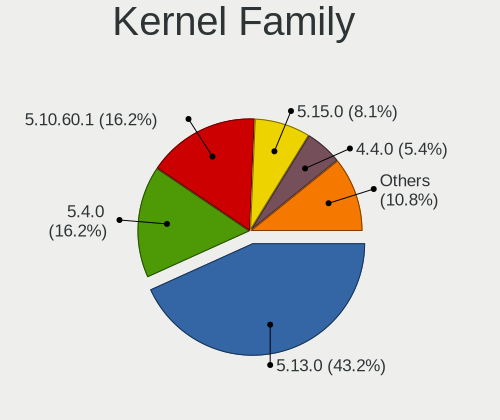
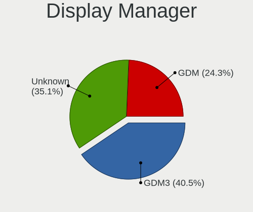
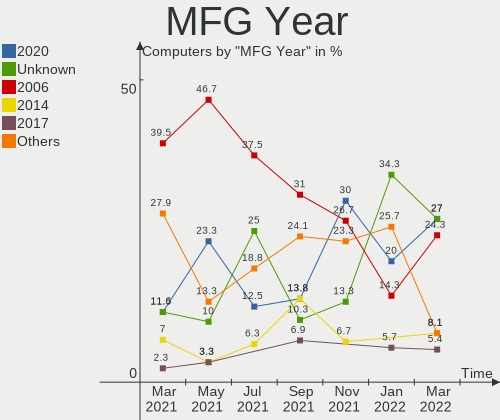
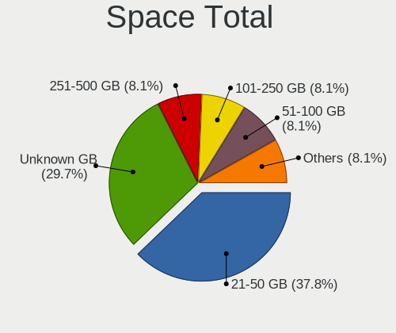
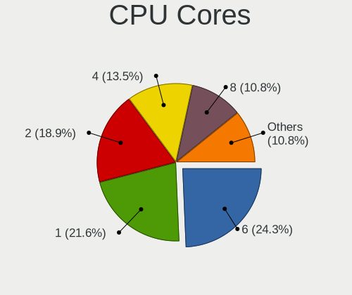
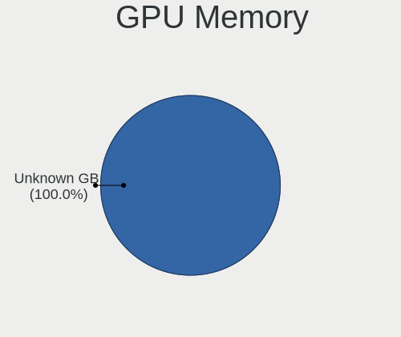
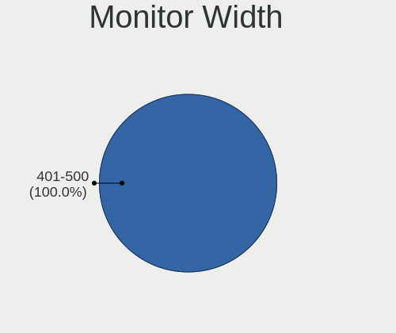
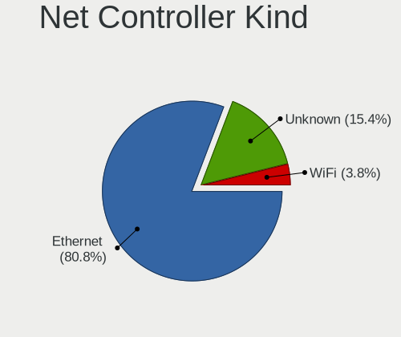
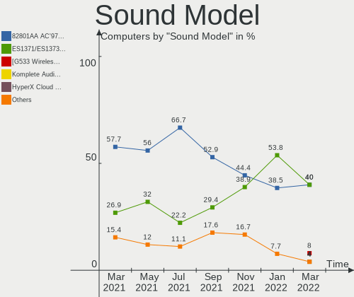

Ubuntu Virtual Hardware Trends
------------------------------

A project to identify most popular virtual hardware characteristics and track their change
over time based on data collected by Ubuntu users at https://Linux-Hardware.org.

Anyone can contribute to this report by the [hw-probe](https://github.com/linuxhw/hw-probe) tool:

    sudo -E hw-probe -all -upload

This report is for one last month. Overall report since the beginning of time: [TestCoverage_VE](https://github.com/linuxhw/TestCoverage_VE)

Period: Mar, 2022.

Contents
--------

* [ System ](#system)
  - [ OS                       ](#os)
  - [ OS Family                ](#os-family)
  - [ Kernel                   ](#kernel)
  - [ Kernel Family            ](#kernel-family)
  - [ Kernel Major Ver.        ](#kernel-major-ver)
  - [ Arch                     ](#arch)
  - [ DE                       ](#de)
  - [ Display Server           ](#display-server)
  - [ Display Manager          ](#display-manager)
  - [ OS Lang                  ](#os-lang)
  - [ Boot Mode                ](#boot-mode)
  - [ Filesystem               ](#filesystem)
  - [ Part. scheme             ](#part-scheme)
  - [ Dual Boot with Linux/BSD ](#dual-boot-with-linuxbsd)
  - [ Dual Boot (Win)          ](#dual-boot-win)

* [ Board ](#board)
  - [ Vendor                   ](#vendor)
  - [ Model                    ](#model)
  - [ Model Family             ](#model-family)
  - [ MFG Year                 ](#mfg-year)
  - [ Form Factor              ](#form-factor)
  - [ Secure Boot              ](#secure-boot)
  - [ Coreboot                 ](#coreboot)
  - [ RAM Size                 ](#ram-size)
  - [ RAM Used                 ](#ram-used)
  - [ Total Drives             ](#total-drives)
  - [ Has CD-ROM               ](#has-cd-rom)
  - [ Has Ethernet             ](#has-ethernet)
  - [ Has WiFi                 ](#has-wifi)
  - [ Has Bluetooth            ](#has-bluetooth)

* [ Location ](#location)
  - [ Country                  ](#country)
  - [ City                     ](#city)

* [ Drives ](#drives)
  - [ Drive Vendor             ](#drive-vendor)
  - [ Drive Model              ](#drive-model)
  - [ HDD Vendor               ](#hdd-vendor)
  - [ SSD Vendor               ](#ssd-vendor)
  - [ Drive Kind               ](#drive-kind)
  - [ Drive Connector          ](#drive-connector)
  - [ Drive Size               ](#drive-size)
  - [ Space Total              ](#space-total)
  - [ Space Used               ](#space-used)
  - [ Malfunc. Drives          ](#malfunc-drives)
  - [ Malfunc. Drive Vendor    ](#malfunc-drive-vendor)
  - [ Malfunc. HDD Vendor      ](#malfunc-hdd-vendor)
  - [ Malfunc. Drive Kind      ](#malfunc-drive-kind)
  - [ Failed Drives            ](#failed-drives)
  - [ Failed Drive Vendor      ](#failed-drive-vendor)
  - [ Drive Status             ](#drive-status)

* [ Storage controller ](#storage-controller)
  - [ Storage Vendor           ](#storage-vendor)
  - [ Storage Model            ](#storage-model)
  - [ Storage Kind             ](#storage-kind)

* [ Processor ](#processor)
  - [ CPU Vendor               ](#cpu-vendor)
  - [ CPU Model                ](#cpu-model)
  - [ CPU Model Family         ](#cpu-model-family)
  - [ CPU Cores                ](#cpu-cores)
  - [ CPU Sockets              ](#cpu-sockets)
  - [ CPU Threads              ](#cpu-threads)
  - [ CPU Op-Modes             ](#cpu-op-modes)
  - [ CPU Microcode            ](#cpu-microcode)
  - [ CPU Microarch            ](#cpu-microarch)

* [ Graphics ](#graphics)
  - [ GPU Vendor               ](#gpu-vendor)
  - [ GPU Model                ](#gpu-model)
  - [ GPU Combo                ](#gpu-combo)
  - [ GPU Driver               ](#gpu-driver)
  - [ GPU Memory               ](#gpu-memory)

* [ Monitor ](#monitor)
  - [ Monitor Vendor           ](#monitor-vendor)
  - [ Monitor Model            ](#monitor-model)
  - [ Monitor Resolution       ](#monitor-resolution)
  - [ Monitor Diagonal         ](#monitor-diagonal)
  - [ Monitor Width            ](#monitor-width)
  - [ Aspect Ratio             ](#aspect-ratio)
  - [ Monitor Area             ](#monitor-area)
  - [ Pixel Density            ](#pixel-density)
  - [ Multiple Monitors        ](#multiple-monitors)

* [ Network ](#network)
  - [ Net Controller Vendor    ](#net-controller-vendor)
  - [ Net Controller Model     ](#net-controller-model)
  - [ Wireless Vendor          ](#wireless-vendor)
  - [ Wireless Model           ](#wireless-model)
  - [ Ethernet Vendor          ](#ethernet-vendor)
  - [ Ethernet Model           ](#ethernet-model)
  - [ Net Controller Kind      ](#net-controller-kind)
  - [ Used Controller          ](#used-controller)
  - [ NICs                     ](#nics)
  - [ IPv6                     ](#ipv6)

* [ Bluetooth ](#bluetooth)
  - [ Bluetooth Vendor         ](#bluetooth-vendor)
  - [ Bluetooth Model          ](#bluetooth-model)

* [ Sound ](#sound)
  - [ Sound Vendor             ](#sound-vendor)
  - [ Sound Model              ](#sound-model)

* [ Memory ](#memory)
  - [ Memory Vendor            ](#memory-vendor)
  - [ Memory Model             ](#memory-model)
  - [ Memory Kind              ](#memory-kind)
  - [ Memory Form Factor       ](#memory-form-factor)
  - [ Memory Size              ](#memory-size)
  - [ Memory Speed             ](#memory-speed)

* [ Printers & scanners ](#printers--scanners)
  - [ Printer Vendor           ](#printer-vendor)
  - [ Printer Model            ](#printer-model)
  - [ Scanner Vendor           ](#scanner-vendor)
  - [ Scanner Model            ](#scanner-model)

* [ Camera ](#camera)
  - [ Camera Vendor            ](#camera-vendor)
  - [ Camera Model             ](#camera-model)

* [ Security ](#security)
  - [ Fingerprint Vendor       ](#fingerprint-vendor)
  - [ Fingerprint Model        ](#fingerprint-model)
  - [ Chipcard Vendor          ](#chipcard-vendor)
  - [ Chipcard Model           ](#chipcard-model)

* [ Unsupported ](#unsupported)
  - [ Unsupported Devices      ](#unsupported-devices)
  - [ Unsupported Device Types ](#unsupported-device-types)

System
------

OS
--

Installed operating systems

| Name         | Computers | Percent |
|--------------|-----------|---------|
| Ubuntu 20.04 | 27        | 72.97%  |
| Ubuntu 21.10 | 5         | 13.51%  |
| Ubuntu 22.04 | 3         | 8.11%   |
| Ubuntu 18.04 | 2         | 5.41%   |

OS Family
---------

OS without a version

| Name   | Computers | Percent |
|--------|-----------|---------|
| Ubuntu | 37        | 100%    |

Kernel
------

Version of the Linux kernel

| Version                            | Computers | Percent |
|------------------------------------|-----------|---------|
| 5.13.0-35-generic                  | 10        | 27.03%  |
| 5.10.60.1-microsoft-standard-WSL2  | 4         | 10.81%  |
| 5.13.0-37-generic                  | 3         | 8.11%   |
| 5.15.0-23-generic                  | 2         | 5.41%   |
| 5.10.60.1-microsoft-standard-WSL2+ | 2         | 5.41%   |
| 4.4.0-19041-Microsoft              | 2         | 5.41%   |
| 5.4.72-microsoft-standard-WSL2     | 1         | 2.7%    |
| 5.4.0-99-generic                   | 1         | 2.7%    |
| 5.4.0-72-generic                   | 1         | 2.7%    |
| 5.4.0-42-generic                   | 1         | 2.7%    |
| 5.4.0-26-generic                   | 1         | 2.7%    |
| 5.4.0-104-generic                  | 1         | 2.7%    |
| 5.4.0-100-generic                  | 1         | 2.7%    |
| 5.15.0-18-generic                  | 1         | 2.7%    |
| 5.13.0-39-generic                  | 1         | 2.7%    |
| 5.13.0-30-generic                  | 1         | 2.7%    |
| 5.13.0-28-generic                  | 1         | 2.7%    |
| 5.10.16.3-microsoft-standard-WSL2  | 1         | 2.7%    |
| 5.10.102.1-microsoft-standard-WSL2 | 1         | 2.7%    |
| 4.15.0-175-generic                 | 1         | 2.7%    |

Kernel Family
-------------

Linux kernel without a distro release

| Version    | Computers | Percent |
|------------|-----------|---------|
| 5.13.0     | 16        | 43.24%  |
| 5.4.0      | 6         | 16.22%  |
| 5.10.60.1  | 6         | 16.22%  |
| 5.15.0     | 3         | 8.11%   |
| 4.4.0      | 2         | 5.41%   |
| 5.4.72     | 1         | 2.7%    |
| 5.10.16.3  | 1         | 2.7%    |
| 5.10.102.1 | 1         | 2.7%    |
| 4.15.0     | 1         | 2.7%    |

Kernel Major Ver.
-----------------

Linux kernel major version

| Version  | Computers | Percent |
|----------|-----------|---------|
| 5.13     | 16        | 43.24%  |
| 5.4      | 7         | 18.92%  |
| 5.10.60  | 6         | 16.22%  |
| 5.15     | 3         | 8.11%   |
| 4.4      | 2         | 5.41%   |
| 5.10.16  | 1         | 2.7%    |
| 5.10.102 | 1         | 2.7%    |
| 4.15     | 1         | 2.7%    |

Arch
----

OS architecture (x86_64, i586, etc.)

| Name   | Computers | Percent |
|--------|-----------|---------|
| x86_64 | 36        | 97.3%   |
| i686   | 1         | 2.7%    |

DE
--

Desktop Environment

| Name    | Computers | Percent |
|---------|-----------|---------|
| GNOME   | 26        | 70.27%  |
| Unknown | 10        | 27.03%  |
| Unity   | 1         | 2.7%    |

Display Server
--------------

X11 or Wayland

| Name    | Computers | Percent |
|---------|-----------|---------|
| X11     | 16        | 43.24%  |
| Wayland | 11        | 29.73%  |
| Unknown | 8         | 21.62%  |
| Tty     | 2         | 5.41%   |

Display Manager
---------------

SDDM, LightDM, etc.

| Name    | Computers | Percent |
|---------|-----------|---------|
| GDM3    | 15        | 40.54%  |
| Unknown | 13        | 35.14%  |
| GDM     | 9         | 24.32%  |

OS Lang
-------

Language

| Lang    | Computers | Percent |
|---------|-----------|---------|
| en_US   | 13        | 35.14%  |
| C       | 13        | 35.14%  |
| fr_FR   | 2         | 5.41%   |
| de_DE   | 2         | 5.41%   |
| zh_CN   | 1         | 2.7%    |
| ru_RU   | 1         | 2.7%    |
| pt_BR   | 1         | 2.7%    |
| ja_JP   | 1         | 2.7%    |
| it_IT   | 1         | 2.7%    |
| fr_BE   | 1         | 2.7%    |
| Unknown | 1         | 2.7%    |

Boot Mode
---------

EFI or BIOS

| Mode | Computers | Percent |
|------|-----------|---------|
| BIOS | 36        | 97.3%   |
| EFI  | 1         | 2.7%    |

Filesystem
----------

Type of filesystem

| Type    | Computers | Percent |
|---------|-----------|---------|
| Ext4    | 32        | 86.49%  |
| Wslfs   | 2         | 5.41%   |
| Unknown | 2         | 5.41%   |
| Zfs     | 1         | 2.7%    |

Part. scheme
------------

Scheme of partitioning

| Type    | Computers | Percent |
|---------|-----------|---------|
| Unknown | 24        | 64.86%  |
| MBR     | 7         | 18.92%  |
| GPT     | 6         | 16.22%  |

Dual Boot with Linux/BSD
------------------------

Hosting more than one Linux/BSD

| Dual boot | Computers | Percent |
|-----------|-----------|---------|
| No        | 36        | 97.3%   |
| Yes       | 1         | 2.7%    |

Dual Boot (Win)
---------------

Hosting Linux and Windows

| Dual boot | Computers | Percent |
|-----------|-----------|---------|
| No        | 37        | 100%    |

Board
-----

Vendor
------

Motherboard manufacturer

| Name                 | Computers | Percent |
|----------------------|-----------|---------|
| Microsoft            | 13        | 35.14%  |
| VMware               | 10        | 27.03%  |
| Oracle               | 10        | 27.03%  |
| OpenStack Foundation | 2         | 5.41%   |
| QEMU                 | 1         | 2.7%    |
| Hetzner              | 1         | 2.7%    |

Model
-----

Motherboard model

| Name                                   | Computers | Percent |
|----------------------------------------|-----------|---------|
| VMware Virtual Platform                | 10        | 27.03%  |
| Oracle VirtualBox                      | 10        | 27.03%  |
| Microsoft Windows Subsystem for Linux  | 10        | 27.03%  |
| Microsoft Virtual Machine              | 3         | 8.11%   |
| OpenStack Foundation OpenStack Nova    | 2         | 5.41%   |
| QEMU Standard PC (i440FX + PIIX, 1996) | 1         | 2.7%    |
| Hetzner vServer                        | 1         | 2.7%    |

Model Family
------------

Motherboard model prefix

| Name                           | Computers | Percent |
|--------------------------------|-----------|---------|
| VMware Virtual                 | 10        | 27.03%  |
| Oracle VirtualBox              | 10        | 27.03%  |
| Microsoft Windows              | 10        | 27.03%  |
| Microsoft Virtual              | 3         | 8.11%   |
| OpenStack Foundation OpenStack | 2         | 5.41%   |
| QEMU Standard                  | 1         | 2.7%    |
| Hetzner vServer                | 1         | 2.7%    |

MFG Year
--------

Motherboard manufacture year

| Year    | Computers | Percent |
|---------|-----------|---------|
| 2020    | 10        | 27.03%  |
| Unknown | 10        | 27.03%  |
| 2006    | 9         | 24.32%  |
| 2014    | 3         | 8.11%   |
| 2017    | 2         | 5.41%   |
| 2021    | 1         | 2.7%    |
| 2019    | 1         | 2.7%    |
| 2016    | 1         | 2.7%    |

Form Factor
-----------

Physical design of the computer

| Name            | Computers | Percent |
|-----------------|-----------|---------|
| Virtual machine | 37        | 100%    |

Secure Boot
-----------

Enabled or disabled

| State    | Computers | Percent |
|----------|-----------|---------|
| Disabled | 37        | 100%    |

Coreboot
--------

Have coreboot on board

| Used | Computers | Percent |
|------|-----------|---------|
| No   | 37        | 100%    |

RAM Size
--------

Total RAM memory

| Size in GB | Computers | Percent |
|------------|-----------|---------|
| 8.01-16.0  | 9         | 24.32%  |
| 4.01-8.0   | 8         | 21.62%  |
| 3.01-4.0   | 5         | 13.51%  |
| 24.01-32.0 | 4         | 10.81%  |
| 16.01-24.0 | 4         | 10.81%  |
| 1.01-2.0   | 4         | 10.81%  |
| 0.51-1.0   | 2         | 5.41%   |
| 32.01-64.0 | 1         | 2.7%    |

RAM Used
--------

Used RAM memory

| Used GB   | Computers | Percent |
|-----------|-----------|---------|
| 1.01-2.0  | 18        | 48.65%  |
| 0.51-1.0  | 7         | 18.92%  |
| 0.01-0.5  | 5         | 13.51%  |
| 4.01-8.0  | 2         | 5.41%   |
| 2.01-3.0  | 2         | 5.41%   |
| Unknown   | 2         | 5.41%   |
| 8.01-16.0 | 1         | 2.7%    |

Total Drives
------------

Number of drives on board

| Drives | Computers | Percent |
|--------|-----------|---------|
| 1      | 25        | 67.57%  |
| 3      | 5         | 13.51%  |
| 0      | 3         | 8.11%   |
| 4      | 2         | 5.41%   |
| 2      | 2         | 5.41%   |

Has CD-ROM
----------

Has CD-ROM on board

| Presented | Computers | Percent |
|-----------|-----------|---------|
| Yes       | 23        | 62.16%  |
| No        | 14        | 37.84%  |

Has Ethernet
------------

Has Ethernet on board

| Presented | Computers | Percent |
|-----------|-----------|---------|
| Yes       | 21        | 56.76%  |
| No        | 16        | 43.24%  |

Has WiFi
--------

Has WiFi module

| Presented | Computers | Percent |
|-----------|-----------|---------|
| No        | 36        | 97.3%   |
| Yes       | 1         | 2.7%    |

Has Bluetooth
-------------

Has Bluetooth module

| Presented | Computers | Percent |
|-----------|-----------|---------|
| No        | 31        | 83.78%  |
| Yes       | 6         | 16.22%  |

Location
--------

Country
-------

Geographic location (country)

| Country     | Computers | Percent |
|-------------|-----------|---------|
| USA         | 7         | 18.92%  |
| Germany     | 7         | 18.92%  |
| France      | 3         | 8.11%   |
| Italy       | 2         | 5.41%   |
| Indonesia   | 2         | 5.41%   |
| China       | 2         | 5.41%   |
| Brazil      | 2         | 5.41%   |
| UK          | 1         | 2.7%    |
| Tunisia     | 1         | 2.7%    |
| Slovenia    | 1         | 2.7%    |
| Senegal     | 1         | 2.7%    |
| Russia      | 1         | 2.7%    |
| Romania     | 1         | 2.7%    |
| Poland      | 1         | 2.7%    |
| Netherlands | 1         | 2.7%    |
| Morocco     | 1         | 2.7%    |
| Japan       | 1         | 2.7%    |
| Colombia    | 1         | 2.7%    |
| Belgium     | 1         | 2.7%    |

City
----

Geographic location (city)

| City                  | Computers | Percent |
|-----------------------|-----------|---------|
| Port Orange           | 2         | 5.41%   |
| Warsaw                | 1         | 2.7%    |
| Tunis                 | 1         | 2.7%    |
| Tulcea                | 1         | 2.7%    |
| Tampa                 | 1         | 2.7%    |
| Strasbourg            | 1         | 2.7%    |
| Rio de Janeiro        | 1         | 2.7%    |
| Recklinghausen        | 1         | 2.7%    |
| Pouso Alegre          | 1         | 2.7%    |
| Paris                 | 1         | 2.7%    |
| Padova                | 1         | 2.7%    |
| Orlando               | 1         | 2.7%    |
| Nuremberg             | 1         | 2.7%    |
| Nottingham            | 1         | 2.7%    |
| Moscow                | 1         | 2.7%    |
| Montauban-de-Bretagne | 1         | 2.7%    |
| Medellín           | 1         | 2.7%    |
| Mascalucia            | 1         | 2.7%    |
| Manado                | 1         | 2.7%    |
| Ljubljana             | 1         | 2.7%    |
| Langenselbold         | 1         | 2.7%    |
| Kortrijk              | 1         | 2.7%    |
| Kanazawa              | 1         | 2.7%    |
| Hamburg               | 1         | 2.7%    |
| Guangzhou             | 1         | 2.7%    |
| Geseke                | 1         | 2.7%    |
| Frankfurt (Oder)      | 1         | 2.7%    |
| Flushing              | 1         | 2.7%    |
| Edmonds               | 1         | 2.7%    |
| Dakar                 | 1         | 2.7%    |
| Canyon                | 1         | 2.7%    |
| Berkane               | 1         | 2.7%    |
| Beijing               | 1         | 2.7%    |
| Banjarmasin           | 1         | 2.7%    |
| Ann Arbor             | 1         | 2.7%    |
| Alfter                | 1         | 2.7%    |

Drives
------

Drive Vendor
------------

Hard drive vendors

| Vendor | Computers | Drives | Percent |
|--------|-----------|--------|---------|
| Msft   | 11        | 29     | 32.35%  |
| VMware | 10        | 10     | 29.41%  |
| VBOX   | 10        | 10     | 29.41%  |
| QEMU   | 3         | 3      | 8.82%   |

Drive Model
-----------

Hard drive models

| Model                 | Computers | Percent |
|-----------------------|-----------|---------|
| Msft Virtual Disk     | 11        | 32.35%  |
| VBOX HARDDISK         | 10        | 29.41%  |
| VMware Virtual S      | 8         | 23.53%  |
| QEMU HARDDISK         | 3         | 8.82%   |
| VMware Virtual disk   | 1         | 2.94%   |
| VMware NVMe SSD Drive | 1         | 2.94%   |

HDD Vendor
----------

Hard disk drive vendors

| Vendor | Computers | Drives | Percent |
|--------|-----------|--------|---------|
| Msft   | 11        | 29     | 32.35%  |
| VMware | 10        | 10     | 29.41%  |
| VBOX   | 10        | 10     | 29.41%  |
| QEMU   | 3         | 3      | 8.82%   |

SSD Vendor
----------

Solid state drive vendors

Zero info for selected period =(

Drive Kind
----------

HDD or SSD

| Kind | Computers | Drives | Percent |
|------|-----------|--------|---------|
| HDD  | 34        | 52     | 100%    |

Drive Connector
---------------

SATA, SAS, NVMe, etc.

| Type | Computers | Drives | Percent |
|------|-----------|--------|---------|
| SAS  | 20        | 38     | 58.82%  |
| SATA | 13        | 13     | 38.24%  |
| NVMe | 1         | 1      | 2.94%   |

Drive Size
----------

Size of hard drive

| Size in TB | Computers | Drives | Percent |
|------------|-----------|--------|---------|
| 0.01-0.5   | 34        | 52     | 100%    |

Space Total
-----------

Amount of disk space available on the file system

| Size in GB | Computers | Percent |
|------------|-----------|---------|
| 21-50      | 14        | 37.84%  |
| Unknown    | 11        | 29.73%  |
| 251-500    | 3         | 8.11%   |
| 101-250    | 3         | 8.11%   |
| 51-100     | 3         | 8.11%   |
| 1-20       | 2         | 5.41%   |
| 1001-2000  | 1         | 2.7%    |

Space Used
----------

Amount of used disk space

| Used GB | Computers | Percent |
|---------|-----------|---------|
| 1-20    | 22        | 59.46%  |
| Unknown | 11        | 29.73%  |
| 21-50   | 2         | 5.41%   |
| 101-250 | 1         | 2.7%    |
| 51-100  | 1         | 2.7%    |

Malfunc. Drives
---------------

Drive models with a malfunction

Zero info for selected period =(

Malfunc. Drive Vendor
---------------------

Vendors of faulty drives

Zero info for selected period =(

Malfunc. HDD Vendor
-------------------

Vendors of faulty HDD drives

Zero info for selected period =(

Malfunc. Drive Kind
-------------------

Kinds of faulty drives

Zero info for selected period =(

Failed Drives
-------------

Failed drive models

Zero info for selected period =(

Failed Drive Vendor
-------------------

Failed drive vendors

Zero info for selected period =(

Drive Status
------------

Number of failed and malfunc. drives

| Status   | Computers | Drives | Percent |
|----------|-----------|--------|---------|
| Detected | 34        | 52     | 100%    |

Storage controller
------------------

Storage Vendor
--------------

Storage controller vendors

| Vendor                    | Computers | Percent |
|---------------------------|-----------|---------|
| Intel                     | 24        | 48.98%  |
| VMware                    | 10        | 20.41%  |
| LSI Logic / Symbios Logic | 9         | 18.37%  |
| Red Hat                   | 6         | 12.24%  |

Storage Model
-------------

Storage controller models

| Model                                                                 | Computers | Percent |
|-----------------------------------------------------------------------|-----------|---------|
| Intel 82371AB/EB/MB PIIX4 IDE                                         | 19        | 32.2%   |
| VMware SATA AHCI controller                                           | 10        | 16.95%  |
| Intel 82801HM/HEM (ICH8M/ICH8M-E) SATA Controller [AHCI mode]         | 10        | 16.95%  |
| LSI Logic / Symbios Logic 53c1030 PCI-X Fusion-MPT Dual Ultra320 SCSI | 9         | 15.25%  |
| Intel 82371SB PIIX3 IDE [Natoma/Triton II]                            | 4         | 6.78%   |
| Red Hat Virtio filesystem                                             | 3         | 5.08%   |
| Red Hat Virtio SCSI                                                   | 2         | 3.39%   |
| VMware NVMe SSD Controller                                            | 1         | 1.69%   |
| Red Hat Virtio block device                                           | 1         | 1.69%   |

Storage Kind
------------

Kind of storage controller (IDE, SATA, NVMe, SAS, ...)

| Kind | Computers | Percent |
|------|-----------|---------|
| IDE  | 23        | 38.98%  |
| SATA | 20        | 33.9%   |
| SCSI | 15        | 25.42%  |
| NVMe | 1         | 1.69%   |

Processor
---------

CPU Vendor
----------

Processor vendors

| Vendor | Computers | Percent |
|--------|-----------|---------|
| Intel  | 30        | 81.08%  |
| AMD    | 7         | 18.92%  |

CPU Model
---------

Processor models

| Model                                   | Computers | Percent |
|-----------------------------------------|-----------|---------|
| Intel Core i5-8600K CPU @ 3.60GHz       | 2         | 5.41%   |
| Intel 11th Gen Core i7-1165G7 @ 2.80GHz | 2         | 5.41%   |
| AMD Ryzen 9 3900X 12-Core Processor     | 2         | 5.41%   |
| Intel Xeon D-2183IT CPU @ 2.20GHz       | 1         | 2.7%    |
| Intel Xeon CPU E5-2660 v2 @ 2.20GHz     | 1         | 2.7%    |
| Intel Xeon CPU E5-1620 0 @ 3.60GHz      | 1         | 2.7%    |
| Intel Core Processor (Haswell, no TSX)  | 1         | 2.7%    |
| Intel Core i9-9900K CPU @ 3.60GHz       | 1         | 2.7%    |
| Intel Core i9-10850K CPU @ 3.60GHz      | 1         | 2.7%    |
| Intel Core i7-9750H CPU @ 2.60GHz       | 1         | 2.7%    |
| Intel Core i7-9700K CPU @ 3.60GHz       | 1         | 2.7%    |
| Intel Core i7-9700 CPU @ 3.00GHz        | 1         | 2.7%    |
| Intel Core i7-8750H CPU @ 2.20GHz       | 1         | 2.7%    |
| Intel Core i7-7700HQ CPU @ 2.80GHz      | 1         | 2.7%    |
| Intel Core i7-6600U CPU @ 2.60GHz       | 1         | 2.7%    |
| Intel Core i7-5820K CPU @ 3.30GHz       | 1         | 2.7%    |
| Intel Core i7-3740QM CPU @ 2.70GHz      | 1         | 2.7%    |
| Intel Core i7-10750H CPU @ 2.60GHz      | 1         | 2.7%    |
| Intel Core i7-10700K CPU @ 3.80GHz      | 1         | 2.7%    |
| Intel Core i7-10510U CPU @ 1.80GHz      | 1         | 2.7%    |
| Intel Core i5-8200Y CPU @ 1.30GHz       | 1         | 2.7%    |
| Intel Core i5-7400 CPU @ 3.00GHz        | 1         | 2.7%    |
| Intel Core i5-7300U CPU @ 2.60GHz       | 1         | 2.7%    |
| Intel Core i5-7200U CPU @ 2.50GHz       | 1         | 2.7%    |
| Intel Core i5-6600K CPU @ 3.50GHz       | 1         | 2.7%    |
| Intel Core i5-4460 CPU @ 3.20GHz        | 1         | 2.7%    |
| Intel Core i5 CPU M 560 @ 2.67GHz       | 1         | 2.7%    |
| Intel Core i3-6100 CPU @ 3.70GHz        | 1         | 2.7%    |
| Intel 11th Gen Core i5-11400 @ 2.60GHz  | 1         | 2.7%    |
| AMD Ryzen 7 4800HS with Radeon Graphics | 1         | 2.7%    |
| AMD Ryzen 5 5600U with Radeon Graphics  | 1         | 2.7%    |
| AMD Ryzen 5 4600H with Radeon Graphics  | 1         | 2.7%    |
| AMD Ryzen 5 3600 6-Core Processor       | 1         | 2.7%    |
| AMD EPYC Processor                      | 1         | 2.7%    |

CPU Model Family
----------------

Processor model prefix

| Model         | Computers | Percent |
|---------------|-----------|---------|
| Intel Core i7 | 11        | 29.73%  |
| Intel Core i5 | 9         | 24.32%  |
| Other         | 3         | 8.11%   |
| Intel Xeon    | 3         | 8.11%   |
| AMD Ryzen 5   | 3         | 8.11%   |
| Intel Core i9 | 2         | 5.41%   |
| AMD Ryzen 9   | 2         | 5.41%   |
| Intel Core i3 | 1         | 2.7%    |
| Intel Core    | 1         | 2.7%    |
| AMD Ryzen 7   | 1         | 2.7%    |
| AMD EPYC      | 1         | 2.7%    |

CPU Cores
---------

Number of processor cores

| Number | Computers | Percent |
|--------|-----------|---------|
| 6      | 9         | 24.32%  |
| 1      | 8         | 21.62%  |
| 2      | 7         | 18.92%  |
| 4      | 5         | 13.51%  |
| 8      | 4         | 10.81%  |
| 3      | 2         | 5.41%   |
| 32     | 1         | 2.7%    |
| 12     | 1         | 2.7%    |

CPU Sockets
-----------

Number of sockets

| Number | Computers | Percent |
|--------|-----------|---------|
| 1      | 27        | 72.97%  |
| 2      | 10        | 27.03%  |

CPU Threads
-----------

Threads per core (Hyper-Threading)

| Number | Computers | Percent |
|--------|-----------|---------|
| 1      | 27        | 72.97%  |
| 2      | 10        | 27.03%  |

CPU Op-Modes
------------

CPU Operation Modes (32-bit, 64-bit)

| Op mode        | Computers | Percent |
|----------------|-----------|---------|
| 32-bit, 64-bit | 37        | 100%    |

CPU Microcode
-------------

Microcode number

| Number  | Computers | Percent |
|---------|-----------|---------|
| Unknown | 37        | 100%    |

CPU Microarch
-------------

Microarchitecture

| Name        | Computers | Percent |
|-------------|-----------|---------|
| KabyLake    | 13        | 35.14%  |
| Zen 2       | 6         | 16.22%  |
| Skylake     | 4         | 10.81%  |
| Haswell     | 3         | 8.11%   |
| CometLake   | 3         | 8.11%   |
| TigerLake   | 2         | 5.41%   |
| IvyBridge   | 2         | 5.41%   |
| Zen 3       | 1         | 2.7%    |
| Westmere    | 1         | 2.7%    |
| SandyBridge | 1         | 2.7%    |
| Unknown     | 1         | 2.7%    |

Graphics
--------

GPU Vendor
----------

Vendors of graphics cards

| Vendor       | Computers | Percent |
|--------------|-----------|---------|
| VMware       | 20        | 66.67%  |
| Microsoft    | 6         | 20%     |
| Red Hat      | 2         | 6.67%   |
| Technical    | 1         | 3.33%   |
| Cirrus Logic | 1         | 3.33%   |

GPU Model
---------

Graphics card models

| Model                                | Computers | Percent |
|--------------------------------------|-----------|---------|
| VMware SVGA II Adapter               | 20        | 66.67%  |
| Microsoft Virtual Render             | 6         | 20%     |
| Red Hat QXL paravirtual graphic card | 2         | 6.67%   |
| Technical VGA compatible controller  | 1         | 3.33%   |
| Cirrus Logic GD 5446                 | 1         | 3.33%   |

GPU Combo
---------

Combinations of graphics cards

| Name             | Computers | Percent |
|------------------|-----------|---------|
| 1 x VMware       | 20        | 54.05%  |
| Other            | 8         | 21.62%  |
| 1 x Microsoft    | 6         | 16.22%  |
| 1 x Red Hat      | 2         | 5.41%   |
| 1 x Cirrus Logic | 1         | 2.7%    |

GPU Driver
----------

Free vs proprietary

| Driver  | Computers | Percent |
|---------|-----------|---------|
| Unknown | 37        | 100%    |

GPU Memory
----------

Total video memory

| Size in GB | Computers | Percent |
|------------|-----------|---------|
| Unknown    | 37        | 100%    |

Monitor
-------

Monitor Vendor
--------------

Monitor vendors

| Vendor | Computers | Percent |
|--------|-----------|---------|
| RHT    | 1         | 100%    |

Monitor Model
-------------

Monitor models

| Model                                                  | Computers | Percent |
|--------------------------------------------------------|-----------|---------|
| RHT QEMU Monitor RHT1234 2048x1152 260x195mm 12.8-inch | 1         | 100%    |

Monitor Resolution
------------------

Monitor screen resolution

| Resolution | Computers | Percent |
|------------|-----------|---------|
| 2048x1152  | 1         | 100%    |

Monitor Diagonal
----------------

Diagonal size in inches

| Inches | Computers | Percent |
|--------|-----------|---------|
| 19     | 1         | 100%    |

Monitor Width
-------------

Physical width

| Width in mm | Computers | Percent |
|-------------|-----------|---------|
| 401-500     | 1         | 100%    |

Aspect Ratio
------------

Proportional relationship between the width and the height

| Ratio | Computers | Percent |
|-------|-----------|---------|
| 4/3   | 1         | 100%    |

Monitor Area
------------

Area in inch²

| Area in inch² | Computers | Percent |
|----------------|-----------|---------|
| 151-200        | 1         | 100%    |

Pixel Density
-------------

Pixels per inch

| Density | Computers | Percent |
|---------|-----------|---------|
| 101-120 | 1         | 100%    |

Multiple Monitors
-----------------

Total monitors connected

| Total | Computers | Percent |
|-------|-----------|---------|
| 0     | 20        | 54.05%  |
| 1     | 17        | 45.95%  |

Network
-------

Net Controller Vendor
---------------------

Controller vendors

| Vendor                | Computers | Percent |
|-----------------------|-----------|---------|
| Intel                 | 20        | 76.92%  |
| Red Hat               | 3         | 11.54%  |
| Realtek Semiconductor | 1         | 3.85%   |
| Qualcomm Atheros      | 1         | 3.85%   |
| Allwinner Technology  | 1         | 3.85%   |

Net Controller Model
--------------------

Controller models

| Model                                                           | Computers | Percent |
|-----------------------------------------------------------------|-----------|---------|
| Intel 82545EM Gigabit Ethernet Controller (Copper)              | 10        | 38.46%  |
| Intel 82540EM Gigabit Ethernet Controller                       | 10        | 38.46%  |
| Red Hat Virtio network device                                   | 3         | 11.54%  |
| Realtek RTL-8100/8101L/8139 PCI Fast Ethernet Adapter           | 1         | 3.85%   |
| Qualcomm Atheros QCA986x/988x 802.11ac Wireless Network Adapter | 1         | 3.85%   |
| Allwinner sunxi SoC OTG connector in FEL/flashing mode          | 1         | 3.85%   |

Wireless Vendor
---------------

Wireless vendors

| Vendor           | Computers | Percent |
|------------------|-----------|---------|
| Qualcomm Atheros | 1         | 100%    |

Wireless Model
--------------

Wireless models

| Model                                                           | Computers | Percent |
|-----------------------------------------------------------------|-----------|---------|
| Qualcomm Atheros QCA986x/988x 802.11ac Wireless Network Adapter | 1         | 100%    |

Ethernet Vendor
---------------

Ethernet vendors

| Vendor                | Computers | Percent |
|-----------------------|-----------|---------|
| Intel                 | 20        | 95.24%  |
| Realtek Semiconductor | 1         | 4.76%   |

Ethernet Model
--------------

Ethernet models

| Model                                                 | Computers | Percent |
|-------------------------------------------------------|-----------|---------|
| Intel 82545EM Gigabit Ethernet Controller (Copper)    | 10        | 47.62%  |
| Intel 82540EM Gigabit Ethernet Controller             | 10        | 47.62%  |
| Realtek RTL-8100/8101L/8139 PCI Fast Ethernet Adapter | 1         | 4.76%   |

Net Controller Kind
-------------------

Ethernet, WiFi or modem

| Kind     | Computers | Percent |
|----------|-----------|---------|
| Ethernet | 21        | 80.77%  |
| Unknown  | 4         | 15.38%  |
| WiFi     | 1         | 3.85%   |

Used Controller
---------------

Currently used network controller

| Kind     | Computers | Percent |
|----------|-----------|---------|
| Ethernet | 21        | 100%    |

NICs
----

Total network controllers on board

| Total | Computers | Percent |
|-------|-----------|---------|
| 1     | 22        | 59.46%  |
| 0     | 15        | 40.54%  |

IPv6
----

IPv6 vs IPv4

| Used | Computers | Percent |
|------|-----------|---------|
| No   | 34        | 91.89%  |
| Yes  | 3         | 8.11%   |

Bluetooth
---------

Bluetooth Vendor
----------------

Controller vendors

| Vendor | Computers | Percent |
|--------|-----------|---------|
| VMware | 6         | 100%    |

Bluetooth Model
---------------

Controller models

| Model                            | Computers | Percent |
|----------------------------------|-----------|---------|
| VMware Virtual Bluetooth Adapter | 6         | 100%    |

Sound
-----

Sound Vendor
------------

Sound card vendors

| Vendor              | Computers | Percent |
|---------------------|-----------|---------|
| Intel               | 11        | 44%     |
| Ensoniq             | 10        | 40%     |
| Logitech            | 2         | 8%      |
| Native Instruments  | 1         | 4%      |
| Kingston Technology | 1         | 4%      |

Sound Model
-----------

Sound card models

| Model                                                                      | Computers | Percent |
|----------------------------------------------------------------------------|-----------|---------|
| Intel 82801AA AC'97 Audio Controller                                       | 10        | 40%     |
| Ensoniq ES1371/ES1373 / Creative Labs CT2518                               | 10        | 40%     |
| Logitech [G533 Wireless Headset Dongle]                                    | 2         | 8%      |
| Native Instruments Komplete Audio 6 MK2                                    | 1         | 4%      |
| Kingston Technology HyperX Cloud Flight S                                  | 1         | 4%      |
| Intel 82801FB/FBM/FR/FW/FRW (ICH6 Family) High Definition Audio Controller | 1         | 4%      |

Memory
------

Memory Vendor
-------------

Memory module vendors

| Vendor  | Computers | Percent |
|---------|-----------|---------|
| Unknown | 5         | 62.5%   |
| QEMU    | 3         | 37.5%   |

Memory Model
------------

Memory module models

| Model                           | Computers | Percent |
|---------------------------------|-----------|---------|
| Unknown                         | 5         | 62.5%   |
| QEMU RAM Module 4096MB DIMM RAM | 1         | 12.5%   |
| QEMU RAM Module 4000MB DIMM RAM | 1         | 12.5%   |
| QEMU RAM Module 2000MB DIMM RAM | 1         | 12.5%   |

Memory Kind
-----------

Memory module kinds

| Kind | Computers | Percent |
|------|-----------|---------|
| DRAM | 5         | 62.5%   |
| RAM  | 3         | 37.5%   |

Memory Form Factor
------------------

Physical design of the memory module

| Name | Computers | Percent |
|------|-----------|---------|
| DIMM | 8         | 100%    |

Memory Size
-----------

Memory module size

| Size  | Computers | Percent |
|-------|-----------|---------|
| 16384 | 3         | 37.5%   |
| 4096  | 2         | 25%     |
| 8192  | 1         | 12.5%   |
| 4000  | 1         | 12.5%   |
| 2000  | 1         | 12.5%   |

Memory Speed
------------

Memory module speed

| Speed   | Computers | Percent |
|---------|-----------|---------|
| Unknown | 8         | 100%    |

Printers & scanners
-------------------

Printer Vendor
--------------

Printer device vendors

Zero info for selected period =(

Printer Model
-------------

Printer device models

Zero info for selected period =(

Scanner Vendor
--------------

Scanner device vendors

Zero info for selected period =(

Scanner Model
-------------

Scanner device models

Zero info for selected period =(

Camera
------

Camera Vendor
-------------

Camera device vendors

| Vendor                      | Computers | Percent |
|-----------------------------|-----------|---------|
| Luxvisions Innotech Limited | 1         | 100%    |

Camera Model
------------

Camera device models

| Model                                               | Computers | Percent |
|-----------------------------------------------------|-----------|---------|
| Luxvisions Innotech Limited HP TrueVision HD Camera | 1         | 100%    |

Security
--------

Fingerprint Vendor
------------------

Fingerprint sensor vendors

Zero info for selected period =(

Fingerprint Model
-----------------

Fingerprint sensor models

Zero info for selected period =(

Chipcard Vendor
---------------

Chipcard module vendors

| Vendor                | Computers | Percent |
|-----------------------|-----------|---------|
| Gemalto (was Gemplus) | 1         | 100%    |

Chipcard Model
--------------

Chipcard module models

| Model                               | Computers | Percent |
|-------------------------------------|-----------|---------|
| Gemalto (was Gemplus) GemPC433-Swap | 1         | 100%    |

Unsupported
-----------

Unsupported Devices
-------------------

Total unsupported devices on board

| Total | Computers | Percent |
|-------|-----------|---------|
| 0     | 33        | 89.19%  |
| 1     | 3         | 8.11%   |
| 2     | 1         | 2.7%    |

Unsupported Device Types
------------------------

Types of unsupported devices

| Type          | Computers | Percent |
|---------------|-----------|---------|
| Graphics card | 2         | 40%     |
| Network       | 1         | 20%     |
| Net/wireless  | 1         | 20%     |
| Chipcard      | 1         | 20%     |

